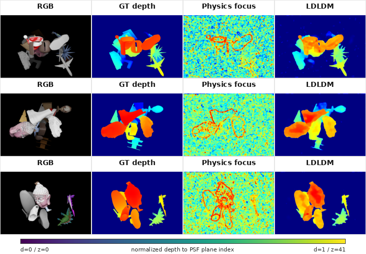

# Lensless Depth Diffusion Final Model Status

## Metadata

- Research ID: `lensless-depth-diffusion/2026/ldldm-bg-suppressed`
- Topic: physics-integrated latent diffusion for synthetic lensless depth estimation
- Last updated: 2026-06-07
- Public report URL: `https://donggeonbae.github.io/research/projects/lensless-depth-diffusion-final-model-status/`
- Figure archive mirror: `https://donggeonbae.github.io/research/projects/lensless-depth-diffusion-figure-set/`
- Manuscript status: `https://donggeonbae.github.io/writing/projects/lensless-depth-diffusion-manuscript-status/`

## Research Question

How can PSF-stack deconvolution physics be integrated into a latent diffusion depth model, instead of being used only as a static preprocessing step before a supervised depth regressor?

## Synthetic Scope

- Train split: 66,000 RGB/depth pairs.
- Test split: 6,000 RGB/depth pairs.
- PSF stack: 42 calibrated planes.
- Synthetic test measurements are generated from RGB/depth/PSF physics.
- One epoch is 66,000 optimizer updates in the batch-size-1 configuration.
- The current paper is scoped to synthetic train/test results. Real captures remain diagnostic and are not included in the paper result table.

## Model Naming Policy

The final model name is `LDLDM`, short for Lensless Depth Latent Diffusion Model.

`LDLDM` means the promoted model must be a diffusion model with PSF/deconvolution physics active inside the model. A supervised U-Net or plane-posterior model may score higher, but it is a baseline or diagnostic comparison, not the promoted method.

## Current LDLDM Checkpoint

Current selected checkpoint:

- Model family: integrated-Wiener latent diffusion with PSF-stack deconvolution/focus conditioning.
- Checkpoint: 340,000 accumulated optimizer updates.
- Approximate training exposure: 5.15 epochs at 66,000 updates per epoch.
- Reverse diffusion sampling: 16 DDIM-style denoising steps.
- Added regularization: supervised background depth and background smoothness losses.
- Verified evaluation: 500 held-out synthetic samples.
- Full 6,000-sample synthetic evaluation: running separately and should replace the 500-row once complete.

## Why Background Suppression Is Not Cheating

The background suppression terms are training losses computed from training depth labels. At inference, LDLDM receives only the lensless measurement and the calibrated PSF stack. It does not receive a ground-truth depth map, a ground-truth background mask, or any test-time post-processing derived from labels.

This is equivalent to adding a supervised regularizer to reduce background speckle. It would become cheating only if the evaluation or inference path used GT masks or GT depth to modify predictions.

## Current Verified Metrics

The background-suppressed checkpoint is verified on 500 held-out synthetic samples. The paper table marks this evaluation size explicitly so it is not confused with full-6k baseline rows.

| Method | Eval size | Train state | Denoise steps | fg delta1 | fg delta2 | fg delta3 | fg MAE | Boundary MAE | bg MAE | bg TV |
| --- | ---: | ---: | ---: | ---: | ---: | ---: | ---: | ---: | ---: | ---: |
| Physics focus baseline | 500 | no training | - | 0.390 | 0.621 | 0.822 | 0.2136 | 0.2342 | 0.4782 | 0.0364 |
| **LDLDM** | 500 | 340k updates | 16 | **0.885** | **0.924** | **0.936** | **0.0829** | **0.1117** | **0.0057** | **0.0019** |

Full-6k synthetic baselines retained in the paper:

| Method | Eval size | Train state | fg delta1 | fg delta2 | fg delta3 | fg MAE | Boundary MAE |
| --- | ---: | ---: | ---: | ---: | ---: | ---: | ---: |
| Physics focus, lambda=1e-4 | 6,000 | no training | 0.391 | 0.617 | 0.816 | 0.2137 | 0.2368 |
| Raw-measurement U-Net | 6,000 | 66k updates | 0.436 | 0.629 | 0.753 | 0.2040 | 0.3760 |
| Deconv-volume U-Net | 6,000 | 66k updates | 0.865 | 0.926 | 0.949 | 0.0501 | 0.1144 |
| FlatNet3D-style RGB/depth | 6,000 | 66k updates | 0.823 | 0.908 | 0.939 | 0.0685 | 0.1740 |
| Plane-posterior U-Net | 6,000 | 66k updates | 0.898 | 0.939 | 0.957 | 0.0369 | 0.0925 |
| Plane-posterior + calibration | 6,000 | 66k updates | 0.885 | 0.946 | 0.971 | 0.0406 | 0.1099 |

## Qualitative Result

| LDLDM background-suppressed qualitative result |
| --- |
|  |

The paper figure now uses the background-suppressed LDLDM output rather than the earlier speckled diffusion output. The panel order is RGB, GT depth, physics focus baseline, and LDLDM. The colorbar maps normalized depth `d in [0,1]` to PSF plane index `z=round(41d)`.

## Paper Update

The synthetic paper has been updated with:

- A tighter Introduction section with the large paragraph gap removed.
- The promoted method name `LDLDM`.
- Background suppression described as supervised training regularization, not test-time filtering.
- A table row for the verified background-suppressed LDLDM checkpoint.
- A qualitative figure using the cleaned LDLDM depth maps and a depth-to-PSF-plane color guide.

The local manuscript currently builds to a 6-page PDF.

## Pending Evidence

The remaining update is to replace the 500-sample LDLDM row with a full 6,000-sample LDLDM row after the running synthetic evaluation completes. Until then, the report should keep the LDLDM evaluation size visible and should not claim that the background-suppressed checkpoint has completed full-test validation.
