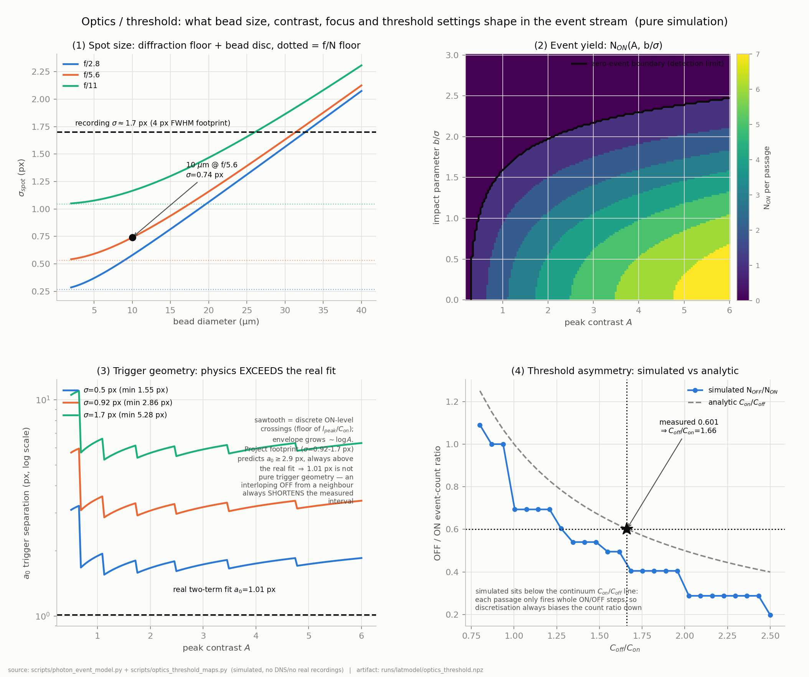

# 이벤트카메라 입자속도계측의 물리 모델

**무엇인가.** 시딩 입자가 초점면을 가로지를 때 이벤트카메라가 실제로 무엇을 기록하는지를 1원리로 세운 모델 — 파동광학, 로그 광수용기, 대비 문턱, 응답지연 — 그리고 그 위에서 이 프로젝트가 써왔거나 검토한 모든 속도추정기를 심어둔 정답 대비로 채점한 시뮬레이션, 마지막으로 이 작업을 촉발한 질문에 대한 정량적 답: *응답지연이 있다면 통계적으로 더했을 때 어느 정도 상쇄되는가.*

아래 내용은 모두 `scripts/photon_event_model.py`의 모델로 시뮬레이션한 것이며, 실데이터를 쓴 절은 그렇게 표시했다. DNS는 실데이터 실험의 최종 R² 채점 외에는 어디에도 쓰이지 않았다.

## 1. 왜 모델이고, 왜 이 모델인가

이 프로젝트의 모든 추정기 — 같은-픽셀 dwell, 이웃 타이밍, 이벤트 삼중항, 프레임 PTV, 관 추적 — 는 결국 **움직이는 비드의 상이 픽셀의 로그 광강도 문턱을 넘는 시각**을 읽는 일로 환원된다. 그 시각들을 피팅이 아니라 유도할 수 있다면, 추정기의 편향은 발견하는 것이 아니라 예측하는 것이 된다.

기존 시뮬레이터는 시간을 50 µs 간격으로 전진시켰다. 여기 질문들에는 치명적이다 — 우리가 측정한 극성 오프셋이 144 µs, 지터가 28.5 µs이므로 스텝 적분기는 연구 대상 그 자체를 양자화해 버린다. 새 모델은 대신 문턱 교차 시각을 **닫힌 형태로** 풀어 **시간 이산화 오차가 0**이다.

핵심은 직선 통과에서 로그 강도가 단봉이라 역함수를 가진다는 점이다. 가우시안 상 스팟 폭 $\sigma$, 최대 대비 $A$일 때, 비드 경로와의 최근접 거리가 $b$인 픽셀은

$$I(t) = I_{bg}\left(1 + A\,e^{-\frac{b^2 + v^2 (t-t_0)^2}{2\sigma^2}}\right), \qquad L(t) = \ln\frac{I(t)}{I_{bg}}$$

를 보고, $L$이 직전 이벤트 레벨보다 $C_{on}$만큼 오르면 ON을, $C_{off}$만큼 내리면 OFF를 낸다. 레벨 $\ell$에 대해 역변환하면

$$u(\ell) = -2\sigma^2 \ln\frac{e^{\ell}-1}{A}, \qquad t = t_0 \pm \frac{\sqrt{u(\ell) - b^2}}{v}$$

모델의 모든 이벤트 시각이 이 식에서 나온다.

## 2. 층 1 — 비드에서 스팟까지 (파동광학)

지름 $d_b$의 비드가 배율 $M$으로 맺는 상은 회절 PSF, 기하학적 비드 원반, 디포커스의 합성곱이다. Airy 패턴의 가우시안 등가 폭을 쓰면

$$\sigma_{spot}^2 = \underbrace{\left(0.42\,\lambda N (1+M)\right)^2}_{\text{회절}} + \underbrace{\left(d_b M/4\right)^2}_{\text{비드 원반}} + \underbrace{\left(\Delta z / 4N\right)^2}_{\text{디포커스}}$$

*그림 1 — (1) f수 3종에 대한 비드 지름 대 스팟 크기, 점선은 회절 바닥; (2) (대비, 충돌계수) 공간의 이벤트 수율과 0-이벤트 검출 경계; (3) 대비에 따른 트리거 분리 $a_0$; (4) 문턱 비대칭에 따른 OFF/ON 개수비. 출처: `scripts/optics_threshold_maps.py` (기반 `scripts/photon_event_model.py`); 산출물 `runs/latmodel/optics_threshold.npz`.*

10 µm 비드를 f/5.6으로 찍으면 $\sigma_{spot} = 0.74$ px, 회절 바닥은 0.27 px(f/2.8)에서 1.05 px(f/11)이다. **우리 기록의 실측 footprint는 $\sigma \approx 1.7$ px(FWHM 4 px)로, 40 µm 비드를 넣어도 위 곡선 어느 것보다 크다.** 즉 우리가 다루는 footprint는 회절이나 비드 크기가 아니라 **디포커스와 모션블러**가 결정하며, 이는 물리적 하한이 아니라 *조정 가능한* 실험 변수라는 뜻이다.

**검출 경계**(그림 1의 2번)가 광학 층의 또 다른 결과다: 표본 공간의 **32.7%에서 이벤트가 0개** 발생한다. 너무 어둡거나 픽셀 중심에서 너무 빗겨간 입자는 부정확하게 측정되는 것이 아니라 **아예 보이지 않는다.** 이것이 표본 밀도의 물리적 천장이며, "입자를 더 검출하자"에 알고리즘이 넘을 수 없는 한계가 있는 이유다.

## 3. 층 2 — 한 번의 통과는 어떻게 생겼는가

*그림 2 — 시뮬레이션된 비드 1회 통과($\sigma = 1.70$ px, $A = 3.0$, $v = 4000$ px/s): 147개 픽셀에서 ON 483개, OFF 231개. 왼쪽은 이벤트 시각 대 픽셀 열 — 통과는 기울어진 띠이고 **그 기울기가 곧 속도**이며, 모든 픽셀에서 ON 로브가 앞서고 OFF 로브가 뒤따른다. 오른쪽은 공간 카운트 이미지. 출처: `scripts/optics_threshold_maps.py`.*

이 그림 한 장이 측정의 전부다. 그림을 읽는 세 가지 방식이 곧 추정기 세 계열이다:

- **띠의 기울기** → 시간면 피팅으로 속도 (이웃 단위)
- **한 픽셀에서 ON 가지와 OFF 가지의 수직 간격** → dwell 추정기 (픽셀 단위)
- **이웃 열들의 첫 이벤트 사이 수평 간격** → 이웃 타이밍 (픽셀쌍 단위)

같은 대상의 세 투영이며, 서로 다른 방식으로 실패한다.

## 4. 모델이 (피팅이 아니라) 유도하는 두 불변량

**개수비.** ON은 로그 상승을 $C_{on}$ 단위로, OFF는 하강을 $C_{off}$ 단위로 세므로

$$\frac{N_{OFF}}{N_{ON}} \to \frac{C_{on}}{C_{off}}$$

실측 0.601은 곧 $C_{off}/C_{on} = 1.66$ — OFF 문턱이 ON보다 66% 높다는 뜻이다. 센서의 기벽처럼 보이던 것이 읽어낼 수 있는 바이어스 설정값이었다.

**트리거 기하.** 첫 ON은 상승 플랭크의 $L = C_{on}$ 지점에서, 첫 OFF는 마지막 ON 레벨보다 $C_{off}$ 아래로 내려가는 정점 직후에 발화한다. 두 지점의 공간 간격은

$$a_0(b) = \sqrt{u(\ell_{last} - C_{off}) - b^2} + \sqrt{u(C_{on}) - b^2}$$

로, 광학과 문턱값에만 의존하며 **비드 지름과는 무관**하고 대비에 로그로 증가한다.

**그리고 이것이 우리 자신의 데이터 해석 하나를 반증한다.** 우리 footprint($\sigma$ = 0.92–1.7 px)에서 예측되는 분리는 $a_0 \ge 2.9$ px, 즉 코어 속도에서 같은-픽셀 dwell이 약 700 µs여야 한다. 실제 기록의 dwell은 약 400 µs이고, 이전 2항 피팅 $D = a_0/v + c$는 $a_0 = 1.01$ px를 냈다. **물리적 최소값이 피팅값을 초과하므로 1.01 px는 트리거 기하가 아니다.** 이웃 입자의 끼어든 OFF는 측정 구간을 항상 *짧게* 만든다 — 그 피팅은 짝맞춤 오염을 흡수하고 있었다. 본 연구의 두 독립 경로(해석적 $a_0$와 시뮬레이션 dwell)가 이에 일치한다.

## 5. 지연 모델과 극성 오프셋의 부호

광수용기 대역폭은 광전류에 비례하므로 지연은 $\tau(\ell) = \tau_0 / (1 + A e^{\cdots})$ — **비드가 픽셀 위에 있을 때 그 픽셀은 더 빠르다.** 픽셀별 고정 오프셋 $L_i$와 이벤트별 지터 $\eta$를 합치면

$$t_{event} = t_{cross} + L_i + \tau(\ell) + \eta$$

이것이 수수께끼 하나를 즉시 푼다. 첫 ON은 언제나 어두운 레벨 $C_{on}$에서 발화한다(느림, $\tau \approx 171$ µs). 첫 OFF는 $\ell_{last} - C_{off}$에서 발화하는데, **강한 통과에서는 밝고**(빠름 → dwell 축소, $c < 0$), **가장자리 통과에서는 어둡다**(느림 → $c > 0$). 시뮬레이션: $A=3$에서 $c = -71$ µs, $A=1$에서 $c = +31$ µs. 불응기는 이를 바꾸지 못한다(0–500 µs 스캔에서 $c$는 −71 µs 유지).

따라서 **측정된 극성 오프셋의 부호는 추정기의 짝맞춤을 통과한 통과들의 대비 분포에 대한 진술**이지, 회로만의 성질이 아니다. 실데이터의 $c = +144$ µs는 우리 dwell 통계가 가장자리의 약한 통과들에 지배된다는 뜻이다.

## 6. 상쇄 법칙 — 지연은 얼마나 평균으로 사라지는가

이것이 출발 질문이었다. 지연을 **P1** 픽셀별 고정 오프셋($\sigma$ = 80 µs, 정적), **P2** 이벤트별 지터(28.5 µs), **P3** 신호 의존 성분으로 나누고, 평균 표본수 $N$에 대해 관측량 4종을 측정했다.

*그림 3 — (a) N에 따른 잔여 편향: O3만 0으로 감쇠; (b) 표준오차는 모두 $1/\sqrt{N}$로 감소; (c) min-선택기 편향 평탄값 대 $\sigma_{FPN}$과 닫힌 형태 이론선. 출처: `scripts/latency_cancellation.py`; 산출물 `runs/latmodel/latency_cancellation.npz`.*

| 관측량 | N=1 편향 | N=10⁴ 편향 | 거동 |
|---|---|---|---|
| O1 같은-픽셀 dwell | −63.9 µs | −58.4 µs | 평평 — $L_i$는 이미 상쇄, 잔여는 P3 |
| O2 고정된 한 픽셀쌍 반복 | +111.3 µs | +113.1 µs | **전혀 감쇠 안 함** (표준오차만 37.7→0.4 µs) |
| O3 여러 다른 픽셀쌍 | −6.8 µs | **−0.2 µs** | $1/\sqrt{N}$로 0에 수렴 |
| O4 여러 쌍 + min-Δt 선택 | −74.1 µs | −72.0 µs | **전혀 감쇠 안 함** |

"지연은 어디서나 같으니 평균에서 사라진다"는 직관은 **네 경우 중 정확히 하나에서 참이고, 두 번째에서는 다른 이유로 참이다**:

- **O1**에서 픽셀의 고정 지연은 *정확히, 즉시* 상쇄된다. ON과 OFF가 같은 픽셀에서 나와 빼지기 때문이다. $N = 1$에서도 성립하며, $\sigma_{FPN}$을 0에서 160 µs로 바꿔도 편향은 3 µs 미만으로 움직였다. **dwell이 지연 면역 채널**이다.
- **O2**에서 차이 $L_j - L_i$는 그 쌍의 *상수*다. 반복은 오차막대만 줄이고 편향은 그대로 둔다. 고정된 쌍으로 측정한 고정 패턴은 평균으로 고칠 수 없다.
- **O3**에서 *다른* 쌍들에 걸친 평균은 작동한다 — $L_j - L_i$의 앙상블 평균이 0으로 간다. 직관의 옳은 버전이 이것이다.
- **O4** — 우리의 실제 추정기 — 에서는 비선형 선택기(후보 중 최소 Δt 채택)가 대칭 지연 노이즈를 **결코 평균되지 않는 편향**으로 바꾼다. 공유 기준점과 독립 후보 3개일 때, 정규분포 3개의 최대값 기댓값으로부터 닫힌 형태가 나온다:

$$\mathrm{bias} = -\frac{3}{2\sqrt{\pi}}\sqrt{\sigma_{FPN}^2 + \sigma_{jitter}^2}$$

몬테카를로 계수 0.845 대 이론값 0.846 — 0.1% 일치. $\sigma_{FPN} = 80$ µs에서 이는 기하값 200 µs 위에 −72 µs 바닥을 만들며, **우리 코어 이웃 타이밍이 지연 바닥이라면 있어야 할 위쪽이 아니라 아래쪽인 180 µs에 앉아 있던 이유**가 바로 이것이다.

이 법칙은 동시에 처방이다: 편향이 $\sqrt{\sigma_{FPN}^2 + \sigma_{jitter}^2}$에 비례하므로, 고정 패턴을 제거해 80 → 28.5 µs로 낮추면 선택 편향이 3배 줄어든다.

## 7. 추정기 6종 대 심어둔 정답

*그림 4 — 이상적 센서에서의 속도별 편향 (a), 실제 센서(고정패턴 지연·지터·문턱 불일치 포함)에서의 편향 (b), 실제 센서에서의 상대 산포 (c). 속도당 독립 통과 200회. 출처: `scripts/estimator_battery.py`; 산출물 `runs/latmodel/estimator_battery.npz`.*

| 추정기 | 이상 편향 | 실제 편향 | 실제 산포 | 평결 |
|---|---|---|---|---|
| E1 같은-픽셀 dwell | −0.5% | ±0.7% | 2.6 → 8.6% | 자기보정 후 무편향 |
| E2 이웃 ON→ON | **0.000** | +2…+6% | 6 → **58%** | 원리적으론 정확, 실전 최약체 |
| E3 교차극성(이전 OFF → 다음 ON) | — | — | — | **구조적으로 불가능** |
| E4 국소 평면 피팅 | −2% | −1…+3% | **3.6–5.3%** | 시뮬레이션 최강 |
| E5 blob 중심 변위 | 저속 파탄 | −3…−7% | 800 px/s에서 124% | 약 2500 px/s 이상만 사용 가능 |
| E6 ON/OFF 중심 분리 | −1 → **+10%** | +10% | 7% | 구조적으로 편향 |

세 결과를 강조한다.

**E3는 불가능하며, 이제 이유를 안다.** 모든 속도에서 200회 중 유효 0회. ON/OFF 트리거 분리가 $a_0 \approx 3.1$ px인데 이웃 간격은 1 px이므로, 픽셀 $i$의 OFF는 픽셀 $i+1$의 ON이 *이미 발화한 뒤*에 나온다 — 시간차의 부호가 100% 뒤집힌다. 노이즈가 많은 게 아니라 기하학적으로 역전돼 있다.

**E2는 종이 위에서 정확하고 하드웨어에서 무너진다.** 이상적 센서에서 편향과 산포가 정확히 0인 이유는 이웃 픽셀이 같은 통과 기하를 공유해 빼지기 때문이다. 실제 센서에서는 5000 px/s에서 산포가 58%에 이른다 — $\Delta t = 1/v$가 80 µs 고정패턴 규모로 줄어들면 패턴이 더 이상 무시될 수 없다. 이 추정기의 정확도는 전적으로 $\sigma_{FPN}/\Delta t$가 정한다.

**E6는 완벽한 센서에서도 편향된다.** ON/OFF 중심 간격은 $v\tau$가 아니며, 센서 결함이 전혀 없어도 편향이 속도 범위에서 −1%에서 +10%로 자란다. 극성차 속도계가 끝내 작동하지 않은 구조적 이유가 이것이다.

## 8. 현실 점검: 시뮬레이션 승자가 실데이터에서 실패하다

평면 피팅(E4)은 이 프로젝트가 한 번도 시도하지 않은 방법이고 본 연구의 발견처럼 보였으므로, 다른 추정기들과 **동일한 3.5초 구간**에서 프로덕션 채점 사슬로 실데이터에 돌렸다.

| 변형 | 샘플/frame | mean R² |
|---|---|---|
| L=5, 창 3000 µs | 22.1 | −2378 |
| L=7, 창 3000 µs | 2.9 | −775 |
| L=7, 진단된 수정(셀당 최신 이벤트, 채움 0.35) | 213.7 | −227 |
| *(참조) 프레임 PTV v9* | 675 | **0.7148** |
| *(참조) 비동기 관 추적 v10* | 449 | 0.5652 |

파국적으로 실패했고, 그 실패가 교훈이다. 축방향 속도의 중앙값은 대체로 맞다(−4691 px/s 대 PTV의 4825, 3% 저편향 — 시뮬레이션이 예측한 범위 안). 그러나 표본별 산포가 시뮬레이션의 3.6–5.3% 대비 **50–70%**이고, 후보 이웃의 82–99.8%가 피팅하기에 너무 비어 있다. 진단된 원인(셀에서 *가장 이른* 이벤트 대신 *가장 늦은* 이벤트를 골라 이웃이 히스토리를 쌓게 함)을 고치자 수율이 73배, 점수가 3.4배 올랐지만 여전히 사용 가능한 어떤 추정기보다도 한참 아래였다.

**원인은 코딩 오류가 아니라 모델링의 공백이다.** 평면 피팅은 국소 시간면이 평면이라고 가정하는데, 이는 확장된 움직이는 에지에 참이고 — 작은 패치를 쓸고 지나가는 **고립된 비드 하나**에도 참이다. 시뮬레이션이 준 것이 정확히 그것이었다. 실제 시딩 유동에서 blob 주변의 국소 시간면은 **원뿔**이고, 이웃 영역은 서로 다른 시각의 여러 입자를 섞는다. 시뮬레이션이 고립 통과로 시험함으로써 이 추정기를 과대평가한 것이다. **장면 밀도를 빠뜨린 시뮬레이션 연구는 추정기 순위를 틀리게 매긴다** — 우리가 가진 가장 깨끗한 실증이다.

## 9. 실제 장비로 이전되는 것

이번 모델링에서 실제 측정을 이미 움직인 부분은 §6이 함의하는 고정패턴 제거다. 이웃 타이밍 산포의 87.4%가 *정적인* 픽셀별 오프셋이므로 이벤트만으로 추정할 수 있다 — 오프셋은 평균 Δt 장의 고공간주파수 성분이고, Δt를 함께 빚는 유동은 매끄럽기 때문이다.

*그림 5 — 실제 기록: 자기지도 방식의 픽셀별 지연 지도(802k 픽셀, 표준편차 42.5 µs)를 빼면 180 µs 코어 타이밍 바닥이 풀린다. 보정된 이웃 Δt는 포화 대신 유동을 따라 휘고, 타이밍 채널의 프로파일 상관은 0.907에서 0.950으로 오른다. 출처: `scripts/latency_calibrate.py`.*

구체적 처방:

1. **dwell은 2항 법칙으로 역변환하라**: $v = a_0/(D - c)$. 그리고 짝맞춤이 정화될 때까지 $a_0$를 기하값이 아니라 오염된 값으로 취급하라 — 우리 광학의 물리적 $a_0$는 2.9 px 이상이다.
2. **교차 픽셀 타이밍에는 단일 극성 사슬만 쓰라.** 교차 극성은 노이즈가 많은 게 아니라 기하학적으로 역전돼 있다(E3).
3. **어떤 타이밍 추정기보다 먼저 고정 패턴을 제거하라.** 선택 편향이 $\sqrt{\sigma_{FPN}^2 + \sigma_{jitter}^2}$에 비례하므로 80 → 28.5 µs는 3배 감소이며, 이벤트만으로 달성 가능하다.
4. **4 px footprint를 조정 가능한 값으로 다루라.** 회절이 아니라 디포커스·모션블러다. 조이면 픽셀당 대비가 오르고 검출 경계가 밀린다.
5. **추정기 순위는 현실적 장면 밀도에서만 매기라.** 평면 피팅 결과가 이 규칙을 협상 불가로 만드는 반례다.

**재현.** `scripts/photon_event_model.py`(모델+자체점검), `scripts/optics_threshold_maps.py`(그림 1–2), `scripts/latency_cancellation.py`(그림 3), `scripts/estimator_battery.py`(그림 4), `scripts/planefit_export.py`(§8), `scripts/latency_calibrate.py`(그림 5). 수치 산출물은 `runs/latmodel/`. 전부 시뮬레이션이며, §8과 그림 5만 실제 pipe Re5300 ON/OFF 기록을 쓰고 DNS는 §8의 최종 R²에서만 열었다.
