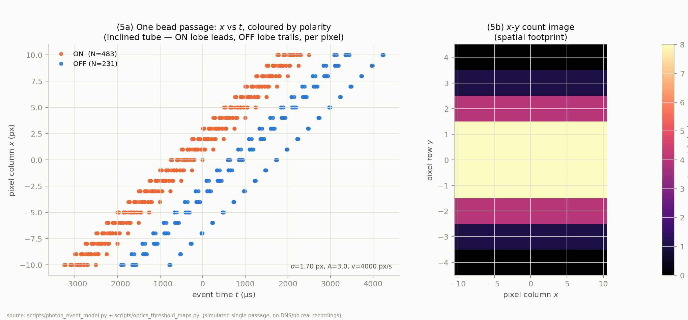
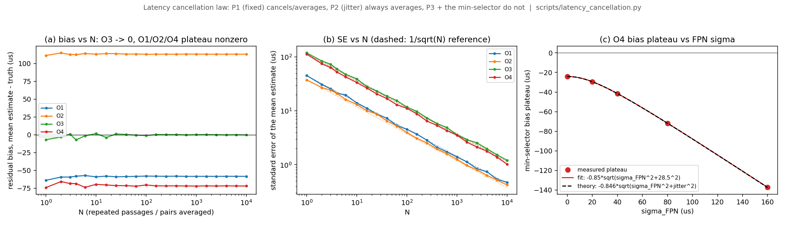
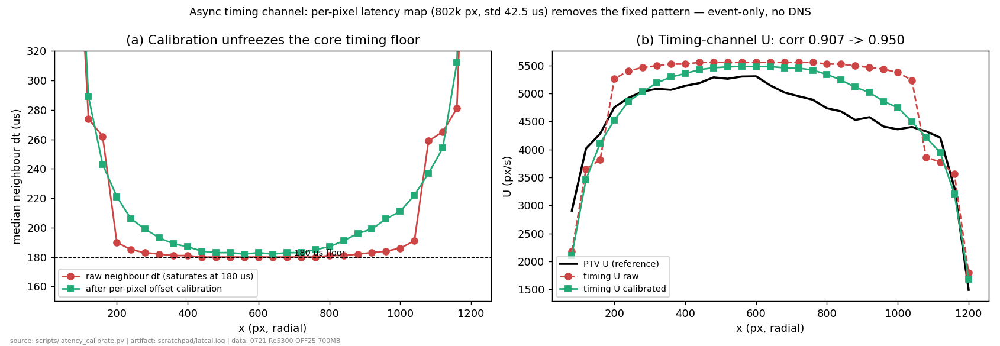

# Event-Camera Physics of Particle Velocimetry

**What this is.** A first-principles model of what an event camera actually records when a seeded particle crosses its focal plane — wave optics, log photoreceptor, contrast thresholds, latency — followed by simulations that score every velocity estimator this project has used or considered against planted ground truth, and a quantitative answer to the question that motivated the work: *if there is a response delay, how much of it cancels when you average?*

Everything below is simulated from the model in `scripts/photon_event_model.py`; the one real-data section is labelled as such. No DNS is used anywhere except the final R² scoring of the real-data experiment.

## 1. Why a model, and why this one

Every estimator in this project — same-pixel dwell, neighbour timing, event triplets, frame PTV, tube tracking — reduces to reading **the times at which a moving bead's image crosses a pixel's log-intensity thresholds**. If those times can be derived rather than fitted, estimator bias becomes predictable instead of discoverable.

The previous simulator stepped time at 50 µs. That is fatal for the questions here: the polarity offset we measure is 144 µs and the jitter 28.5 µs, so a stepped integrator quantises exactly the quantities under study. The new model instead solves the crossing times in closed form, giving **zero time-step error**.

The trick is that along a straight passage the log-intensity is unimodal, so it can be inverted. With a Gaussian image spot of width $\sigma$ and peak contrast $A$, a pixel whose closest approach to the bead's path is $b$ sees

$$I(t) = I_{bg}\left(1 + A\,e^{-\frac{b^2 + v^2 (t-t_0)^2}{2\sigma^2}}\right), \qquad L(t) = \ln\frac{I(t)}{I_{bg}}$$

and the pixel emits an ON event whenever $L$ rises $C_{on}$ above the last event's level, an OFF whenever it falls $C_{off}$ below it. Inverting for the level $\ell$:

$$u(\ell) = -2\sigma^2 \ln\frac{e^{\ell}-1}{A}, \qquad t = t_0 \pm \frac{\sqrt{u(\ell) - b^2}}{v}$$

Every event time in the model comes from that expression.

## 2. Layer 1 — from bead to spot (wave optics)

A bead of diameter $d_b$ at magnification $M$ images to a spot that is the convolution of the diffraction PSF, the geometric bead disc, and defocus. Using the Gaussian-equivalent width of the Airy pattern:

$$\sigma_{spot}^2 = \underbrace{\left(0.42\,\lambda N (1+M)\right)^2}_{\text{diffraction}} + \underbrace{\left(d_b M/4\right)^2}_{\text{bead disc}} + \underbrace{\left(\Delta z / 4N\right)^2}_{\text{defocus}}$$

*Fig 1 — (1) spot size vs bead diameter for three f-numbers, with the diffraction floors dotted; (2) event yield over (contrast, impact parameter) with the zero-event detection boundary; (3) trigger separation $a_0$ vs contrast; (4) OFF/ON count ratio vs threshold asymmetry. Source: `scripts/optics_threshold_maps.py` over `scripts/photon_event_model.py`; artifact `runs/latmodel/optics_threshold.npz`.*

A 10 µm bead at f/5.6 gives $\sigma_{spot} = 0.74$ px; the diffraction floors are 0.27 px (f/2.8) to 1.05 px (f/11). **Our recording's measured footprint is $\sigma \approx 1.7$ px (4 px FWHM) — above every one of those curves even at a 40 µm bead.** The footprint we work with is therefore not set by diffraction or bead size but by defocus and motion blur, which means it is an *adjustable* experimental parameter, not a physical floor.

**The detection boundary** (Fig 1 panel 2) is the other optics-level result: 32.7% of the sampled (contrast, impact-parameter) space produces **zero events**. A particle that is too dim, or passes too far from a pixel centre, is not merely measured poorly — it is invisible. This is the physical ceiling on sample density, and it is why "detect more particles" has limits no algorithm can cross.

## 3. Layer 2 — what one passage looks like

*Fig 2 — one simulated bead passage ($\sigma = 1.70$ px, $A = 3.0$, $v = 4000$ px/s) across a pixel patch: 483 ON and 231 OFF events over 147 pixels. Left, event time vs pixel column: the passage is an inclined band whose slope IS the velocity, with the ON lobe leading and the OFF lobe trailing at every pixel. Right, the spatial count image. Source: `scripts/optics_threshold_maps.py`.*

This figure is the whole measurement in one picture. Three readings of it correspond to three families of estimator:

- **the slope of the band** → velocity from a time-surface fit (per-neighbourhood);
- **the vertical gap between the ON and OFF branch at one pixel** → the dwell estimator (per-pixel);
- **the horizontal offset between neighbouring columns' first events** → neighbour timing (per-pixel-pair).

They are three projections of the same object, and they fail in different ways.

## 4. Two invariants the model derives (not fits)

**Count ratio.** ON events count the log rise in units of $C_{on}$, OFF events count the fall in units of $C_{off}$, so

$$\frac{N_{OFF}}{N_{ON}} \to \frac{C_{on}}{C_{off}}$$

The recording's measured 0.601 therefore implies $C_{off}/C_{on} = 1.66$: the OFF threshold is 66% higher than the ON threshold. What looked like a sensor quirk is a readable bias setting.

**Trigger geometry.** The first ON fires where $L = C_{on}$ on the rising flank; the first OFF fires $C_{off}$ below the last ON level, just past the peak. Their spatial separation is

$$a_0(b) = \sqrt{u(\ell_{last} - C_{off}) - b^2} + \sqrt{u(C_{on}) - b^2}$$

which depends on the optics and the thresholds — **not on the bead diameter** — and grows logarithmically with contrast.

**And this falsifies an earlier reading of our own data.** For our measured footprint ($\sigma = 0.92$–1.7 px) the predicted separation is $a_0 \ge 2.9$ px, i.e. a same-pixel dwell of ~700 µs at core speed. The real recording's dwell is ~400 µs, and the earlier two-term fit $D = a_0/v + c$ returned $a_0 = 1.01$ px. **The physical minimum exceeds the fitted value, so that 1.01 px is not trigger geometry.** An interloping OFF from a neighbouring particle always *shortens* the measured interval; the fit was absorbing pairing contamination. Two independent routes in this study (the analytic $a_0$ and the simulated dwell) agree on this.

## 5. The latency model, and the sign of the polarity offset

Photoreceptor bandwidth scales with photocurrent, so the delay is $\tau(\ell) = \tau_0 / (1 + A e^{\cdots})$ — **the pixel is faster while the bead is on it.** Together with the per-pixel fixed offset $L_i$ and per-event jitter $\eta$:

$$t_{event} = t_{cross} + L_i + \tau(\ell) + \eta$$

This immediately explains a puzzle. The first ON always fires at the dim level $C_{on}$ (slow, $\tau \approx 171$ µs). The first OFF fires at $\ell_{last} - C_{off}$, which is **bright for a strong passage** (fast → the dwell shrinks, $c < 0$) but **dim for a marginal one** (slow → $c > 0$). Simulation: $c = -71$ µs at $A = 3$, $c = +31$ µs at $A = 1$. Refractory period does not change it (scanned 0–500 µs, $c$ stayed at −71 µs).

So the **sign of the measured polarity offset is a statement about the contrast distribution of the passages that survive the estimator's pairing** — not about the circuit alone. Our real-data $c = +144$ µs says our dwell statistic is dominated by marginal, off-centre passages.

## 6. The cancellation law — how much of a delay averages away

This was the motivating question. Decompose the delay into **P1** the per-pixel fixed offset ($\sigma = 80$ µs, static), **P2** per-event jitter (28.5 µs), **P3** the signal-dependent part. Then measure four observables as a function of the number of averaged samples $N$.

*Fig 3 — (a) residual bias vs N: only O3 decays to zero; (b) standard errors all fall as $1/\sqrt{N}$; (c) the min-selector bias plateau vs $\sigma_{FPN}$ with the closed-form theory line. Source: `scripts/latency_cancellation.py`; artifact `runs/latmodel/latency_cancellation.npz`.*

| Observable | bias at N=1 | bias at N=10⁴ | behaviour |
|---|---|---|---|
| O1 same-pixel dwell | −63.9 µs | −58.4 µs | flat — $L_i$ already cancelled; residual is P3 |
| O2 one fixed pixel pair, repeated | +111.3 µs | +113.1 µs | **never decays** (SE does: 37.7 → 0.4 µs) |
| O3 many different pixel pairs | −6.8 µs | **−0.2 µs** | decays to zero as $1/\sqrt{N}$ |
| O4 many pairs + min-Δt selection | −74.1 µs | −72.0 µs | **never decays** |

The intuition "a delay is the same everywhere and averages out" is therefore **true in exactly one of the four cases, and true for a different reason in a second**:

- In **O1** the pixel's fixed delay cancels *exactly and immediately*, because ON and OFF come from the same pixel and subtract. This holds at $N = 1$; ablating $\sigma_{FPN}$ from 0 to 160 µs moved the bias by under 3 µs. Dwell is the delay-immune channel.
- In **O2** the difference $L_j - L_i$ is a *constant* of that pair. More repetitions shrink the error bar and leave the bias untouched. Averaging cannot fix a fixed pattern measured through a fixed pair.
- In **O3** averaging over *different* pairs does work: the ensemble mean of $L_j - L_i$ goes to zero. This is the version of the intuition that is correct.
- In **O4** — our actual estimator — a nonlinear selector (taking the minimum Δt among candidates) converts symmetric delay noise into a bias that **never averages away**. Its closed form, for a shared anchor and 3 independent candidates, follows from the expectation of the maximum of three normals:

$$\mathrm{bias} = -\frac{3}{2\sqrt{\pi}}\sqrt{\sigma_{FPN}^2 + \sigma_{jitter}^2}$$

Monte Carlo returns a coefficient of 0.845 against the theoretical 0.846 — agreement to 0.1%. At $\sigma_{FPN} = 80$ µs this is a −72 µs floor on a 200 µs geometric truth, **which is why our core neighbour timing sat at 180 µs, below the geometric value, rather than above it as a latency floor would require.**

The law is also a prescription: the bias scales with $\sqrt{\sigma_{FPN}^2 + \sigma_{jitter}^2}$, so removing the fixed pattern (80 → 28.5 µs) shrinks the selection bias threefold.

## 7. Six estimators against planted truth

*Fig 4 — bias vs speed on an ideal sensor (a) and with the real sensor's fixed-pattern latency, jitter and threshold mismatch (b); relative scatter under the real sensor (c). 200 independent passages per speed. Source: `scripts/estimator_battery.py`; artifact `runs/latmodel/estimator_battery.npz`.*

| Estimator | ideal bias | real bias | real scatter | verdict |
|---|---|---|---|---|
| E1 same-pixel dwell | −0.5% | ±0.7% | 2.6 → 8.6% | unbiased after self-calibration |
| E2 neighbour ON→ON | **0.000** | +2…+6% | 6 → **58%** | exact in principle, most fragile in practice |
| E3 cross-polarity (prev OFF → next ON) | — | — | — | **structurally impossible** |
| E4 local plane fit | −2% | −1…+3% | **3.6–5.3%** | steadiest in simulation |
| E5 blob centroid displacement | fails at low v | −3…−7% | 124% at 800 px/s | usable only above ~2500 px/s |
| E6 ON/OFF centroid separation | −1 → **+10%** | +10% | 7% | biased by construction |

Three results deserve emphasis.

**E3 is impossible, and now we know why.** Zero of 200 passages produced a valid estimate at any speed. The ON/OFF trigger separation is $a_0 \approx 3.1$ px while the neighbour pitch is 1 px, so the OFF at pixel $i$ always fires *after* the ON at pixel $i+1$ has already fired — the time difference has the wrong sign 100% of the time. The construction is not noisy; it is geometrically inverted.

**E2 is exact on paper and collapses in hardware.** On an ideal sensor its bias and scatter are identically zero, because adjacent pixels share the same passage geometry and it subtracts. On the real sensor its scatter reaches 58% at 5000 px/s: as $\Delta t = 1/v$ shrinks toward the 80 µs fixed-pattern scale, the pattern stops being negligible. The estimator's accuracy is set entirely by $\sigma_{FPN}/\Delta t$.

**E6 is biased even on a perfect sensor.** The ON/OFF centroid gap is not $v\tau$; the bias grows from −1% to +10% across the speed range with no sensor imperfection at all. This is the structural reason the polarity-difference velocimeter never worked.

## 8. Reality check: the simulation winner fails on real data

The plane fit (E4) had never been tried in this project and looked like the discovery of the study, so we ran it on the real recording through the production scoring chain, on the same 3.5 s slice as our other estimators.

| Variant | samples/frame | mean R² |
|---|---|---|
| L=5, window 3000 µs | 22.1 | −2378 |
| L=7, window 3000 µs | 2.9 | −775 |
| L=7, diagnosed fix (latest-event-per-cell, fill 0.35) | 213.7 | −227 |
| *(reference) frame PTV v9* | 675 | **0.7148** |
| *(reference) async tube tracking v10* | 449 | 0.5652 |

It fails catastrophically, and the failure is instructive. The median axial velocity is roughly right (−4691 px/s vs 4825 from PTV, a 3% low bias — inside the range the simulation predicted), but the per-sample scatter is 50–70% against the simulation's 3.6–5.3%, and 82–99.8% of candidate neighbourhoods are too empty to fit. Fixing the diagnosed cause (choosing the *latest* event in each cell rather than the earliest, so the neighbourhood has accumulated history) raised the yield 73-fold and the score by 3.4×, and still left it far below any usable estimator.

**The mechanism is a modelling gap, not a coding error.** A plane fit assumes the local time surface is a plane, which is true for an extended moving edge — and true for a single isolated bead sweeping a small patch, which is exactly what the simulation gave it. In a real particle-seeded flow the local time surface around a blob is a *cone*, and neighbourhoods mix several particles at different times. The simulation flattered the estimator by testing it on isolated passages. **A simulation study that omits scene density will rank estimators wrongly**, and this is the cleanest demonstration of it we have.

## 9. What transfers to the real instrument

The one part of this modelling that has already moved a real measurement is the fixed-pattern removal implied by §6. Since 87.4% of the neighbour-timing spread is a *static* per-pixel offset, it can be estimated event-only — the offset is the high-spatial-frequency part of the mean-Δt field, while the flow that also shapes Δt is smooth.

*Fig 5 — real recording: subtracting a self-supervised per-pixel latency map (802k pixels, std 42.5 µs) unfreezes the 180 µs core timing floor; the calibrated neighbour-Δt now bends with the flow instead of saturating, and the timing-channel profile correlation rises from 0.907 to 0.950. Source: `scripts/latency_calibrate.py`.*

Concretely, the model prescribes:

1. **Invert the dwell with the two-term law**, $v = a_0/(D - c)$, and treat $a_0$ as contaminated rather than geometric until the pairing is cleaned — the physical $a_0$ is ≥ 2.9 px for our optics.
2. **Use single-polarity chains for any cross-pixel timing.** Cross-polarity is geometrically inverted (E3), not merely noisy.
3. **Remove the fixed pattern before any timing estimator**, because the selection bias scales as $\sqrt{\sigma_{FPN}^2 + \sigma_{jitter}^2}$: 80 → 28.5 µs is a threefold reduction, and it is achievable event-only.
4. **Treat the 4 px footprint as adjustable.** It is defocus and motion blur, not diffraction; tightening it raises contrast per pixel and moves the detection boundary.
5. **Rank estimators only at realistic scene density.** The plane-fit result is the counterexample that makes this rule non-negotiable.

**Reproduction.** `scripts/photon_event_model.py` (model + self-check), `scripts/optics_threshold_maps.py` (Figs 1–2), `scripts/latency_cancellation.py` (Fig 3), `scripts/estimator_battery.py` (Fig 4), `scripts/planefit_export.py` (§8), `scripts/latency_calibrate.py` (Fig 5). Numeric artifacts under `runs/latmodel/`. All simulation; the §8 and Fig 5 sections use the real pipe Re5300 ON/OFF recording, with DNS opened only for the final R² of §8.
