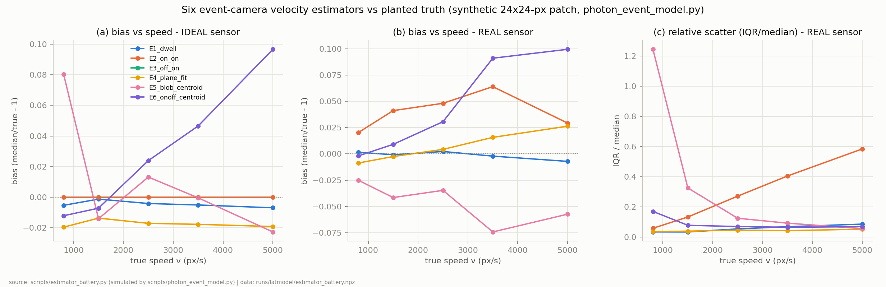
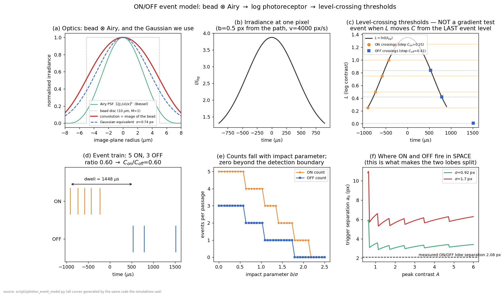
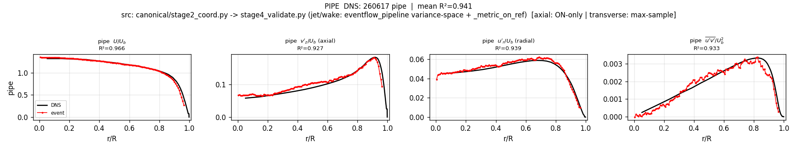

# 채널 법칙: 서로 반대를 요구하는 네 난류 통계량

**이 보고서는.** 2026-08-10 물리 모델 보고서의 후속편이다. 그 보고서는 시딩 입자가 지나갈 때 이벤트카메라가 무엇을 기록하는지를 제1원리로 유도했고, 이번 보고서는 그 처방을 실데이터에 적용한 뒤 일어난 일을 기록한다: 타이밍 루트는 구조적 벽에 부딪혔는데 그 메커니즘을 우리는 처음에 잘못 서술했다가 정정했고; 학습 서브픽셀 추정기는 위치 정확도에서 이기고 난류 통계에서 졌는데 그 이유를 국소화 현미경(SMLM) 문헌이 이미 알고 있으며; 세 종의 스윕이 설계 공간을 지도화하면서 트랙 링킹의 표집 편향을 발견했고; 12개의 실험이 하나의 법칙으로 수렴했다 — 우리가 채점하는 네 통계량($U$, $u_{rms}$, $v_{rms}$, $\overline{uv}$)은 서로 반대되는 요구를 하며, 어떤 단일 추정기 구성도 넷을 동시에 만족시킬 수 없다. 이후 6-에이전트 감사가 캠페인 전체를 검토해 우리 자신의 주장 9건을 정정했다; 아래의 모든 수치는 감사 이후 버전이다.

모든 실데이터 결과는 파이프 Re5300 ON/OFF 레코딩이며, DNS는 최종 R² 채점에서만 열람하고 튜닝·선택에는 절대 쓰지 않는다.

## 1. 어디서 이어받는가

*그림 1 — 직전 보고서의 추정기 배틀: 제1원리 센서 모델 위에서 심어둔 참값에 대해 여섯 속도 추정기를 채점 — 이상 센서(a)와, 실센서의 고정패턴 지연·지터·문턱 비대칭 포함(b, c). 그 보고서는 타이밍 추정기를 위한 다섯 처방으로 끝났다. 이번 보고서는 그 처방을 현금화하는 데서 시작한다. 소스: `scripts/estimator_battery.py` (`scripts/photon_event_model.py` 위); 산출물 `runs/latmodel/estimator_battery.npz`, 그림 `canonical/estimator_battery_fig.png`.*

물리 모델이 남긴 다섯 처방은 이렇다: 서로 *다른* 픽셀쌍 다수로 평균하라(min-선택기 금지), 단일 극성만 쓰라, 픽셀별 고정패턴을 먼저 제거하라, 도착시간 기울기에서 전체 속도 벡터를 역변환하라 $v = \nabla t / |\nabla t|^2$, 샘플 간 공유를 없애라. 다음 단계는 자명했다 — 그 규칙이 처방하는 추정기를 실제로 만들어 실데이터에 돌리는 것.

## 2. 처방 추정기, 평균으로는 움직일 수 없는 벽에 부딪히다

처방 추정기(v12, `scripts/timing_export.py`)는 다섯 규칙을 동시에 구현한다. 처방 자체는 *작동했다*: 이벤트-온리로 추출한 고정패턴 지도가 24.1 µs(dy) / 27.8 µs(dx)의 정적 오프셋을 제거하고, 역류율(0.05%)과 60° 초과 대각도 오차율(0.2%)은 프로젝트 내 전체 추정기 중 최저다. 그런데 난류 통계는 파국적이며 — 그 서명은 꿈쩍하지 않는다:

| 변형 | 샘플/frame | $\|U\|$ (px/s) | $u_{rms}$ | $v_{rms}$ | **v/u 비** | mean R² |
|---|---|---|---|---|---|---|
| v12, 셀 8 px | 347 | 5028 | 1244 | 1426 | **1.15** | −32.2 |
| v12, 셀 16 px | 77 | 5180 | 802 | 961 | **1.20** | −29.0 |
| v12, 셀 28 px | 6.4 | 5313 | 631 | 711 | **1.13** | −48.2 |
| (참조) v9 프레임 PTV | 677 | 4360 | 1151 | 377 | **0.33** | +0.7148 |

평균 셀을 키우면 두 요동 채널이 함께 줄어들지만(1426 → 711 px/s) 횡/축 비는 1.13–1.20에 못박혀 있다 — 물리적 참값(DNS, 검증 전용)은 $v/u \approx 0.4$–0.5이고 변위 루트는 0.33을 잰다. 셀 28에서는 공간 평균이 실제 난류까지 지우기 시작한다($u_{rms}$ 631 < v9의 1151). 어떤 평균화에도 살아남는 비율은 무작위 산포가 아니다; 무언가 계통적인 것이 횡방향 속도를 제조하고 있다.

두 후속 실험이 대안 설명을 닫았다. **짝맞춤 오염 기각**: v13(`scripts/blob_timing_export.py`)은 타이밍 쌍을 *같은* 연결요소 blob의 픽셀로만 제한해 어떤 쌍도 두 입자에 걸칠 수 없게 한다 — 390.6 샘플/frame인데 비율은 1.20 그대로다(mean R² −26.4). **통제 실험이 원인을 확정한다**: 보정된 시뮬레이터에 횡방향 속도가 정확히 0인 순수 축방향 운동을 심고 같은 추정기를 돌리면:

| 심은 노이즈 | 복원된 $v_{rms}$ (참값 0) | v/u |
|---|---|---|
| 없음 | 0 px/s | 0.00 |
| 지터 28.5 µs | 225 px/s | 2.35 |
| 지터 + FPN 80 µs | 411 px/s | 1.42 |
| (실데이터, v13) | 1255 px/s | 1.24 |

타이밍 노이즈만으로 존재하지 않는 횡방향 속도가 수백 px/s씩 만들어진다. 실데이터의 절대 크기가 더 큰 것은 추가 노이즈원(다입자 blob) 때문이지만 지문은 동일하다. 타이밍 루트와 v9의 프로파일 융합도 시도했으나 *오히려 악화*했다(융합 0.5910 < v9 단독 0.6579, 동일 구간): 계통 노이즈는 split-half 분산 추정을 속여 나쁜 소스에 큰 가중치가 실린다 — wake 융합 때와 같은 실패 모드다.

## 3. 정정된 메커니즘: 도착시간 면은 운동의 가로 방향으로 굽어 있다

첫 서술은 원인을 "등방 타이밍 노이즈"로 부르고 방향을 종결 처리했다. **감사가 그 프레이밍을 철회했고(부록 7.1), 정정된 메커니즘이 중요한 이유는 판정을 "불가능"에서 "보정 가능"으로 바꾸기 때문이다.**

*그림 2 — (a) 지나가는 비드의 첫-ON 도착시간 면은 운동 방향으로는 평평하고 가로 방향으로는 굽어 있다; (b) 그로 인한 가로 방향 시간 기울기는 충돌 매개변수에 따라 71–238 µs/px로, 실제 $v_x = 400$ px/s 신호가 만드는 25 µs/px 기울기의 3–10배이며, 무작위 FPN·지터 바닥보다 훨씬 위에 있는 계통량이다; (c) 이것이 유도하는 가짜 $v_x$는 부호 있는 충돌 매개변수에 대해 반대칭: 평균 0, rms 1476 px/s. 소스: `scripts/photon_event_model.py` (ON/OFF 트리거 기하 분석, 커밋 e1c919c); 산출물 `canonical/arrival_curvature_fig.png`.*

기하는 그려 놓으면 단순하다. 비드 경로에서 충돌 매개변수 $b$만큼 떨어진 픽셀은 다가오는 스팟의 로그 강도가 처음 $C_{on}$만큼 오를 때 첫 ON을 낸다 — 그 자취는 직선이 아니라 *호(arc)*다. 경로 축에서 벗어난 픽셀일수록 같은 진행 좌표의 축상 픽셀보다 늦게 발화하므로, 첫-ON 면 $t(x,y)$는 가로 방향 기울기를 갖게 되고, 기울기 역변환 추정기는 그것을 횡방향 속도로 읽는다. 세 성질이 따라 나오며 §2의 측정과 전부 정합한다:

- **노이즈가 아니라 계통량이다** — 실신호 25 µs/px 대비 71–238 µs/px, (제거 후) FPN·지터 바닥 위. 평균화가 v/u 비를 못 움직인 이유다: 결정론적 면은 평균으로 지워지지 않는다.
- **부호 있는 충돌 매개변수에 반대칭이다** — 가짜 $v_x$가 최대 ±2000 px/s인데 평균은 0. 그래서 $U$는 편향시키지 않으면서 $v_{rms}$만 부풀린다: 이 프로젝트의 모든 타이밍 추정기가 보여온 바로 그 지문(거대한 $v_{rms}$, 멀쩡한 평균 유동)이다.
- **결정론적이므로 모델링 가능하다.** 곡률은 모델이 이미 아는 광학과 문턱의 함수다. "종결" 판정은 *무작위* 타이밍 바닥에만 적용되며, 곡률 항은 평면 대신 호를 피팅하면 원리적으로 제거 가능하다. 그 보정은 아직 만들지 않았다 — 향후 타이밍 추정기의 확인된 다음 단계로 기록할 뿐, 성과로 주장하지 않는다.

*그림 3 — 각 극성이 발화하는 위치: (a) 해석적 자취 — 비드가 다가올 때 앞쪽 호에서 ON, 멀어질 때 뒤쪽 호에서 OFF, 그림의 사례에서 트리거 간격 $a_0 = 5.88$ px; (b) 시뮬레이터가 추가 가정 없이 두 호 가족을 재현; (c) 710 µs 창으로 누적하면 두 극성은 유동 방향으로 분리된 두 로브로 퇴적된다 — 실데이터 실측 2.08 px. 소스: `scripts/photon_event_model.py`; 산출물 `canonical/onoff_where_fig.png`.*

*그림 4 — 그림 2–3 배후의 모델 전체: (a) 비드 ⊗ Airy 광학과 가우시안 등가; (b) 통과 중 한 픽셀의 조도; (c) 레벨-교차 문턱 — 이벤트는 로그 강도가 직전 이벤트 레벨에서 $C$만큼 움직일 때 발화하며 기울기 검사가 아니다; (d) 결과 이벤트 열과 dwell; (e) 카운트는 충돌 매개변수에 따라 감소해 검출 경계에서 0이 된다; (f) 두 스팟 폭에 대한 트리거 간격 vs 대비, 실측 2.08 px 로브 간격과 대조. 소스: `scripts/photon_event_model.py`; 산출물 `canonical/onoff_model_fig.png`.*

그림 3c는 감사가 나중에 해소한 불일치도 드러낸다: 시뮬레이터의 로브 간격(그림의 5.68 px) 대 실측 2.08 px. 원인은 스팟 폭의 이중계상이었다 — 실측 4 px FWHM footprint에는 로브 분리와 모션 스미어가 이미 들어 있는데, 그것을 다시 고유 스팟 $\sigma$로 넣었다. 모델 자체의 광학층($\sigma = 0.918$ px)으로는 예측 간격이 3.03 px이고, $\sigma \approx 0.65$–0.92가 실측을 감싼다(상세는 §8). 두-로브 기하 자체 — 혼합 극성 퇴적의 중심이 밝기에 의존한다는 사실 — 는 재보정 후에도 온전하며, §6에서 하중을 받는다.

## 4. 학습 서브픽셀 캠페인: 정밀도는 이겼고, 통계는 졌고, 문헌은 이유를 안다

변위(PTV) 루트의 정확도는 서브픽셀 입자 위치에 달려 있다. 작은 CNN을 보정된 시뮬레이터로 학습했다(사용자의 "8이웃 ON/OFF 정보를 모두 분석" 제안; 격자에서 8이웃 메시지 패싱은 곧 3×3 합성곱이다) — 입력 5채널(ON수, OFF수, 첫 ON, 첫 OFF, dwell), DNS 없음, 실라벨 없음(`scripts/subpixel_net.py`). 시뮬레이션에서는 두 고전 추정기를 모두 이겼다: 학습 0.0363 px vs 닫힌 형태 로그-포물면 피팅 0.0860 px vs 질량중심 0.1404 px.

**이 캠페인의 진짜 산물은 라벨-프리 감사다**(`scripts/subpix_selfsup.py`). 창의 이벤트를 홀/짝 반쪽으로 나눠 각각 위치를 추정하면 $\sigma_{full} = \mathrm{std}(\text{성분별 차이})/2$가 라벨 없이 실데이터 위치오차를 잰다. 이 자가 즉시 도메인갭을 잡아냈고(시뮬 학습 net은 실데이터에서 질량중심 대비 1.45×에 그침, 약속은 2.49×), 3단계 자기지도 미세조정을 이끌었다:

| 단계 | 추가된 손실 | 실데이터 $\sigma$ (px) | 비고 |
|---|---|---|---|
| 질량중심 기준선 | — | 0.1969 | 프로덕션 위치 추정기 |
| 시뮬 학습 net | 지도(시뮬) | 0.1359 | 도메인갭: 1.45× (약속 2.49×) |
| + S1 분할-반쪽 일치 + S2 정수이동 등변성 | 자기지도 | 0.0822 | S1 단독은 상수 출력으로 붕괴; S2가 필수 파트너 |
| + S3 밝기 불변성 | 자기지도 | **0.0650** | 감사의 사각지대를 닫음 |

S3가 존재하는 이유: 분할-반쪽 감사에는 구조적 사각지대가 있다 — 두 반쪽이 창의 밝기를 공유하므로 *카운트 의존* 이동은 보이지 않는다. 밝기 불변성을 직접 검사하자 0.239 px의 밝기 의존 오차가 드러났고 0.0098 px까지 내려갔다. 그 과정에서 프로덕션 질량중심도 정직하게 재측정됐다: 학습 데이터의 두 결함(시뮬에 실퇴적의 방향성 ON/OFF 로브 분리(실측 dy −2.04 px)가 없었던 것; 라벨 정의가 피크 기준 추론과 불일치했던 것)이 질량중심의 참 오차를 가려 왔으며, 그 값은 **0.432 px — 최초 추정의 3배**다.

**그런데도 통계는 나빠졌다.** 풀 레코딩: v15(학습 위치) **0.9243 < v9(질량중심) 0.9354**; 동일 20k 프레임 구간에서 0.9253 vs 0.9290. 진단된 용의자: 3단계 미세조정에도 속도-상관 편향이 살아남았고($r$ = +0.260 → +0.203 → +0.217), net의 질량중심 대비 보정량이 밝기에 강하게 의존한다(6–16 카운트에서 dy +0.57–0.65 px, 28–78 카운트에서 +0.18 px). 파이프에서 밝기는 반경과 상관되므로 이 보정이 반경 프로파일을 왜곡하고, 프레임마다 변하는 보정은 중앙차분에서 속도 노이즈로 전환된다(상수 오프셋은 상쇄되지만 변동 성분은 남는다).

**정직한 판정: 국소화 현미경 문헌이 정확히 이것을 예측한다.** 우리가 쓴 모든 손실 — 분할-반쪽 일치, 이동 등변성, 밝기 불변성 — 은 *자기참조적*이다: 손실 스스로 구성한 두 뷰 사이에서 달라지는 오차만 볼 수 있다. 두 뷰가 공유하는 편향은 구조적으로 보이지 않으며, 속도-상관 편향이 바로 그런 항이다. 확인된 해법은 SMLM이 채택한 것과 같다: **DECODE 스타일의 순방향 모델(render-and-compare) 손실** — 예측한 입자를 보정된 이벤트 시뮬레이터로 다시 렌더링해 기록된 이벤트와 비교하면, 위치가 네트워크 자기 출력의 복사본이 아니라 물리에 접지된다. 캠페인이 재개된다면 이것이 지정 경로다; 그와 무관하게 남는 자산은 라벨-프리 감사 자체, 2.4–3× 위치 추정기(`models/subpixnet_{ft,dirft,peakft}_v1.pt`), 프로덕션 질량중심의 정정된 0.432 px 수치다.

## 5. 설계 공간을 지도화한 세 스윕 — 그리고 그중 하나가 표집 편향을 발견하다

### 5.1 창 길이: 카운트가 정하는 바닥

0.065 px 위치오차는 더 짧은 창을 살 수 있음을 시사했다(속도에 대한 위치 노이즈 기여는 $\sigma\sqrt{2}/(2\,\mathrm{WIN})$ — 710 µs에서 겨우 65 px/s, $u_{rms}$의 6%). 창을 스윕하면(동일 채점 사슬, `scripts/ptv_export_v9.py`의 `PTV_WIN_US`):

| 창 | 검출/frame | 코어 $u_{rms}$ (px/s) | 코어 $v_{rms}$ | U R² | $u_{rms}$ R² | mean R² |
|---|---|---|---|---|---|---|
| 710 µs | 854 | 1069 | 422 | 0.9631 | 0.9120 | **0.9271** |
| 500 µs | 752 | 1359 | 561 | 0.9641 | 0.8594 | 0.8949 |
| 355 µs | 660 | 1592 | 751 | **0.9686** | −0.1937 | 0.6128 |

가설은 절반 맞았다. $U$는 창을 줄일수록 단조 개선한다 — 시간 필터링이 실재하고 평균 유동은 그 완화의 이득을 받는다는 직접 증거다. 그러나 요동 채널은 붕괴한다: 원시 $u_{rms}$가 1069 → 1592 px/s로 부풀고(위치 노이즈 지배의 서명), 역산 위치오차는 0.065 px(710 µs) → 약 0.59 px(355 µs). **검출당 이벤트 수 절반이 위치오차 9배 악화를 낳았다** — $1/\sqrt{N}$보다 훨씬 가파른, 검출 자체가 흔들리는 ~6 이벤트 근방의 문턱 효과다. 창은 자유 파라미터가 아니라 이벤트 밀도가 정하는 값이다. 710 µs가 유지된다(평균 유동만 원하면 355 µs가 이긴다).

### 5.2 기준선: 횡방향 채널은 저역통과되고 축방향은 아니다

중앙차분 기준선 스윕(차감 후 R², 동일 19,952 프레임):

| 짝짓기 | 기준선 | U | $u_{rms}$ | $v_{rms}$ | $\overline{uv}$ | mean |
|---|---|---|---|---|---|---|
| 서로소 쌍 | 0.71 ms | 0.9589 | **−14.08** | 0.6061 | 0.2652 | −3.06 |
| **중앙차분 B=1** | **1.42 ms** | 0.9631 | 0.9120 | **0.9099** | **0.9236** | **0.9271** |
| 중앙차분 B=2 | 2.84 ms | **0.9660** | 0.9210 | 0.8352 | 0.8585 | 0.8952 |
| 중앙차분 B=3 | 4.26 ms | 0.9649 | **0.9218** | 0.8184 | 0.8018 | 0.8767 |

채널마다 최적이 다르다. 기준선을 늘리면 $U$와 $u_{rms}$는 좋아지고(노이즈가 $1/\tau$로 감소; 축방향 요동은 큰 스케일이라 시간 평균에 살아남음) $v_{rms}$·$\overline{uv}$는 나빠진다(횡방향 요동은 작은 스케일이라 먼저 지워짐). 창·기준선·짝짓기를 모두 스윕한 결과, 프로덕션 설정(710 µs + 2창 중앙차분)이 세 축 모두에서 잘 정의된 국소 최적임이 확인됐다. 스윕은 진짜 병목도 재특정했다: $\mathrm{Var}(\tau)$의 $1/\tau^2$ 감쇠는 실효 *프레임 간* 위치 변동 약 1.07 px를 함의한다 — 창 내 0.065 px의 16배. 다음 표적은 서브픽셀 정밀도가 아니라 검출 재현성과 링킹 품질이다.

시간 저역통과 자체에 대해서는 감사의 정정 하나(부록 7.2): 2창 평균이 참 분산의 $2(1-\rho) = 0.66$만 남긴다는 주장은 틀린 공식이었다. 실측 $\rho(1.42\,\mathrm{ms}) = 0.67$에 대한 몬테카를로 답은 보존율 0.767 — 실제 손실은 약 12–23%로, 원래 서술 "34%"의 절반 수준이다. 이와 정합하게, 신호 필터링 $V_0(1-c\tau)$와 잔여 노이즈 $N/\tau^2$를 *모양*으로 분리하는 3-기준선 2성분 외삽(`scripts/baseline_extrap.py`; 채널 선택을 DNS 추세로 하는 방안은 DNS 선택이므로 기각하고 이벤트-온리 판별자로 대체)은 거의 아무것도 회수하지 못한다: mean 0.9273 vs 0.9271. 단순 단일 선형 외삽은 오히려 노이즈를 되살렸다($u_{rms}$ −0.012; 심은 데이터 검사에서 회수 가능 신호를 1.27배 과대추정). 필터링 계통은 실재하지만 이 레코딩에서는 작다.

### 5.3 링킹 게이트: 조건부 표집 편향의 발견

오연결(링크율 0.86)이 1.07 px 프레임 간 변동의 유력 원인이므로 링커에 이벤트-온리 자격 둘을 추가했다: 질량 일치도($|\log(m_j/m_i)|$ 비용)와 상호 최근접(양방향 합의). 이벤트-온리 심판은 원시 $u_{rms}$다($1/\tau^2$ 성분이 곧 프레임 간 위치 변동이므로):

| 링커 | 링크율 | 원시 $u_{rms}$ | 원시 $v_{rms}$ | U | $u_{rms}$ | $v_{rms}$ | $\overline{uv}$ | mean R² |
|---|---|---|---|---|---|---|---|---|
| 그리디(프로덕션) | 0.86 | 1069 | 422 | 0.9631 | **0.9120** | **0.9099** | **0.9236** | **0.9271** |
| 상호 최근접 | 0.84 | 848 (−21%) | 293 (−31%) | **0.9664** | 0.8726 | 0.9027 | 0.8977 | 0.9099 |
| 질량+상호 | 0.83 | **712 (−33%)** | 298 | 0.9655 | 0.8779 | 0.8807 | 0.8548 | 0.8947 |

오연결은 실재하고 제거 가능하다 — 위치 노이즈가 최대 33% 줄었다. **그런데도 R²는 단조 하락했다.** 메커니즘은 조건부 표집 편향이다: 게이트가 기각하는 입자는 겉모습이 변하거나 예측 위치에서 벗어나는 입자인데, 그것이 바로 *요동이 큰* 입자다. 게이트가 지우는 노이즈는 split-half 차감이 이미 처리하고 있었으므로 게이트가 얻는 것은 없고, 버려진 신호는 돌아오지 않는다. 순수 기하 검사인 상호 최근접조차 편향된다(요동이 클수록 양방향 합의가 더 자주 깨진다). 규칙으로 승격: **링킹 단계에서 표본을 버리는 모든 자격 검사는 측정량과 상관된다.** 편향 없는 대안은 모호한 대응을 버리지 않고 가중치로 유지하는 것이다.

### 5.4 Sinkhorn 소프트 할당: 문헌의 답, 우리 채점 사슬에 막히다

그 대안을 구현했다 — 링커에 엔트로피 정규화 최적수송(GotFlow3D/GOTrack 배후 메커니즘). 점수는 0.6833인데 94 샘플/frame에서다: 소프트 가중치가 하드 트랙 연속성을 깨기 때문이다. 감사(부록 7.9)는 이 판정을 **일부 채점 사슬 아티팩트**로 표기한다: 프로덕션 사슬의 tmin 필터와 이벤트별 공간합의 융합(window = 32)이 샘플/frame에 민감해, 저밀도 export는 물리가 아니라 사슬에 의해 벌점을 받을 수 있다. 같은 표기가 v11 기각에도 적용된다. 두 판정 모두 밀도-등화 재채점이 생길 때까지 *보류*이며, 소프트 할당을 지지하는 조건부-표집-편향 논증 자체는 독립적으로 성립한다.

## 6. 채널 법칙

동일 19,952 프레임, 차감 후 R², 12개 실험:

| 실험 | U | $u_{rms}$ | $v_{rms}$ | $\overline{uv}$ | mean |
|---|---|---|---|---|---|
| 기준선 (v16: 양극성, 8 px 게이트, 그리디) | 0.9631 | 0.9120 | **0.9099** | **0.9236** | **0.9271** |
| 공선성 게이트 1 px (삼중항 판정 이식) | 0.9654 | 0.9168 | 0.8826 | 0.8247 | 0.8974 |
| 공선성 게이트 2 px | 0.9651 | 0.8754 | 0.8883 | 0.8721 | 0.9002 |
| ON-only 퇴적 | **0.9661** | **0.9272** | 0.8170 | 0.7514 | 0.8654 |
| dense t20 (최대 표본 퇴적) | 0.9518 | 0.8074 | **0.9386** | **0.9326** | 0.9076 |
| Sinkhorn 소프트 할당 | 0.8792 | 0.6218 | 0.8273 | 0.4048 | 0.6833 |

**법칙:** *표본을 줄이거나 걸러내는 조작은 $U$·$u_{rms}$를 (약간) 올리고 $v_{rms}$·$\overline{uv}$를 (크게) 내린다; 표본을 늘리는 조작은 반대다.* §5.3의 게이트, §5.1의 창 단축, 극성 제한, 소프트 할당 — 전부 같은 부호였다. **네 채널은 반대 요구를 한다: 축방향 쌍은 깨끗한 표본을, 횡방향 쌍은 많은 표본을 원한다.**

법칙을 정직하게 지키는 예외 2건(부록 7.8): 공선성 2 px 게이트는 $u_{rms}$를 *내렸고*(0.9120 → 0.8754), Sinkhorn은 $U$까지 내렸다. 법칙은 "대체로 성립"이며 절대칙이 아니다 — Sinkhorn 행에는 §5.4의 밀도 유보도 함께 붙는다.

법칙에는 물리적 독법이 있다. Benedict & Gould의 수렴 공식은 전단응력의 상대 불확도를 $\sqrt{1+\rho^2}/(\rho\sqrt{N_{eff}})$로 주는데, 파이프에서는 속도상관계수 $\rho_{uv}$가 작아 $\overline{uv}$가 가장 표본에 굶주린 채널이다; 따라서 횡방향 잔차의 상당 부분은 **편향이 아니라 수렴 부족**이며 — 편향을 잡겠다고 표본을 깎을 때마다 그쪽을 더 굶겼다. 축방향에서는 ON-only 퇴적이 두 축방향 채널을 모두 이긴 것이 혼합 극성 편향의 실재를 확증한다: ON·OFF 로브가 유동 방향으로 2.08 px 갈라져 있어(그림 3c) 합산 중심이 개수비에 따라 움직인다 — 다만 ON-only는 이벤트의 38%를 잃고, 그 비용을 횡방향 채널은 감당하지 못한다.

## 7. 채널 분할 합성 — 탐색적(exploratory)

네 채널이 서로 다른 추정기를 원한다면, 각 채널이 자기 최적 소스를 취하게 하자: 축방향($U$, $u_{rms}$)은 ON-only 퇴적에서, 횡방향($v_{rms}$, $\overline{uv}$)은 dense 최대-표본 퇴적에서.

*그림 5 — 19,952 프레임에서 채널 분할 합성 vs DNS: $U$ 0.966, 축방향 요동 0.927(ON-only 소스), 반경방향 요동 0.939, 전단응력 0.933(최대-표본 소스); mean R² 0.941 vs 단일 구성 기준선 0.9271. 소스: `scripts/channel_split.py`, 채점은 `canonical/stage2_coord.py` → `stage4_validate.py`; 산출물 `canonical/pipe5300_channel_split_profile.png`.*

**이 결과는 감사에 따라 탐색적(EXPLORATORY)으로 표기한다(부록 7.5).** 배정의 물리 근거는 진짜이며 이벤트-온리다(유동 방향 로브 분리는 극성 오염을 축방향 채널로 지목하고, Benedict-Gould는 표본 수를 횡방향 채널로 지목한다) — 그러나 배정은 §6의 DNS 채점 표의 채널별 승자를, *같은 프레임 구간에서*, 정확히 그대로 반영하기도 한다. 패턴을 발견한 데이터에서 평가한 규칙은 아무것도 증명하지 못한다. 정직한 시험 — 패턴 발견에 쓰이지 않은 풀 레코딩 — 은 이 글을 쓰는 시점에 실행 중이며 결과 대기 상태다; 0.9411은 그 결과가 나올 때까지 잠정치다.

## 8. 감사: 9건의 정정, 전부 반영

6-에이전트 리뷰가 캠페인 전체를 리포지토리와 대조해 9건의 발견을 검증했다; 전부 위 본문과 `METHODS.md` 부록 7에 반영돼 있다. 이를 공개적으로 제시하는 이유는, 자기 주장을 철회할 수 있는 캠페인이 그러지 못하는 캠페인보다 가치 있기 때문이다:

| # | 무엇이 틀렸나 | 정정 |
|---|---|---|
| 1 | "등방 타이밍 노이즈 → 타이밍 방향 종결" | 메커니즘은 *횡방향 도착면 곡률*: 계통적·반대칭, 71–238 µs/px — 결정론적이므로 모델링 가능(§3). "종결"은 무작위 바닥에만 적용 |
| 2 | $2(1-\rho)$ 분산 보존 공식 | 틀린 공식; MC 보존율 0.767, "34% 손실"은 약 2배 과장(실제 ~12–23%) |
| 3 | 시뮬 로브 간격 5.68 px vs 실측 2.08 px | 스팟 폭 이중계상: 4 px FWHM footprint에 로브 분리+스미어가 이미 포함. 광학층은 $\sigma = 0.918$을 주며 $\sigma \approx 0.65$–0.92가 실측과 정합. net 학습 범위 $\sigma \in U(0.9, 2.2)$는 상향 편향(학습된 모든 net에 유전) |
| 4 | $C_{off}/C_{on} = 1.66$ | 이산화 비일관: 이산화 시뮬레이터에 1.66을 넣으면 OFF/ON 비 0.495가 나와 실측 0.601과 불일치. **1.30**으로 재보정(0.604 산출), $\sigma_{spot} = 0.75$ |
| 5 | 채널 분할의 "사전(a priori)" 주장 | **탐색적**으로 재분류; 풀 레코딩 검증 대기(§7) |
| 6 | 정의 없이 쓰인 "v16" | 정의: 양극성 퇴적, thr 0.30/mass 3.0, 8 px 그리디 링킹, S3 서브픽셀 위치; 19,952 프레임 0.9271. 같은 구간에서 v9가 0.9290 — v16은 참조 기준선이지 최고가 아님 |
| 7 | 서로 다른 두 수치가 모두 "3.5 s v9"로 표기(0.7148 vs 0.6579) | 서로 다른 프레임 구간; 구간 명시 없는 슬라이스 수치는 비교 불능. 규칙: 표는 프레임 범위를 명기 |
| 8 | 채널 법칙의 절대칙 서술 | 예외 2건 기록(§6); 법칙은 "대체로 성립" |
| 9 | 저밀도 기각(v11, Sinkhorn) | 일부 채점 사슬 아티팩트(stage15 밀도 민감성); 판정을 밀도-등화 재채점 대기로 재분류 |

모델 상수는 `scripts/photon_event_model.py`에서 정정됐고(자체점검이 이제 실측 0.601 비를 재현), 영향받은 주장은 `scripts/ptv_export_v9.py`와 `scripts/channel_split.py`의 코드 내 주석으로도 정정돼 있다.

## 9. 문헌 속의 위치, 그리고 다음 단계

네 건의 문헌 조사(이벤트카메라 유속계측; PTV/PIV 편향 보정; LDV 통계; SMLM 국소화)가 캠페인의 위치를 정한다:

- **우리가 찾은 범위에서, $\{U, u_{rms}, v_{rms}, \overline{uv}\}$ 전체를 DNS에 대해 검증한 이벤트카메라 유속계측 논문은 없다.** 발표된 이벤트카메라 PIV/PTV는 평균장 또는 정성적 유동 구조를 보고한다; 기준 대비로 채점된 2차 통계는 이 프로젝트의 빈 땅으로 보인다.
- **연관 게이트가 난류 통계에 가하는 조건부 표집 편향(§5.3)은 미발표로 보인다** — 가장 가까운 선행은 LDV 속도 편향 문헌인데 그것은 도착률 가중의 문제이지 트랙 링킹 수락의 문제가 아니다. 이는 그 자체로 기여 후보다.
- **보정 도구함은 인접 분야에 이미 있다.** LDV는 표집 편향에 대한 체류시간 가중(McLaughlin-Tiederman)을 공급하고; SMLM은 우리에게 필요한 sim-to-real 규율을 공급한다: DECODE 스타일 render-and-compare 손실(§4의 해법), 라벨-프리 해상도 척도인 Fourier ring correlation(분할-반쪽 감사의 사촌), 원리적 정밀도 바닥을 주는 CRLB 분석.

**확정 결과들:** 프로덕션은 여전히 v9, 풀 레코딩 0.9354; 채널 법칙과 그 예외 2건; 링커의 표집 편향 규칙; 라벨-프리 위치 감사와 0.065 px 추정기; 정정된 센서 모델. **다음 단계, 순서대로:** (1) 이미 실행 중인 풀 레코딩 채널 분할 검증 — §7이 진짜 이득인지를 이것이 결정한다; (2) Sinkhorn을 정직하게 재시도할 밀도-등화 재채점; (3) 아티팩트가 결정론적임이 밝혀진 이상, 타이밍 루트의 도착 곡률 보정; (4) 학습 위치 캠페인이 재개된다면 DECODE 스타일 순방향 모델 손실.

**재현.** v12: `scripts/timing_export.py`; v13 + 통제 실험: `scripts/blob_timing_export.py`; 모델 그림: `scripts/photon_event_model.py`; 서브픽셀: `scripts/subpixel_net.py`, `scripts/subpix_selfsup.py` (모델 `models/subpixnet_{ft,dirft,peakft}_v1.pt`); 스윕: `scripts/ptv_export_v9.py` (창/기준선/게이트 env 노브), `scripts/baseline_extrap.py`; 채널 분할: `scripts/channel_split.py`. 사실 기록: `METHODS.md` 부록 3–7 (부록 7 = 감사 정정). 모든 실데이터 수치는 파이프 Re5300 레코딩이며 DNS는 최종 R²에서만 열람.
