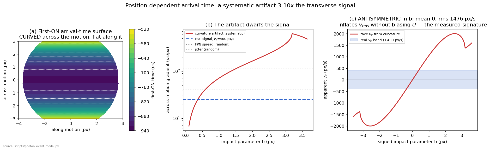
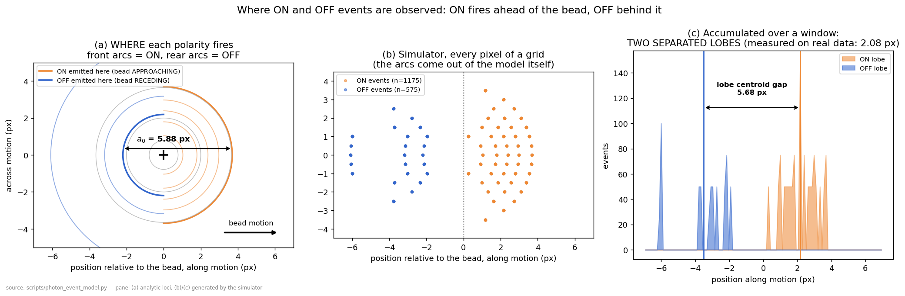

# The Channel Law: Four Turbulence Statistics with Opposing Needs

**What this is.** The continuation of the 2026-08-10 physics-model report. That report derived what an event camera records when a seeded particle crosses it; this one follows those prescriptions into real data and reports what happened next: the timing route hits a structural wall whose mechanism we first mis-stated and then corrected; a learned sub-pixel estimator wins on position accuracy and loses on turbulence statistics, for a reason the localization-microscopy literature already names; three sweeps map the design space and expose a sampling bias in track linking; and twelve experiments converge on one law — the four statistics we score ($U$, $u_{rms}$, $v_{rms}$, $\overline{uv}$) make opposing demands, and no single estimator configuration can serve them all. A six-agent audit then reviewed the whole campaign and corrected nine of our own claims; every number below is the post-audit version.

All real-data results are on the pipe Re5300 ON/OFF recording; DNS is opened only for final R² scoring, never for tuning or selection.

## 1. Where this picks up

*Fig 1 — the previous report's estimator battery: six velocity estimators against planted truth on the first-principles sensor model, on an ideal sensor (a) and with the real sensor's fixed-pattern latency, jitter, and threshold mismatch (b, c). It ended with five prescriptions for a timing estimator. This report begins by cashing them in. Source: `scripts/estimator_battery.py` over `scripts/photon_event_model.py`; artifact `runs/latmodel/estimator_battery.npz`, figure `canonical/estimator_battery_fig.png`.*

The physics model left five concrete prescriptions for timing-based velocimetry: average over many *different* pixel pairs (never through a min-selector), use a single polarity, remove the per-pixel fixed pattern first, invert the full velocity vector from the arrival-time gradient $v = \nabla t / |\nabla t|^2$, and keep samples share-free. The obvious next step was to build the estimator those rules prescribe and run it on the real recording.

## 2. The prescribed timing estimator hits a wall that averaging cannot move

The prescribed estimator (v12, `scripts/timing_export.py`) implements all five rules at once. The prescriptions themselves *worked*: the fixed-pattern map it extracts event-only removes 24.1 µs (dy) / 27.8 µs (dx) of static offset, and its flow-reversal rate (0.05%) and large-angle error rate (0.2% beyond 60°) are the best of any estimator in the project. And its turbulence statistics are catastrophic — with a signature that does not budge:

| Variant | samples/frame | $\|U\|$ (px/s) | $u_{rms}$ | $v_{rms}$ | **v/u ratio** | mean R² |
|---|---|---|---|---|---|---|
| v12, cell 8 px | 347 | 5028 | 1244 | 1426 | **1.15** | −32.2 |
| v12, cell 16 px | 77 | 5180 | 802 | 961 | **1.20** | −29.0 |
| v12, cell 28 px | 6.4 | 5313 | 631 | 711 | **1.13** | −48.2 |
| (ref) v9 frame PTV | 677 | 4360 | 1151 | 377 | **0.33** | +0.7148 |

Growing the averaging cell shrinks both fluctuation channels together (1426 → 711 px/s) but the transverse-to-axial ratio stays pinned at 1.13–1.20 — while the physical truth (DNS, validation-only) is $v/u \approx 0.4$–0.5 and the displacement route measures 0.33. At cell 28 the spatial averaging even starts erasing real turbulence ($u_{rms}$ 631 < v9's 1151). A ratio that survives every amount of averaging is not random scatter; something systematic manufactures transverse velocity.

Two follow-ups closed the alternative explanations. **Pairing contamination is rejected**: v13 (`scripts/blob_timing_export.py`) restricts timing pairs to pixels of the *same* connected-component blob, so no pair can straddle two particles — 390.6 samples/frame, and the ratio stays at 1.20 (mean R² −26.4). **The controlled experiment then pins the cause**: plant a purely axial motion — transverse velocity exactly zero — in the calibrated simulator and run the same estimator:

| Planted noise | recovered $v_{rms}$ (truth: 0) | v/u |
|---|---|---|
| none | 0 px/s | 0.00 |
| jitter 28.5 µs | 225 px/s | 2.35 |
| jitter + FPN 80 µs | 411 px/s | 1.42 |
| (real data, v13) | 1255 px/s | 1.24 |

Timing noise alone fabricates hundreds of px/s of transverse velocity that does not exist. The real recording's larger absolute value comes from additional noise sources (multi-particle blobs), but the fingerprint is identical. A profile-level fusion of the timing route with v9 was also tried and *hurt* (fused 0.5910 < v9 alone 0.6579 on the same slice): systematic noise fools the split-half variance estimate, so the bad source gets the large weight — the same failure mode fusion showed on the wake.

## 3. The corrected mechanism: the arrival-time surface is curved across the motion

Our first write-up called the culprit "isotropic timing noise" and declared the direction closed. **The audit retracted that framing (appendix 7.1), and the corrected mechanism matters because it changes the verdict from "impossible" to "correctable".**

*Fig 2 — (a) the first-ON arrival-time surface of a passing bead is flat along the motion and curved across it; (b) the resulting across-motion time gradient, 71–238 µs/px depending on impact parameter, against the 25 µs/px gradient a real $v_x = 400$ px/s signal produces — the artifact is 3–10× the signal, and it is systematic, sitting far above the random FPN and jitter floors; (c) the fake $v_x$ it induces is antisymmetric in the signed impact parameter: mean zero, rms 1476 px/s. Source: `scripts/photon_event_model.py` (ON/OFF trigger-geometry analysis, commit e1c919c); artifact `canonical/arrival_curvature_fig.png`.*

The geometry is simple once drawn. A pixel at impact parameter $b$ from the bead's path sees its first ON when the approaching spot's log-intensity first climbs $C_{on}$ — and that locus is an *arc*, not a line. Pixels off the path axis fire later than the on-axis pixel at the same along-motion coordinate, so the first-ON surface $t(x,y)$ carries an across-motion gradient that a gradient-inverting estimator reads as transverse velocity. Three properties follow, and all match the measurements of §2:

- **It is systematic, not noise** — 71–238 µs/px against a 25 µs/px real signal, above the FPN (after removal) and jitter floors. That is why averaging never moved the v/u ratio: you cannot average away a deterministic surface.
- **It is antisymmetric in the signed impact parameter** — fake $v_x$ up to ±2000 px/s with mean zero. So it inflates $v_{rms}$ without biasing $U$: exactly the fingerprint (huge $v_{rms}$, decent mean flow) every timing estimator in this project has shown.
- **It is deterministic, hence modellable.** The curvature is a function of the optics and thresholds the model already knows. The "direction closed" verdict applies only to the *random* timing floor; the curvature term is in principle removable by fitting arcs instead of planes. That correction has not been built — it is recorded as the identified next step for any future timing estimator, not claimed.

*Fig 3 — where each polarity fires: (a) analytic loci — ON on leading arcs as the bead approaches, OFF on trailing arcs as it recedes, trigger separation $a_0 = 5.88$ px for the plotted case; (b) the simulator reproduces the two arc families with no extra assumptions; (c) accumulated over a 710 µs window the two polarities deposit as two separated lobes along the flow — measured on the real recording at 2.08 px. Source: `scripts/photon_event_model.py`; artifact `canonical/onoff_where_fig.png`.*

*Fig 4 — the model behind Figs 2–3, end to end: (a) bead ⊗ Airy optics and the Gaussian equivalent; (b) irradiance at one pixel during a passage; (c) level-crossing thresholds — an event fires when log-intensity moves $C$ from the last event's level, not a gradient test; (d) the resulting event train and dwell; (e) counts fall with impact parameter to a hard detection boundary; (f) trigger separation vs contrast for two spot widths against the measured 2.08 px lobe separation. Source: `scripts/photon_event_model.py`; artifact `canonical/onoff_model_fig.png`.*

Fig 3c also flags a discrepancy that the audit later resolved: the simulator's lobe gap (5.68 px as plotted) versus the measured 2.08 px. The cause was a double-count of the spot width — the measured 4 px FWHM footprint already contains lobe separation and motion smear, and we had fed it back in as the intrinsic spot $\sigma$. With the model's own optics layer ($\sigma = 0.918$ px) the predicted gap is 3.03 px, and $\sigma \approx 0.65$–0.92 brackets the measurement (details in §8). The two-lobe geometry itself — the fact that mixed-polarity deposits have a brightness-dependent centroid — survives the recalibration intact, and it becomes load-bearing in §6.

## 4. The learned sub-pixel campaign: precision won, statistics lost, and the literature knows why

The displacement (PTV) route's accuracy rests on sub-pixel particle positions. We trained a small CNN (the user's "analyze all 8-neighbour ON/OFF information" proposal; on a grid, 8-neighbour message passing *is* a 3×3 convolution) on the calibrated simulator — 5 input channels (ON count, OFF count, first-ON, first-OFF, dwell), no DNS, no real labels (`scripts/subpixel_net.py`). In simulation it beat both classical estimators: learned 0.0363 px vs a closed-form log-paraboloid fit 0.0860 px vs the mass centroid 0.1404 px.

**The campaign's real product is the label-free audit** (`scripts/subpix_selfsup.py`). Split a window's events into odd/even halves, estimate the position from each half, and $\sigma_{full} = \mathrm{std}(\text{per-component difference})/2$ measures the real-data position error with no labels at all. It immediately caught the domain gap (the sim-trained net was only 1.45× better than the centroid on real data, not the promised 2.49×), and drove a three-stage self-supervised fine-tune:

| Stage | loss added | real-data $\sigma$ (px) | note |
|---|---|---|---|
| centroid baseline | — | 0.1969 | the production position estimator |
| sim-trained net | supervised (sim) | 0.1359 | domain gap: 1.45× vs promised 2.49× |
| + S1 split-half consistency + S2 shift equivariance | self-supervised | 0.0822 | S1 alone collapses to constant output; S2 is the mandatory partner |
| + S3 brightness invariance | self-supervised | **0.0650** | closes the audit's blind spot |

S3 exists because the split-half audit has a structural blind spot: both halves share the window's brightness, so a *count-dependent* shift is invisible to it. Testing invariance under brightness directly exposed a 0.239 px brightness-dependent error and drove it to 0.0098 px. Along the way the audit also re-measured the production centroid honestly: two training-data defects (the sim lacked the real deposit's directional ON/OFF lobe split, measured dy −2.04 px; and the label definition mismatched the peak-anchored inference) had hidden the centroid's true error, which is **0.432 px, three times the first estimate**.

**And yet the statistics got worse.** Full recording: v15 (learned positions) **0.9243 < v9 (centroid) 0.9354**; on a matched 20k-frame span, 0.9253 vs 0.9290. The diagnosed suspect: a velocity-correlated bias survived all three fine-tuning stages ($r$ = +0.260 → +0.203 → +0.217), and the net's correction relative to the centroid depends strongly on brightness (dy +0.57–0.65 px at 6–16 counts, +0.18 px at 28–78). Brightness correlates with radius in the pipe, so the correction distorts the radial profile; and a frame-varying correction converts to velocity noise in the central difference (a constant offset would cancel; the varying part does not).

**The honest verdict is that the localization-microscopy literature predicts exactly this.** Every loss we used — split-half consistency, shift equivariance, brightness invariance — is *self-referential*: it can only see errors that differ between two views the loss itself constructs. A bias shared by both views is invisible by construction, and velocity-correlated bias is exactly such a term. The identified fix is the one SMLM adopted: a **forward-model (render-and-compare) loss in the style of DECODE** — render the predicted particle back through the calibrated event simulator and compare with the recorded events, which grounds the position against physics rather than against another copy of the network's own output. That is the designated route if this campaign reopens; the surviving assets regardless are the label-free audit itself, the 2.4–3× position estimators (`models/subpixnet_{ft,dirft,peakft}_v1.pt`), and the corrected 0.432 px figure for the production centroid.

## 5. Three sweeps map the design space — and one of them finds a sampling bias

### 5.1 Window length: the count-driven floor

The 0.065 px position error suggested we could afford shorter windows (the position-noise contribution to velocity is $\sigma\sqrt{2}/(2\,\mathrm{WIN})$ — only 65 px/s at 710 µs, 6% of $u_{rms}$). Sweeping the window (same scoring chain, `PTV_WIN_US` in `scripts/ptv_export_v9.py`):

| Window | detections/frame | core $u_{rms}$ (px/s) | core $v_{rms}$ | U R² | $u_{rms}$ R² | mean R² |
|---|---|---|---|---|---|---|
| 710 µs | 854 | 1069 | 422 | 0.9631 | 0.9120 | **0.9271** |
| 500 µs | 752 | 1359 | 561 | 0.9641 | 0.8594 | 0.8949 |
| 355 µs | 660 | 1592 | 751 | **0.9686** | −0.1937 | 0.6128 |

The hypothesis was half right. $U$ improves monotonically as the window shortens — direct evidence that temporal filtering is real and the mean flow benefits from relaxing it. But the fluctuation channels collapse: the raw $u_{rms}$ inflates 1069 → 1592 px/s, the signature of position-noise domination, and the back-computed position error goes 0.065 px (710 µs) → ≈0.59 px (355 µs). **Halving the event count per detection worsened position error ninefold** — far steeper than $1/\sqrt{N}$, a threshold effect near ~6 events where detection itself destabilizes. The window is not a free parameter; the event density sets it. 710 µs stands (unless only the mean flow is wanted, where 355 µs wins).

### 5.2 Baseline: the transverse channels are low-pass filtered, the axial is not

Sweeping the central-difference baseline (denoised R², same 19,952 frames):

| Pairing | baseline | U | $u_{rms}$ | $v_{rms}$ | $\overline{uv}$ | mean |
|---|---|---|---|---|---|---|
| disjoint pairs | 0.71 ms | 0.9589 | **−14.08** | 0.6061 | 0.2652 | −3.06 |
| **central diff B=1** | **1.42 ms** | 0.9631 | 0.9120 | **0.9099** | **0.9236** | **0.9271** |
| central diff B=2 | 2.84 ms | **0.9660** | 0.9210 | 0.8352 | 0.8585 | 0.8952 |
| central diff B=3 | 4.26 ms | 0.9649 | **0.9218** | 0.8184 | 0.8018 | 0.8767 |

Each channel has its own optimum. Lengthening the baseline helps $U$ and $u_{rms}$ (noise falls as $1/\tau$; axial fluctuations are large-scale and survive the time average) and hurts $v_{rms}$ and $\overline{uv}$ (transverse fluctuations are small-scale and get erased first). With window, baseline, and pairing all swept, the production setting (710 µs + 2-window central difference) is confirmed as the well-defined local optimum on all three axes. The sweep also re-identified the real bottleneck: the $1/\tau^2$ decay of $\mathrm{Var}(\tau)$ implies an effective *frame-to-frame* position variability of ≈1.07 px — 16× the within-window 0.065 px. The next target is detection reproducibility and linking quality, not sub-pixel precision.

On the temporal low-pass itself, one correction from the audit (appendix 7.2): our claim that the 2-window average keeps only $2(1-\rho) = 0.66$ of the true variance used a wrong formula. The Monte-Carlo answer for the measured $\rho(1.42\,\mathrm{ms}) = 0.67$ is a retention of 0.767 — the true loss is roughly 12–23%, about half the "34%" originally stated. Consistently, a three-baseline two-component extrapolation (`scripts/baseline_extrap.py`) that separates signal filtering $V_0(1-c\tau)$ from residual noise $N/\tau^2$ by *shape* (an event-only discriminator — using the DNS trend for that choice was considered and rejected as DNS selection) recovers almost nothing: mean 0.9273 vs 0.9271, with the naive single-line extrapolation actually restoring noise ($u_{rms}$ −0.012; a planted-data check showed it overestimates the recoverable signal 1.27×). The filtering systematic is real but small in this recording.

### 5.3 Linking gates: the conditional-sampling-bias discovery

Since misassociation (link rate 0.86) plausibly drives the 1.07 px frame-to-frame variability, we added two event-only qualifiers to the linker: mass consistency ($|\log(m_j/m_i)|$ cost) and mutual nearest-neighbour agreement. The event-only judge is the raw $u_{rms}$ (its $1/\tau^2$ component *is* the frame-to-frame position variability):

| Linker | link rate | raw $u_{rms}$ | raw $v_{rms}$ | U | $u_{rms}$ | $v_{rms}$ | $\overline{uv}$ | mean R² |
|---|---|---|---|---|---|---|---|---|
| greedy (production) | 0.86 | 1069 | 422 | 0.9631 | **0.9120** | **0.9099** | **0.9236** | **0.9271** |
| mutual NN | 0.84 | 848 (−21%) | 293 (−31%) | **0.9664** | 0.8726 | 0.9027 | 0.8977 | 0.9099 |
| mass + mutual | 0.83 | **712 (−33%)** | 298 | 0.9655 | 0.8779 | 0.8807 | 0.8548 | 0.8947 |

Misassociation is real and removable — position noise fell up to 33%. **And R² fell monotonically anyway.** The mechanism is a conditional sampling bias: the particles a gate rejects are the ones whose appearance changes or which stray from the predicted position — which are precisely the *high-fluctuation* particles. The noise the gates remove was already being handled by the split-half subtraction, so the gates gain nothing and the discarded signal never comes back. Even the purely geometric mutual-NN test is biased (large fluctuations break bidirectional agreement more often). Promoted to a rule: **any qualifier that discards samples at the linking stage is correlated with the measurand.** The non-biasing alternative is to keep ambiguous correspondences with weights instead of discarding them.

### 5.4 Sinkhorn soft assignment: the literature's answer, blocked by our own scoring chain

We implemented that alternative — entropy-regularized optimal transport (the mechanism behind GotFlow3D/GOTrack) in the linker. It scored 0.6833, but at 94 samples/frame, because soft weights break hard track continuity. The audit (appendix 7.9) flags this verdict as **partly a scoring-chain artifact**: the production chain's tmin filter and per-event spatial-consensus fusion (window = 32) are sensitive to samples/frame, so low-density exports are penalized by the chain, not necessarily by their physics. The same flag covers v11's rejection. Both verdicts are held as *pending* until a density-equalized rescoring exists; the conditional-sampling-bias argument for soft assignment stands on its own.

## 6. The channel law

Twelve experiments on the same 19,952 frames, denoised R²:

| Experiment | U | $u_{rms}$ | $v_{rms}$ | $\overline{uv}$ | mean |
|---|---|---|---|---|---|
| baseline (v16: both polarities, 8 px gate, greedy) | 0.9631 | 0.9120 | **0.9099** | **0.9236** | **0.9271** |
| colinearity gate 1 px (triplet's acceptance test, ported) | 0.9654 | 0.9168 | 0.8826 | 0.8247 | 0.8974 |
| colinearity gate 2 px | 0.9651 | 0.8754 | 0.8883 | 0.8721 | 0.9002 |
| ON-only deposit | **0.9661** | **0.9272** | 0.8170 | 0.7514 | 0.8654 |
| dense t20 (max-sample deposit) | 0.9518 | 0.8074 | **0.9386** | **0.9326** | 0.9076 |
| Sinkhorn soft assignment | 0.8792 | 0.6218 | 0.8273 | 0.4048 | 0.6833 |

**The law:** *operations that reduce or filter samples raise $U$ and $u_{rms}$ (slightly) and lower $v_{rms}$ and $\overline{uv}$ (a lot); sample-adding operations do the reverse.* The gates of §5.3, the window shortening of §5.1, the polarity restriction, the soft assignment — all carried the same sign. **The four channels make opposing demands: the axial pair wants clean samples, the transverse pair wants many samples.**

Two exceptions keep the law honest (appendix 7.8): the 2 px colinearity gate *lowered* $u_{rms}$ (0.9120 → 0.8754), and Sinkhorn lowered even $U$. The law holds "mostly", not absolutely — and the Sinkhorn row carries the §5.4 density caveat besides.

The law has a physical reading. Benedict & Gould's convergence formula gives the relative uncertainty of the shear stress as $\sqrt{1+\rho^2}/(\rho\sqrt{N_{eff}})$, and in the pipe the velocity-correlation coefficient $\rho_{uv}$ is small, making $\overline{uv}$ the most sample-starved channel; much of the transverse residual is therefore **convergence shortfall, not bias** — and every bias-hunting sample cut starved it further. On the axial side, ON-only deposit winning both axial channels confirms the mixed-polarity bias is real: the ON and OFF lobes sit 2.08 px apart along the flow (Fig 3c), so the summed centroid moves with the count ratio — but ON-only costs 38% of the events, which the transverse channels cannot afford.

## 7. Channel-split composition — exploratory

If the four channels want different estimators, let each channel take its best source: axial ($U$, $u_{rms}$) from the ON-only deposit, transverse ($v_{rms}$, $\overline{uv}$) from the dense max-sample deposit.

*Fig 5 — the channel-split composition against DNS on 19,952 frames: $U$ 0.966, axial fluctuation 0.927 (ON-only source), radial fluctuation 0.939, shear stress 0.933 (max-sample source); mean R² 0.941 vs the single-configuration baseline 0.9271. Source: `scripts/channel_split.py`, scored via `canonical/stage2_coord.py` → `stage4_validate.py`; artifact `canonical/pipe5300_channel_split_profile.png`.*

**This result is labelled EXPLORATORY, per the audit (appendix 7.5).** The physics rationale for the assignment is genuine and event-only (the along-flow lobe split points polarity contamination at the axial channels; Benedict-Gould points sample count at the transverse ones) — but the assignment also exactly mirrors the per-channel winners of the DNS-scored table in §6, *on the same frame span*. A rule discovered and evaluated on the same data proves nothing. The honest test — the full recording, which was not used to discover the pattern — is running and pending at the time of writing; 0.9411 is provisional until it reports.

## 8. The audit: nine corrections, applied

A six-agent review swept the entire campaign against the repository and verified nine findings; all are incorporated above and in `METHODS.md` appendix 7. We present them openly because a campaign that can retract its own claims is worth more than one that cannot:

| # | What was wrong | Correction |
|---|---|---|
| 1 | "Isotropic timing noise → timing direction closed" | Mechanism is *transverse arrival-surface curvature*: systematic, antisymmetric, 71–238 µs/px — deterministic, hence modellable (§3). "Closed" applies only to the random floor |
| 2 | $2(1-\rho)$ variance-retention formula | Wrong formula; MC gives retention 0.767, the "34% loss" was ~2× overstated (true ~12–23%) |
| 3 | Sim lobe gap 5.68 px vs measured 2.08 px | Spot-width double count: the 4 px FWHM footprint already contains lobe split + smear. Optics layer gives $\sigma = 0.918$; $\sigma \approx 0.65$–0.92 matches. The nets' training range $\sigma \in U(0.9, 2.2)$ was upward-biased (inherited by all trained nets) |
| 4 | $C_{off}/C_{on} = 1.66$ | Discretization-inconsistent: 1.66 in the discretized simulator yields an OFF/ON count ratio of 0.495, not the measured 0.601. Recalibrated to **1.30** (yields 0.604), with $\sigma_{spot} = 0.75$ |
| 5 | Channel split claimed "a priori" | Reclassified **exploratory**; full-recording validation pending (§7) |
| 6 | "v16" used without definition | Defined: both-polarity deposit, thr 0.30/mass 3.0, 8 px greedy linking, S3 sub-pixel positions; 0.9271 on 19,952 frames. On that span v9 scores 0.9290 — v16 is the reference baseline, not the best |
| 7 | Two different numbers both labelled "3.5 s v9" (0.7148 vs 0.6579) | Different frame spans; slice numbers without stated ranges are incomparable. Rule: tables state frame ranges |
| 8 | Channel law stated as absolute | Two exceptions recorded (§6); law is "mostly holds" |
| 9 | Low-density rejections (v11, Sinkhorn) | Partly scoring-chain artifacts (stage15 density sensitivity); verdicts reclassified as pending density-equalized rescoring |

Model constants were corrected in `scripts/photon_event_model.py` (self-check now reproduces the measured 0.601 ratio), and the affected claims in `scripts/ptv_export_v9.py` and `scripts/channel_split.py` carry the corrections in-code.

## 9. Where this sits in the literature, and what happens next

Four literature surveys (event-camera velocimetry; PTV/PIV bias correction; LDV statistics; SMLM localization) position the campaign:

- **No published event-camera velocimetry work we found validates the full set $\{U, u_{rms}, v_{rms}, \overline{uv}\}$ against DNS.** Published event-camera PIV/PTV reports mean fields or qualitative flow structure; second-order statistics scored against a reference appear to be this project's open ground.
- **The conditional-sampling bias of association gates on turbulence statistics (§5.3) appears unpublished** — the nearest prior art is the LDV velocity-bias literature, which is about arrival-rate weighting, not track-linking acceptance. This is a candidate contribution in its own right.
- **The correction toolkit already exists in adjacent fields.** LDV supplies residence-time weighting (McLaughlin-Tiederman) for sampling bias; SMLM supplies the sim-to-real discipline we need: DECODE-style render-and-compare losses (the §4 fix), Fourier ring correlation as a label-free resolution measure (the split-half audit is its cousin), and CRLB analysis for principled precision floors.

**Standing results:** production remains v9 at 0.9354 full-recording; the channel law and its two exceptions; the sampling-bias rule for linkers; the label-free position audit and the 0.065 px estimator; the corrected sensor model. **Next, in order:** (1) the full-recording channel-split validation already running — it decides whether §7 is a real gain; (2) a density-equalized rescoring to retry Sinkhorn honestly; (3) an arrival-curvature correction for the timing route, now that the artifact is known to be deterministic; (4) a DECODE-style forward-model loss if the learned-position campaign reopens.

**Reproduction.** v12: `scripts/timing_export.py`; v13 + controlled test: `scripts/blob_timing_export.py`; model figures: `scripts/photon_event_model.py`; sub-pixel: `scripts/subpixel_net.py`, `scripts/subpix_selfsup.py` (models `models/subpixnet_{ft,dirft,peakft}_v1.pt`); sweeps: `scripts/ptv_export_v9.py` (window/baseline/gate env knobs), `scripts/baseline_extrap.py`; channel split: `scripts/channel_split.py`. Factual record: `METHODS.md` appendices 3–7 (appendix 7 = audit corrections). All real-data numbers: pipe Re5300 recording; DNS opened only for final R².
