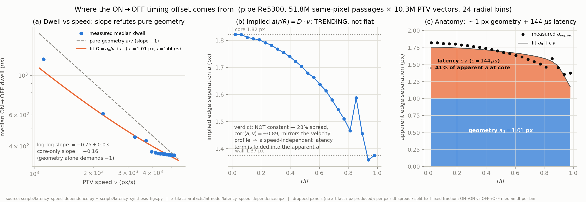
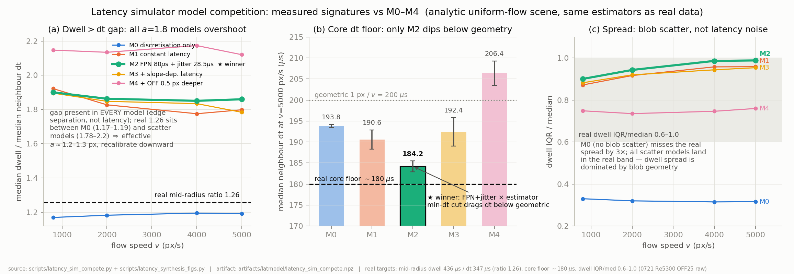
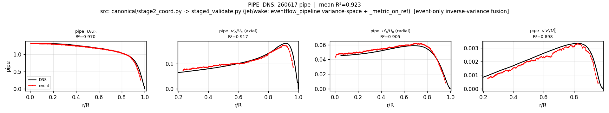

# Learned Detection & the Event-Camera Latency Model

**Scope.** Two campaigns on the pipe Re5300 ON/OFF recording, one day: (1) a critical, experiment-backed model of the event-camera pixel latency that explains the ON→OFF timing offset; (2) the first learned (simulation-trained, DNS-free) particle detector run through the full production machinery, with its full-recording verdict. Plus the method taxonomy that now organizes the codebase (`METHODS.md`).

## 1. The latency model: where the ON/OFF timing offset comes from

The question under test (user hypothesis): *"pixel response latency is the same everywhere and cancels in averages, so it cannot hurt velocity; the real cause of the ON/OFF offset is the bead's brightness profile crossing thresholds at different points."* A 7-agent campaign (literature, three real-data experiments on 51.8M same-pixel passages × 10.3M PTV vectors, a 5-model simulator competition, and an adversarial critic) returned a split verdict.

*Fig 1 — Dwell vs speed refutes pure geometry: the measured dwell follows $D = a_0/v + c$ with $a_0 = 1.01$ px of true ON/OFF trigger-point separation and $c = 144\,\mu s$ of speed-independent polarity latency (41% of the apparent edge separation at core speed). Source: `scripts/latency_speed_dependence.py` + `scripts/latency_synthesis_figs.py`; artifact `runs/latmodel/latency_speed_dependence.npz`.*

- **"Latency cancels in averages" — refuted**, three ways. It is not equal across pixels (87.4% of the timing floor is a per-pixel *fixed pattern*, σ≈80 µs — split-half r = +0.875); it is not constant at one pixel (latency is a function of illumination, contrast slope and polarity — the literature is unambiguous: 12 µs @ 1 klux vs 125 µs @ 10 lux); and even the zero-mean part does not cancel through the nonlinear min-Δt pairing estimator, which drags the median neighbour timing ~8% below geometric. **Exception where the intuition is right:** in same-pixel dwell, the pixel's fixed latency $L_i$ cancels exactly — which is why dwell is the robust timing channel.
- **"Trigger-point geometry" — partly supported, and it is the dominant term** ($a_0 \approx 1$ px), but a genuine polarity-asymmetric latency sits on top: an independent single-polarity chain experiment measured the OFF→OFF chain **+87 µs slower and 28× noisier** than ON→ON — same order and sign as the fitted $c = 144\,\mu s$.
- The previously calibrated edge separation $a = 1.8$ px was a composite: ~1.0 px geometry + ~0.8 px of latency misread as geometry. The correct inversion is $v = a_0/(D - c)$, and cross-pixel timing should use single-polarity chains only.

*Fig 2 — Simulator model competition: only M2 (fixed-pattern 80 µs + jitter 28.5 µs) reproduces the real 180 µs core floor (184.2 ± 1.3 µs over 5 seeds); constant-latency M1 (the "cancels in averages" mental model) cannot (190.6 µs), and the floor sits below the geometric 200 µs — an estimator selection-bias effect, not a latency floor. Source: `scripts/latency_sim_compete.py`; artifact `runs/latmodel/latency_sim_compete.npz`.*

**Exploitable consequences:** (i) invert dwell with the two-term law, (ii) single-polarity chains for cross-pixel timing, (iii) the fixed 87.4% of latency is calibratable event-only — a per-pixel latency map is a standing improvement item.

## 2. The learned detector: sim-to-real, the traps, and the full-recording verdict

The confirmed law of this project — $R^2$ = samples/frame × per-window position quality — pointed at a learned attack on position quality. We built a calibrated event simulator (measured constants: OFF/ON ratio 0.601, edge separation 1.8 px, latency FPN 80 µs + jitter 28.5 µs; self-check reproduces the measured dwell distribution, OFF/ON ratio and footprint), generated 600 scenes over the DNS-free synthetic-turbulence corpus, and trained a small conv net (PosNet) to emit particle positions from 710 µs count images. On held-out simulation it beats the production mass centroid **0.497 px vs 1.102 px median error, recall 0.87 vs 0.69**.

Getting an honest real-data verdict required burning down five wrong explanations:

| Hypothesis for the slice-score gap | Verdict | Evidence |
|---|---|---|
| Duplicate ON/OFF-lobe peaks | rejected | NN < 3 px only 2% of detections |
| Faint-detection dilution | rejected | raising the threshold made scores worse |
| Polarity-lobe position poisoning | **partly real** | polarity-blind 1-ch retrain: uv 0.216 → 0.391 |
| Peak-locking | rejected | v9 locking (2.18) *weaker* than v4 (4.16) |
| Density-driven mislinking | rejected | density-matched run scored worse |
| **Slice-length artifact** | **root cause** | v4 on the *same* 3.5 s window: 0.5011 |

The decisive control: the remembered v4 "slice baseline 0.8798" came from a 14 s slice; at the same 3.5 s window v4 scores **0.5011** while v9 scores **0.7148** — every "deficit" was uv/v_rms statistical non-convergence, and the learned detector's 1.5× samples were *accelerating* convergence exactly as the law predicts. Two standing lessons were written into memory and code comments: **(a)** slice comparisons are valid only at identical spans, conclusions only at full recording; **(b)** PTV frame column 4 must stay a constant — real track ids activate the stage-2 Lagrangian cross-pass, whose noise estimator is poisoned by the shared-interior-position anti-correlation of central differences (measured: v4 0.8798 → 0.5205), meaning *all* PTV-route scores are raw quality, with stage-2 denoising inert; a share-free lag ≥ 3 pairing is the documented fix.

*Fig 3 — Full-recording profiles of the learned-detection route (fused-scoring output shown, mean 0.923; the single-source v9 row scores 0.9354). All four channels track DNS. Source: `scripts/ptv_export_v9.py` (polarity-blind PosNet, 7×7 centroid positions) scored by `scripts/profile_fuse.py`; figure `canonical/pipe5300_fusedprof_profile.png`.*

**Full-recording verdict (69,358 frames, 46.1M samples — 1.7× v4):**

| Route | mean R² | U | u_rms | v_rms | uv |
|---|---|---|---|---|---|
| **v9 learned detection** | **0.9354** | 0.9696 | 0.9124 | 0.9145 | 0.9451 |
| v4 watershed | 0.9364 | 0.9810 | — | — | 0.9647 |
| v2 uniform detect | 0.9461 | — | — | — | — |
| production triplet | 0.9559 | — | — | — | — |

A simulation-trained detector with **zero real labels and zero DNS** reaches parity with the best hand-crafted segmentation detector at full convergence. It does not set a record: its per-sample position noise on real data (raw u_rms/v_rms inflation up to 2.1× at the densest bin) is compensated — but not beaten — by its extra samples. The remaining levers, in order: simulator realism (background clutter, hot pixels, footprint spread — retrain), the per-pixel latency map from §1, and a share-free stage-2 denoiser (lag ≥ 3) that would finally let the machinery remove PTV position noise.

## 3. Codebase organization

`METHODS.md` (in-repo) now classifies all estimator code on four axes — **dwell used / frame-accumulated vs per-event / PTV vs not / frame-image vs pure-async** — with status and rejection reasons per script; 13 rejected standalone estimators moved to `experiments/20260805_rejected_estimators/archive/`. Repro chain for this report: `scripts/event_sim.py make` → `scripts/train_detector.py train (in_ch=1)` → `scripts/ptv_export_v9.py` (POSNET_POS_MODE=centroid) → `scripts/profile_fuse.py pipe5300 <dir> 69358`; commits `7265a5f` (latency campaign), `adbd0a8`/subsequent (v9), METHODS/archive commits on `master`.
