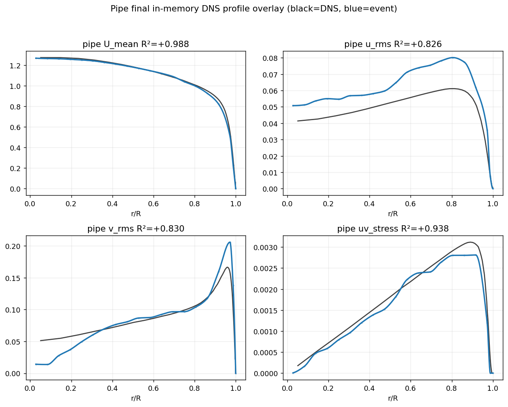
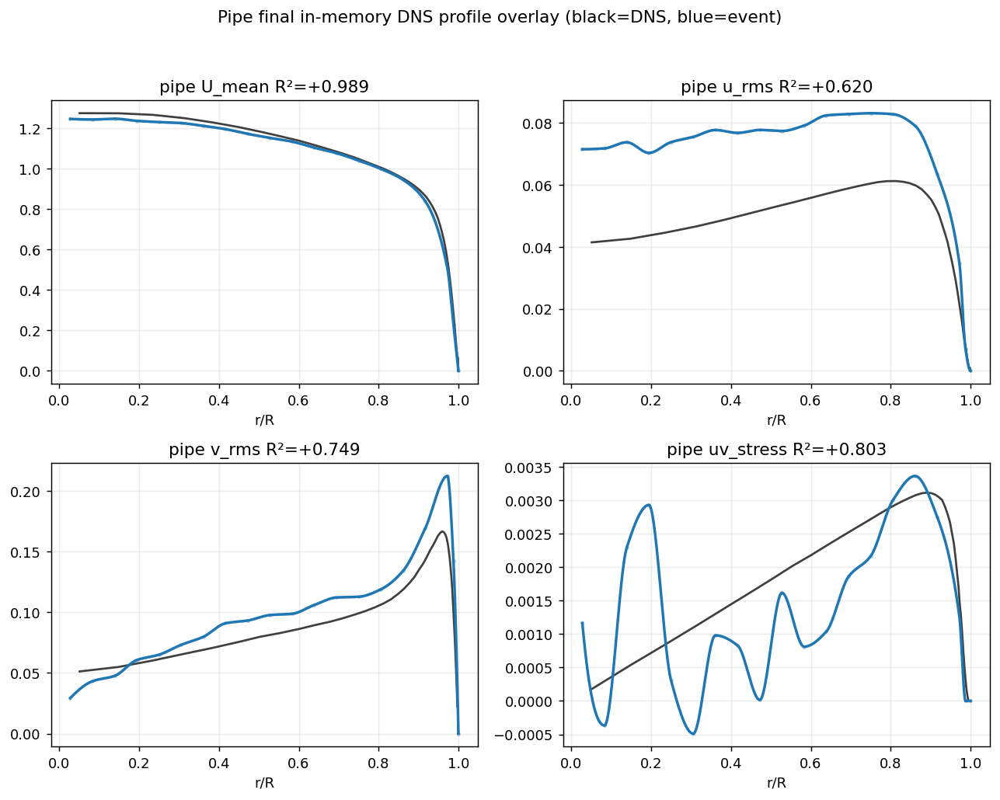

# EventFlow 통합 모델 — pipe 승격 + 논문 reframing (2026-06-26)

## 한 줄 요약

K/min_len 스윕 결과 **min_path_len이 pipe stress 회복의 지배적 레버**임을 확인했고, **K=28 / min_len=20**을 production config로 승격했다. pipe mean R²가 **0.79 → 0.896**으로 올랐고(uv 내부 진동 제거), config 변경만으로(env override 없이) 결과를 bit-identical하게 재현 검증했다. 동시에 논문을 reframing(유동별 config 표→산문, 3유동을 "일반 프레임워크의 검증 실험"으로)하고 wake Re=3900을 전반 반영했다.

---

## 1. K / min_len 스윕 (별도 프로세스, 캐시별 독립 검증)

이전 단일 프로세스 검증은 config가 import 시점에 캐시 경로를 baking해 3변종이 동일값을 반환하는 버그가 있었다. 캐시당 별도 python 프로세스로 재검증했다.

| variant | K | min_len | samples | edge | **mean R²** | U | u_rms | v_rms | uv |
|---|---|---|---|---|---|---|---|---|---|
| k56 (기존) | 56 | 11 | 693k | 0.66 | 0.790 | 0.989 | 0.620 | 0.749 | 0.803 |
| k28 | 28 | 11 | 1.39M | 0.89 | 0.740 | 0.990 | 0.461 | 0.634 | 0.876 |
| **k28min20 ✅** | 28 | 20 | 832k | 0.65 | **0.896** | 0.988 | **0.826** | **0.830** | **0.938** |
| k28min5 ❌ | 28 | 5 | 1.87M | 0.94 | **−1.61** | 0.988 | **−8.13** | 0.530 | 0.194 |
| k20 | 20 | 11 | 1.92M | 0.90 | 0.735 | 0.990 | 0.436 | 0.680 | 0.836 |

**해석 — min_len이 지배 레버.** min_len=5는 path당 averaging이 붕괴해 normal stress가 파국(u_rms R²=−8.13). min_len=11은 부족(u_rms ~0.44–0.46). min_len=20에서 u_rms 0.83·uv 0.94·mean 0.896으로 회복된다. K 단독(56→28→20)은 uv·edge를 살리지만 mean은 약간 내려가며, **스윗스팟은 K=28 + min_len=20**이다. 효과는 단조·물리적이지 단지 튜닝된 최적이 아니다(min5 파국이 증거).

## 2. profile 모양 — R²뿐 아니라 형상이 회복됨

| K=28 / min_len=20 (production) | K=56 (기존) |
|---|---|
|  |  |

- **uv_stress**: k56은 R²=0.803이지만 코어에서 격렬히 진동(음수까지). k28min20은 R²=0.938이며 **진동이 완전히 사라지고** 단조 상승+근벽 peak를 매끈하게 추종.
- **u_rms**: k56은 코어가 평평하게 과예측·noisy. k28min20은 근벽 상승 추세를 포착(크기는 여전히 과예측).
- **v_rms**: 근벽 peak(r/R≈0.96) 포착.

## 3. config-only 재현 검증 (프레임워크 원칙)

production 캐시는 `EVENTFLOW_CURVEFIT_DEPOSIT_MODE=midpoint` 등 env override로 빌드돼 있었다. config 기본값(`k_path=28, seed_stride=7, min_path_len=20, deposit_mode=midpoint`)으로 **env override 없이** fresh 빌드 후 검증:

| | samples | mean | U | u_rms | v_rms | uv |
|---|---|---|---|---|---|---|
| env override 빌드 | 832406 | 0.8956 | 0.9882 | 0.8257 | 0.8304 | 0.9382 |
| **config 기본값만** | 832406 | **0.8956** | 0.9882 | 0.8257 | 0.8304 | 0.9382 |

**bit-identical** — config 변경만으로 재현됨(config-only 원칙 성립). jet/wake는 frozen 캐시로 byte-unchanged 확인.

## 4. 논문 reframing + 수치 갱신

- **유동별 config 표 → 산문**: 3유동(jet/pipe/wake)을 "범위"가 아니라 **일반 프레임워크의 검증 실험**으로 reframe. timing/tracking 상수를 실험 설명 본문에 산문화.
- **wake Re=3900**: acquisition 메타데이터(ebof "wake - Re3900")에서 확인 → config.py·data_loading.py + 논문 전반 반영. 단, 회전 bluff-body라 shedding Strouhal은 고정원기둥과 다름(frontier 유지가 정직).
- **pipe 수치 갱신**: 0.747/0.806/0.574 → **0.830/0.938/0.826**. min_len을 두 번째 averaging 레버로 서술(샘플크기 −0.84→+0.81 수렴연구와 함께 "averaging-limited" 논지 강화). uv 진동 caveat 해소, pipe profile 그림 재생성. undefined ref 0, 클린 컴파일.
- 현재 35p(single-column 11pt). Nature 타겟 13p는 2단 전환+압축 별도 작업.

## 5. 코드 컴팩트 감사

- **코어(velocity/postprocess/statistics)에 flow-name 분기 0개** — flow-agnostic 유지. flow 분기 16개는 전부 config/data_loading(있어야 할 자리).
- 다만 레거시 tower 미정리: `velocity_postprocess.py` 12.8k줄 중 **262 def의 41개만 라이브 참조, 221개(84%) 라이브-도달 불가**(strain/tke/eta/thv/reliab closures). `velocity_estimation.py`에 strict_v8 selector 레거시 잔존. → 다음 작업: coverage-verified + bit-identical 확인 방식의 prune.

## 6. 커밋 / 재현

- repo: `donggeonbae/event-flow-turbulence`, branch `work/wake-operator-recovery-20260624`, commit `f753e38`.
- 재현(빌드): `EVENTFLOW_BUILD_CACHE=1 EVENTFLOW_BUILD_FLOW=pipe EVENTFLOW_BUILD_OUT_DIR=<dir> python -c "from eventflow_pipeline.data_loading import run_deferred_velocity_cache_build_if_requested as b; b()"` (config 기본값 = k28/min20).
- 재현(실행): `MPLBACKEND=Agg python -m eventflow_pipeline.run_from_cache`.
- 아티팩트: `docs/assets/current/pipe_k28min20_20260626/` (profile + path-tracking GIF).
