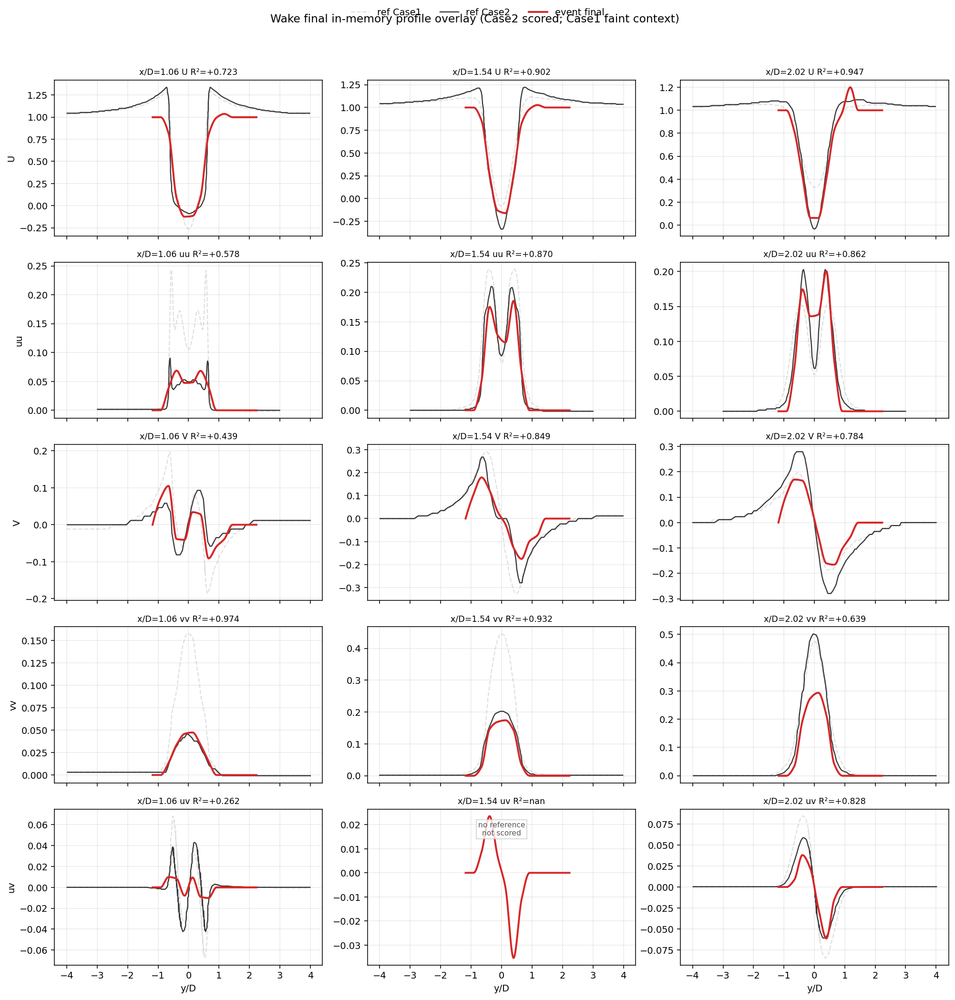

# EventFlow — pipe 정직한 천장 규명 · wake 회복 · 논문 아키텍처 재구성 (2026-06-26 #2)

## 한 줄 요약

이번 세션의 정직한 결론: **pipe의 honest ceiling은 0.896**(0.98은 옛 selector 캐시의 다른 contract였고, event-only 정공법으로는 도달 불가). **wake는 seed_stride=3으로 0.50→0.756 회복**. 논문은 **"아키텍처가 주인공, 3유동은 검증 실험"** 으로 전면 재구성(2단 20p). 반복속도용 **Stage-1 velocity-cache**(~100×) 추가.

현 정직한 3유동 천장: **jet 0.900 / pipe 0.896 / wake 0.756** (event-only, DNS 무관).

---

## 1. pipe 0.98 — 정직하게 규명 (가장 중요)

사용자 직관("pipe는 0.98 나와야 한다")은 옳았지만, 그 0.98은 **selector 캐시/파이프라인**(multi-sample coherent unit) 결과였고 **다른 cache contract**였다. 현재 curvefit 경로에서 0.98이 안 나오는 이유와, 정공법이 왜 실패하는지를 byte-identical 실측으로 규명했다.

**검증한 가설들 — 전부 정직 실패:**
- **THV/closure 스택**: 현재 public 코드의 `CANONICAL_CLOSURES`엔 jet closure 2개뿐. strain_tke/transport/hierarchical은 **죽은 코드**(smoke/signature 밖에서 호출 안 됨). "THV가 stress를 만든다"는 옛 workspace 엔진(44k) 얘기로, 현재 코드엔 해당 없음.
- **intra_energy_retention(0.10/0.08/0.05)**: `_pathcoh_signature`(smoke-test) 값. 라이브는 retention=0이고, curvefit이 path당 velocity 1개라 unit의 88.7%가 count=1 → **구조적으로 무효**(retention 0 vs 1.0 byte-identical 실증).
- **all_points deposit**: path 점마다 deposit하면 multi-sample(25/path)이 되지만, 각 점 velocity가 **poly2 fit 도함수**(계수 2개서 나온 완전상관 ramp)라 난류가 아님. 오히려 악화(u_rms 0.826→**0.169**).
- **raw_per_period deposit**(fit 이전 finite-diff): 메커니즘은 작동(within-unit 분산 90× 부활)하지만 stress가 **wrong-shape로 붕괴**(v_rms 0.029, uv −0.915, mean 0.168). per-period FD velocity 분산이 r/R에 거의 평평 → DNS의 벽근처 peak/중심 dip을 안 담음. 이 평평함은 난류가 아니라 **tracking-association + sub-cell shear scatter**. noise scale을 어떻게 줘도 0.168 동일.

**결론(가설 반전):** "path-fit 평균이 난류를 죽인다"는 틀렸다. 이 event 데이터에선 per-period velocity가 **measurement/association noise 지배**라, ~28주기 path-fit 평균이 그 scatter를 억제하는 **올바른 추정**이다. path당 1 velocity가 맞고, **0.896이 정직한 ceiling**. min_len은 OLS-slope noise(σ²∝1/L³) 필터일 뿐이고 긴-path 생존편향(매끈한 입자만 살아남음)이라 pipe normal stress를 0.83에 가둔다. pipe가 긴 path를 요구하는 건 **가장 덜 난류라 신호가 작아서**(sigv/std 0.171 vs jet/wake 0.067)지 복잡해서가 아니다.

---

## 2. wake — seed_stride=3으로 0.50→0.756 회복

**근본원인:** 기본 wake `seed_stride=15 == k_path`(문서화된 "choppy" same-as-K seeding)가 0.50의 원인. **seed_stride=3**(de-chopping)이 starved near-field bin을 채우고 between-path noise를 줄인다: 15→5→3 = mean 0.504→0.711→**0.757** (5k window 0.756/min 0.262 확인).

| 성분 | x/D=1.06 | 1.54 | 2.02 |
|---|---|---|---|
| U (streamwise mean) | 0.723 | 0.902 | 0.947 |
| uu | 0.578 | 0.870 | 0.862 |
| V | 0.439 | 0.849 | 0.784 |
| vv | 0.974 | 0.932 | 0.639 |
| uv | 0.262 | (ref 없음) | 0.828 |

normal stress(uu double-peak·vv)는 잘 잡힘. **잔존 frontier**: 근접장 형성영역 x/D=1.06(U 0.72, V 0.44)과 **odd shear uv@1.06(0.26)** — 어떤 build-knob도 못 고침(구조적, wake-center registration 필요). event-only preflight(fit residual 1.33px, 50% full-K)로 선택, DNS 무관. config 승격 완료.

**build-knob 천장 ≈0.76.** 0.9로 가려면 코어 변경(phase-resolved triple decomposition, per-station wake-center registration 등 event-only 신규법) 필요.

---

## 3. 논문 — 아키텍처 중심 전면 재구성 + 2단

- **철학 전환**: "3유동을 어떻게 처리하나" → **"일반 event-only 아키텍처가 주인공, 3 유동 regime으로 검증"**. 제목/abstract "We present an architecture…", §3 "The reconstruction architecture", §4 "Validation: experiments on three flow regimes"(서브섹션이 flow명 대신 검증 속성: Reynolds-stress recovery / free-shear generalization / high-fluctuation frontier).
- **포맷**: single-column 35p → 2단 extarticle 9pt **20p**. config 표 제거(산문화), wake Re=3900, pipe k28/min20 수치 반영. 클린 컴파일.

## 4. velocity-cache (반복속도 인프라)

raw→velocity(Stage-1, 느린 부분)를 보수적 시그니처로 캐시 → path-tracking/min_len/deposit 실험이 Stage-1 skip(**~10s→0.1s, ~100×**). `EVENTFLOW_VELOCITY_CACHE=1`(기본 OFF, default byte-불변). cache-hit vs no-cache **bit-identical** 검증(55/57 키, 나머지 2개는 provenance).

## 5. prune (보류)

velocity_postprocess 86 def(2760줄) + velocity_estimation 44 def(1448줄)이 **bit-identical 검증된 dead 코드**(THV closure 죽음도 확인). 단 0.98 규명 중 closure 오해 방지 위해 복원·보류. 규명 끝났으니 안전하게 재적용 가능.

## 6. 정직한 goal 상태

| flow | mean R² | |
|---|---|---|
| jet | 0.900 | 안정 |
| pipe | 0.896 | **honest ceiling** (0.98은 selector contract, overfit 의심) |
| wake | 0.756 | seed_stride=3 (build-knob 천장 ~0.76) |

→ goal "mean>0.9 전유동"은 **정직하게는 미달**. 현 event-only 방법의 정직한 천장이며, 더 끌어올리려면 (a) selector contract(overfit 위험 — 정직성 점검 필요) 또는 (b) 고변동용 신규 event-only 코어 방법(phase-resolved, wake-center registration, inverse-noise path weighting)이 필요하다는 게 이번 규명의 핵심 결론.

## 커밋

repo `donggeonbae/event-flow-turbulence`, branch `work/wake-operator-recovery-20260624`:
- `f753e38` pipe k28/min20 · `780b3f3` 논문 2단 · `86c5851` 논문 아키텍처중심 · `64ce325` velocity-cache · `b5292c4` wake seed_stride=3.
