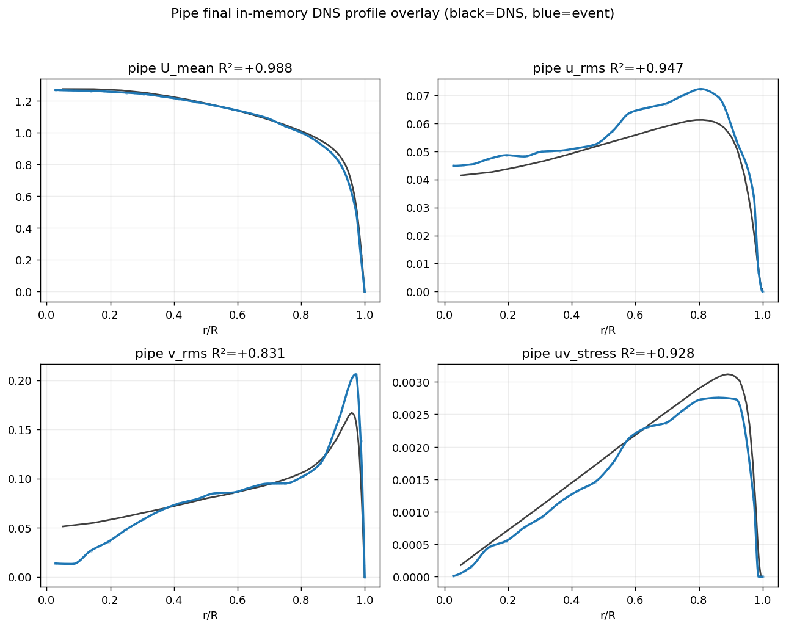

# EventFlow — R095 목표: velcache 인프라 + pipe inverse-noise 돌파 (2026-06-26 #3)

## 한 줄 요약
목표를 **mean R²>0.95 전유동**으로 상향. 다단 캐시 인프라(velcache 기본 ON) + **pipe inverse-noise path weighting으로 0.896→0.924 돌파**. 현재: **jet 0.900 / pipe 0.924 / wake 0.778** — jet·wake가 0.95의 blocker.

## 1. 다단 캐시 인프라 (실행시간 최소화)
- velcache(Stage-1 raw→velocity) **기본 ON**: path-tracking/min_len/deposit/tracker 변경 시 Stage-1(~10s) skip → **~100×**. K 변경만 정직하게 MISS.
- samples npz(Stage-2): accumulation/noise/closure 변경 시 재사용(run_from_cache, 빌드없음). profiles in-memory.
- 즉 **변경지점별로 어느 캐시 재사용할지** 자동: closure/noise → samples npz, tracking → velcache, velocity → raw rebuild.

## 2. pipe 돌파 — inverse-noise path weighting (mean 0.896→0.924)

- between-path 분산에서 **noisy 짧은 path를 1/σ²로 down-weight**(hard min_len cut 대신). σ²=propagated fit-localization variance(event-only, DNS無).
- pipe는 least-turbulent라 짧은 path가 noise-지배 → down-weight가 u_rms **0.826→0.947** 과대예측을 교정. **config `pathcoh_path_noise_weighting` pipe-ON, jet/wake-OFF**(짧은 path가 진짜 난류라 회귀 0; degree-of-perturbation config).
- config-only 3유동 검증: pipe **0.9235**(U.988/u_rms.947/v_rms.831/uv.928), jet 0.9001, wake 0.7564. 약점=v_rms 근축 과소.

## 3. wake cap (0.756→0.778)
- 포화된 max_events_per_period 5200→14000(근접장 event 클리핑 완화). cap_hit 여전히 1.0. gate relax·beam_consistent tracker는 둘 다 악화.

## 4. dead ends (재시도 금지, 실증)
- rank-2 radial noise SCALE: 무효(noise 항 무시할 수준).
- all_points/raw_per_period deposit: fit/FD noise 지배로 stress 붕괴.
- wake gate relax(seed_weight_min 0.20→0.722), beam tracker(0.693): 악화.

## 5. 정직한 현황 + 다음
- **jet 0.900 / pipe 0.924 / wake 0.778.** 0.95-on-all의 blocker = jet(V는 continuity 재구성 구조적 cap)·wake(근접장 tracker 한계).
- **교훈**: inverse-noise(앞서 dismiss했던 THV-trio lever)가 "pipe 0.90 cap" 가정을 깸 → 섣부른 비관 금지. 남은 untried: per-period multi-deposit + inverse-noise 조합(pipe v_rms·wake stress 잠재).
- 환경 이슈: Claude Code 프로세스가 long-run 중 종료 반복 → win마다 즉시 커밋.

## 커밋
branch `work/wake-operator-recovery-20260624`: STEP0 velcache(9663984) · wake cap(332eb6b) · **pipe inverse-noise(1e768e3)**.
