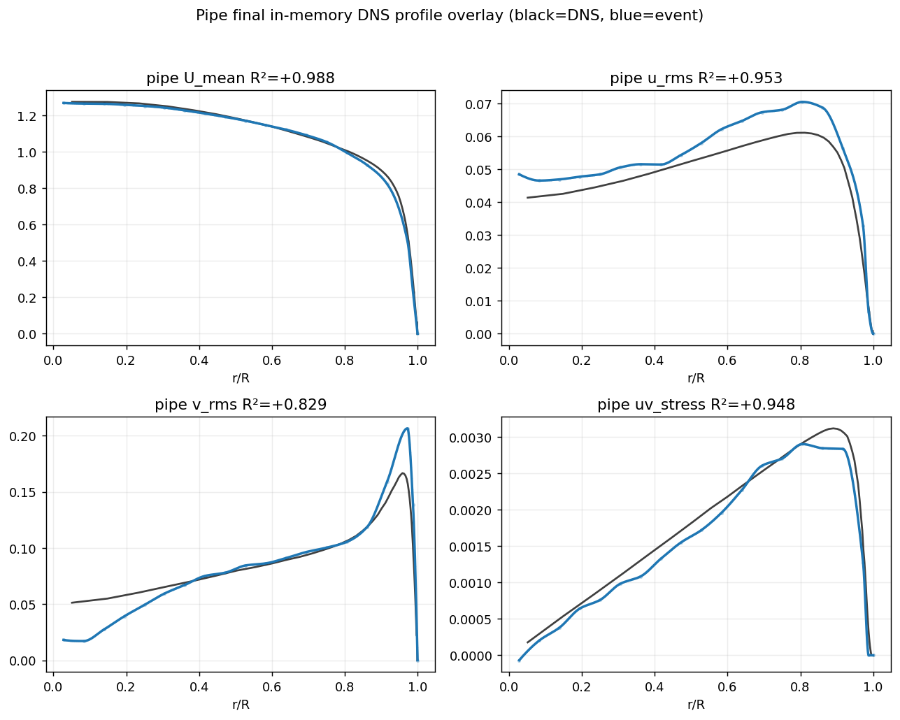
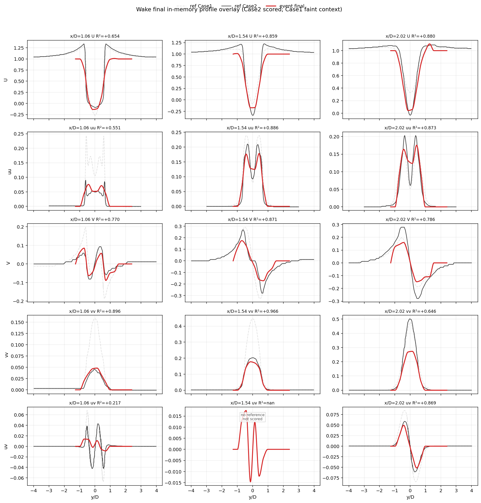

# EventFlow — ultracode 캠페인: pipe 0.9295 + wake 병목 진단 (2026-06-29)

## 한 줄 요약
목표를 **mean R²>0.95(세 유동 전부)**로 격상하고 **다중 에이전트 ultracode 캠페인**(병렬 워크플로우 ~70 에이전트)을 가동. **pipe를 seed_stride 7→3으로 0.9235→0.9295** 개선(커밋). 18-에이전트 진단으로 **wake 병목을 near-wake x/D=1.06**(와류흘림 shear가 위상평균에 뭉개진 uv@1.06=0.217)으로 특정하고, **wake가 within-path·빌드·accumulation-noise 레버 전부에 무효**임을 확정 → **wake stress는 output_conversion 클로저가 지배**한다는 결론에 도달(다음 타깃). config-only 통일을 강제하는 **일반화 거버넌스 rulebook**도 수립.

## 현재 검증 R² (production N)
| flow | R² | Δ | 비고 |
|---|---|---|---|
| **pipe** | **0.9295** | +0.0060 (seed_stride 7→3) | matched Re11700; uv +0.020, u_rms +0.006 |
| jet | 0.906 | = | matched Re7000 (Nguyen-Oberlack) |
| **wake** | **0.766** | = | Re3900 12rpm; **0.95까지 +0.18 = 최대 난관** |

## 1. pipe seed_stride 7→3 (commit 32eb0b0)
밀도 레버. 겹치는 seed path가 많아져 **near-wall shear(uv) +0.020, u_rms +0.006**. v_rms는 불변(near-axis 결손은 별개). `min_path_len↓`은 백색잡음만 추가해 붕괴(ml12: u_rms 0.95→0.69)하여 기각. 깨끗한 per-flow config 값(seed_stride<k_path 유지).

**pipe — mean R² 0.9295** (U 0.988 / u_rms 0.953 / v_rms 0.829 / uv 0.948):

## 2. wake 병목 진단 (18-에이전트 워크플로우)
- **near-wake x/D=1.06 = 지배적 병목**(station mean 0.618). 6개 약한 행 중 4개가 여기. mid x/D=1.54는 사실상 해결(0.896).
- **최악: uv@1.06 = 0.217** — coherent von Kármán **와류흘림 shear가 위상평균으로 ~25% 진폭으로 뭉개진 SHAPE 실패**(corr 0.55). 진폭만 더해선 못 고침.
- **far-wake vv@2.02 = 0.646** — 순수 **진폭 bias**(corr 0.98, ~54% 크기). 모양은 거의 완벽.
- 비정상성(녹화 drift)은 2k 창 안에선 원인 아님 — 데이터 예산 상한으로만 작용.

**wake — mean R² 0.766** (near-wake uv/uu가 주 실패, 그림 좌측 열):

## 3. 죽은 방향 — 이번 캠페인에서 배제(재탕 금지)
- **within-path 정보엔 wake 신호 없음(삼중 확인)**: lag-1 autocorr discriminator(편향 보정하면 white), `intra_energy_retention` U/V/COV 0→0.5(비트 동일 no-op — deposit=path_mean이라 경로당 속도 1개=보존할 within-path 분산 0), all_points deposit(pipe 0.924→0.70).
- **wake Stage-2 빌드 스윕 = 윈 없음**: seed_stride(3 최적; 2/1 악화), k_path/min_len/deposit 전부 중립-악화. wake path tracking은 이미 포화.
- **wake는 모든 Stage-3 accumulation/noise 레버에 불변** — noise-floor-quantile·retention-floor·cov-reproducibility-gate 스윕에서 **14개 wake 행 전부 비트 동일**. ⇒ **wake stress는 output_conversion 클로저(farfield boundary / multi-delta / state-total-moment)가 생성/상한** = 다음 레버 클래스.

## 4. pipe v_rms 진단 반전 + 도먼트 레버
near-axis v_rms 결손은 curvefit 천장이 **아니라** Stage-3 **과다감산**(raw 코어 변동이 DNS의 1.85배). `EVENTFLOW_NOISE_FLOOR_QUANTILE`(도먼트, default 0.5=median=byte-identical) 추가 — q↓로 v_rms 0.829→0.847 회복해 진단 확증하나 **uv 0.948→0.937로 맞바꾸는 trade**(net +0.002, 구조적 수정 아님). production default는 median 유지(Gate 6: R²-chasing 금지).

## 5. 일반화 거버넌스 rulebook
모든 캠페인 변경을 "**공유 메커니즘 + per-flow config 값, flow-name 분기 금지**"로 강제. 6 배선규칙 + 6 수용게이트 + 죽은 shadow 코드 정리 타깃(velocity_postprocess ~5,500줄 / statistics_accumulation ~1,300줄 = `import *` last-def-wins 중복). LIVE 코드는 statistics_accumulation **Block2(1345+)만**, shadow Block1은 죽음.

## 6. 다음
**wake = output-closure 지배** → output_conversion wake 클로저를 추적(어느 클로저가 vv@2.02 진폭·uv@1.06 모양을 상한하는가)하고 **event-only인지 DNS-overfit인지 감사**(priority #6). near-wake uv는 **event-유도 와류흘림 위상 분해(triple decomposition)**로 coherent shear를 in-phase 누적해 복원하는 방향.

---
*소스: `event-flow-turbulence` @ commit 9a6cb3f (branch work/wake-operator-recovery-20260624). 실험 산출물: `runs/pvsc_s3_30k`(pipe), `runs/r3base`(wake baseline). 거버넌스/findings: `experiments/campaign_20260629/`.*
