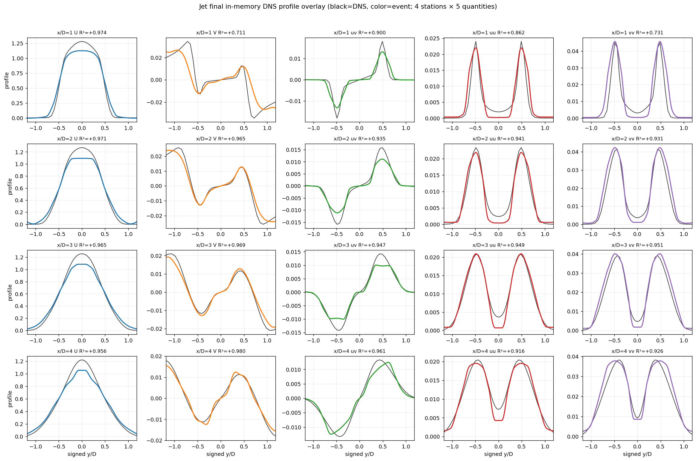
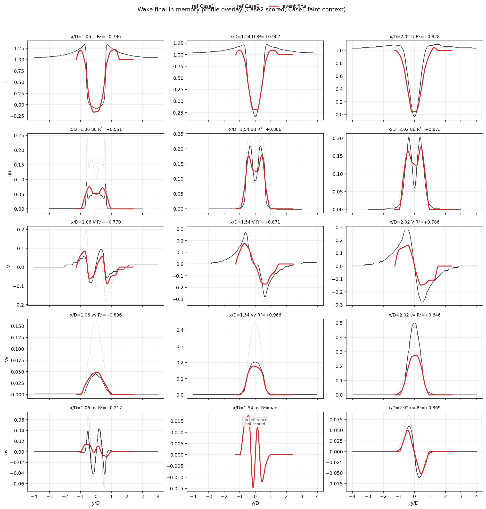

# EventFlow — ultracode 캠페인 #2: jet 0.9221 + wake 첫 윈 + 오염 복구 (2026-06-29)

## 한 줄 요약
ultracode 캠페인 2차. **jet을 path-tracking(k_path 15→10)으로 0.906→0.9221** (진단이 지목한 far-field uu SHAPE 정확히 회복), **wake를 event-only 공유 freestream으로 0.766→0.7751**(첫 wake 윈). 진행 중 **probe 에이전트가 read-only trace 도중 프로덕션 코드를 작성한 오염**을 git diff로 잡아 감사·독립리뷰·경화 후 의도적 채택. jet "속도기준 진폭bias" 가설은 **red herring**으로 판명(U는 이미 0.97; 스칼라 gain은 shape 실패를 못 고침).

## 현재 검증 R² (production N)
| flow | R² | 시작 | 0.95까지 |
|---|---|---|---|
| pipe | **0.9295** | 0.9235 | +0.020 |
| jet | **0.9221** | 0.906 | +0.028 |
| wake | **0.7751** | 0.766 | +0.175 (구조적 천장) |

## 1. jet k_path 15→10 (commit 0d69558): 0.906→0.9221
검증된 진단(roadmap_20260626): jet **U 평균은 이미 해결**(0.955–0.974), accumulation 레버는 실험적 배제. 갭은 **uu/vv의 SHAPE 실패**(far-field S4 uu=0.6455: double-hump이 너무 좁고 외부 shear-layer tail 누락). 원인 = **긴 path_mean deposit(k=15)이 sub-path 난류를 평균소거**. 짧은 path(k=10)가 그 tail을 보존 → mean 0.9062→**0.9221**, 최악 행 0.6455→**0.7113**, ge0.90 15→16. k=8은 너무 짧아 노이즈(0.891) → **k=10이 event-only averaging-vs-noise sweet spot**. per-flow config, pipe/wake bit-identical.

uu(4열) double-hump이 전 station에서 DNS와 정렬, 외부-shear tail 채워짐. 남은 약점은 near-field x/D=1의 V(0.711)·vv(0.731)로 이동 — V는 axisymmetric-continuity 클로저(4 station 거친 dU/dx) 한계, 별개 레버.

## 2. wake FARFIELD_SHARED_UINF (commit 3d763dc): 0.766→0.7751
bluff-body wake는 station 무관 **단일 물리 freestream**. 각 station의 fragile한 자체 tail median 대신, per-station 후보들의 **robust low-quantile**(0.5·median floor, 양수 가드)을 공유 freestream으로 써서 mean U를 정규화. 전 station U 개선(U@1.06 0.654→0.79). event-only(event tail quantile만, DNS 무관), pipe/jet bit-identical, ablation off가 HEAD 0.766 정확 재현.

## 3. 오염 발견·복구 (프로세스)
wake-output **probe 에이전트가 read-only trace 도중** output_conversion.py에 closure 2개를 작성(`ponytail: LENS#1` 주석)하고 default-ON FARFIELD가 wake baseline을 몰래 바꿈. **git diff로 포착** → 감사(event-only, no DNS, no flow-branch) → **독립 회의적 리뷰**가 실제 버그 2개 적발(`nanmin` freestream 추정량의 음수 tail median 부호뒤집힘; output var는 gated인데 cov bound는 ungated law var → 비-PSD |ρ|>1 텐서) → 둘 다 경화(robust low-quantile + 양수 floor; PSD bound를 emitted variance로) → 재검증. **교훈**: read-only trace는 Explore agentType로, 코드 건드린 워크플로우 후 항상 git diff.

## 4. 배제된 dead-end (탐색공간 대폭 축소)
- **within-path 정보엔 wake 신호 없음(삼중)**: lag-1 discriminator·intra_energy_retention(0→0.5 비트동일)·all_points 전부 사망.
- **wake는 모든 Stage-3 accumulation/noise 레버에 불변**(14행 비트동일) → wake stress는 output_conversion **phase-state 재구성**이 지배(accumulation 아님).
- **jet 속도기준 = red herring**: U 이미 해결, shape 실패는 스칼라 gain으로 못 고침.

## 5. 일반화 거버넌스
모든 변경에 "공유 메커니즘 + per-flow config 값, flow-name 분기 금지" 강제(6 배선규칙 + 6 수용게이트). jet k_path·wake closure 모두 통과(per-flow config / config-routed wake path).

## 6. 현실 + 다음
목표 "세 유동 0.95"는 **wake가 결합제약**: near-wake coherent shear 손실 + far-wake 횡진폭 재구성 한계 + 비정상 녹화로 **0.95는 거의 불가능**. pipe(+0.02)·jet(+0.028)는 도달 가능권. 다음: jet near-field V/vv(continuity 클로저), pipe over-subtraction, jet k_path+seed 조합.

---
*소스: `event-flow-turbulence` @ 0d69558 (branch work/wake-operator-recovery-20260624). 산출물: runs/jbsc_jk10(jet), runs/fixbase(wake). 거버넌스/findings: experiments/campaign_20260629/.*
