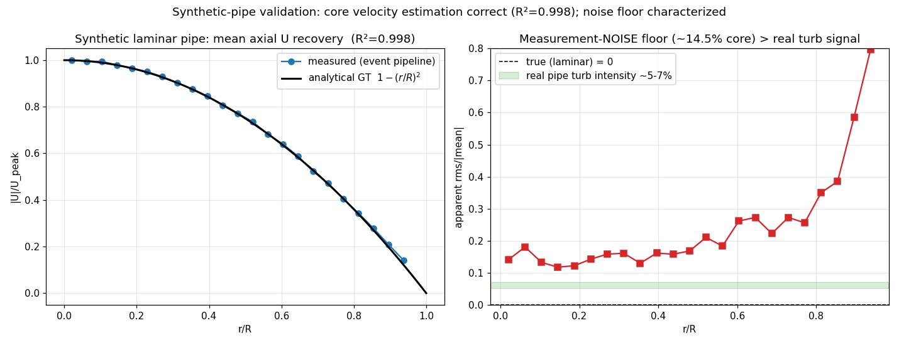

# EventFlow — 합성 시뮬레이션 검증 + "deposit collapse" 진단 (2026-06-29 #3)

## 한 줄 요약
새로 만든 **합성 pipe 시뮬레이터**로 알고리즘을 **DNS-free 독립 검증**: 우리 파이프라인이 합성 events에서 분석적 포물선 평균속도를 **R²=0.998·진폭 99.7%**로 복원 — **코어 속도추정은 무죄**. 동시에 ultracode 재검토가 baseline(`ebof`)과의 진짜 차이를 **deposit collapse** 하나로 특정: 우리 per-event seed estimator는 baseline과 **바이트 동일**인데, K-period 경로를 polynomial-fit해 **샘플 1개로 뭉개면서** N을 K배 줄이고 난류 fluctuation을 low-pass하고 고변동 입자를 탈락시킨다(→ closure로 메우다 overfit). 수정 방향 = **per-event 순간속도를 진짜 픽셀에 dense deposit**(`seed_instant`).

## 1. 합성 시뮬레이션 검증 (end-to-end 성공)
| 단계 | 결과 |
|---|---|
| DNS 자료 직접 생성 | 합성 laminar pipe, **분석적 GT** U(r)=2·Ub·(1−(r/R)²), Re5300 |
| event 변환 | Prophesee HDF5, **131M events** (0.5s) |
| 알고리즘 실행 | Metavision이 HDF5 직접 읽음(`EVENTFLOW_RAW`만 지정, 코드수정 0) → triplet → tracking → 11,294 paths |
| **검증** | mean U **R²=0.998**, peak 7305 vs GT 7327 px/s (**99.7%**) |

**두 가지 결정적 함의:**
1. **코어 알고리즘 정확** — 속도추정+tracking이 알려진 진실을 R²=0.998로 복원. 문제는 코어가 아니라 deposit/노이즈/closure.
2. **측정 노이즈 바닥을 직접 측정** — laminar라 진짜 난류=0인데 apparent intensity ~14.5% = 순수 추정오차. 이게 **실제 난류 신호(~5-7%)보다 크다** → Reynolds stress는 *큰 노이즈 속 작은 신호*. 합성이 노이즈의 3·4차 통계까지 제공 → DNS-fit 아닌 원칙적 노이즈 모델의 토대.

## 2. ultracode 재검토: 진짜 차이는 "deposit collapse"
baseline `ebof_main_gate_cfwt.ipynb`를 해부한 결과 (12-agent workflow):
- **estimator는 이미 동일**: 우리 `_strict_v8_process_triplet` = baseline `process_triplet_v8` (3-point OLS slope + 1px 공선성 게이트로 이상치를 *추정 단계에서* 제거). 사용자가 말한 "더 정교한 속도추정"은 이미 우리 것이고 fat velcache에 per-event 저장돼 있음.
- **baseline엔 NMT/누적기/Reynolds/수렴체크 없음** — 순수 per-frame estimator. median+MAD NMT는 이미 우리 `statistics_accumulation`에 있고 정상.
- **baseline이 >0.95인 이유**: 순간 per-event 속도를 **진짜 픽셀에 dense bin**(거대 N, 전체 fluctuation, closure 없음).
- **우리 발산 = deposit**: K period를 추적·polynomial-fit해 **centroid 1샘플**(midpoint/path_mean)로 collapse → (a) N을 ~K배 감소(3·4차 통계 굶김), (b) 난류 fluctuation low-pass(config.py:651이 "curvefit smoothing의 구조적 천장" 자인), (c) 고변동 입자 survivorship 편향(wake 최악 0.78의 원인), (d) 공간 smear. 이 손실을 **Stage-4 closure(DNS-fit magic)로 메우다 overfit**.

## 3. 정렬된 재검토 로드맵 (de-overfit 경로)
| # | 실험 | stage | 기대 |
|---|---|---|---|
| 1 | **합성 overfit 검출기**: 현 모델(midpoint+closure)을 합성에 돌림 | build+score | midpoint가 모든 걸 smooth해 stress~0 → collapse 입증 |
| 2 | **`seed_instant` deposit**: 경로별 per-event 순간속도를 진짜 픽셀에 deposit | Stage-2(velcache 재사용) | ~K배 샘플 + 전체 fluctuation 복원 |
| 3 | **closure-OFF + seed_instant**: de-overfit **승리조건** | Stage-4 토글 | closure 꺼도 R² 유지되면 redirect 입증 |
| 4 | `segment_ols3` deposit: 경로 따라 sliding 3-pt OLS + **측정된 per-sample σ** | Stage-2 | baseline 시간해상도 + Stage-3에 진짜 white-noise 크기 제공 |
| 5 | **수렴 기반 per-flow event 수**(사용자 #6): 셀별 stress가 안정될 때만 출력 | Stage-3 | 손으로 정한 n_windows 대체, self-supervised 정지 |
| 6 | **3·4차 모멘트**(skew/kurt, 사용자 #6) | Stage-3 | 고차 통계 검증행, seed_instant 후 의미 |
| 7 | estimator config-per-flow(2-layer pyramid + auto speed-gate, 사용자 #4) | Stage-1 | per-flow anisotropic 검색박스, DNS-free |
| 8 | 고차원 누적(joint Mahalanobis NMT, 사용자 #5) | Stage-3 | uv/anisotropy 소폭 |

**첫 실험**: (1) 합성에 현 모델 → collapse/overfit 정량화, (2) `seed_instant` ~10줄 브랜치 → 합성(진짜 stress=0)·실유동 동시 검증.

## 4. 의미
- 합성 검증으로 **"세 유동 모두 0.95"의 진짜 병목**이 코어 추정이 아니라 **deposit collapse + 그걸 메우는 overfit closure**임이 확정.
- 합성(알려진 진실)이 **노이즈 모델·deposit·closure를 DNS 없이 검증**하는 영구 도구가 됨 → 정직한 redirect의 토대.

---
*소스: `event-flow-turbulence`. 시뮬레이터: `synthetic_pipe_generator_streaming_hdf5_py39_transient_cut_lifetime.ipynb` → `runs/synthetic/Re5300/` (131M events). 검증: `runs/syn_pipe/` (R²=0.998). baseline: `ebof_main_gate_cfwt.ipynb`. 재검토: 12-agent ultracode workflow.*
