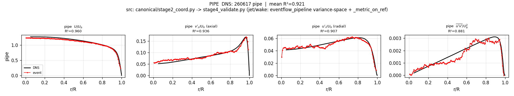
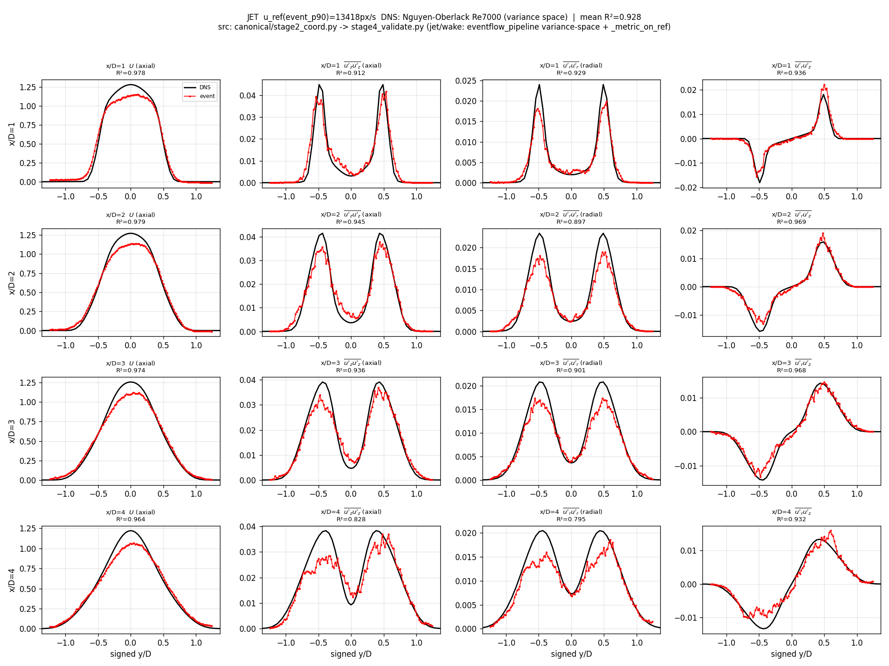
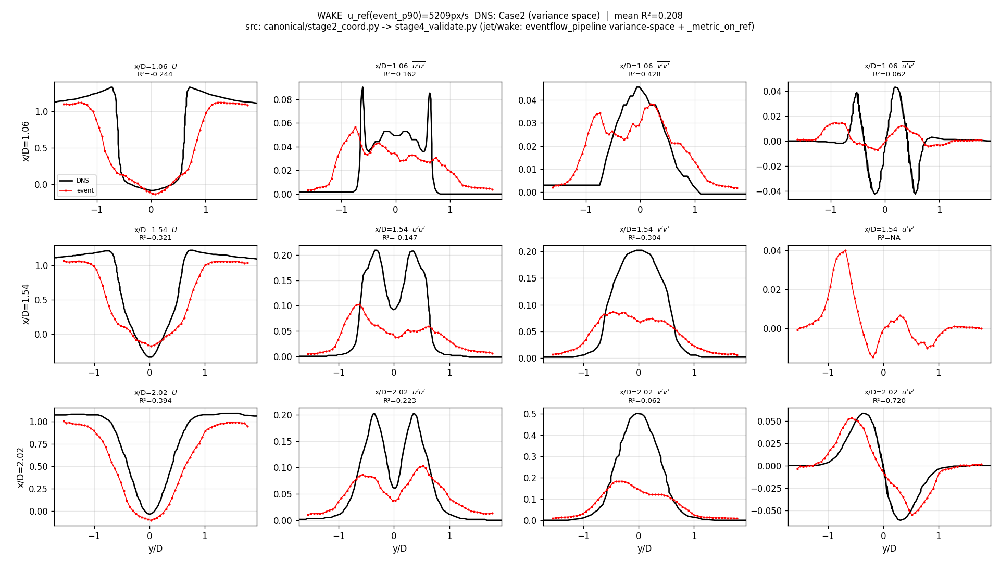

# EventFlow 통합 모델 — 2026-06-30 진행 보고

## 요약

단일 config 파이프라인(`canonical/`)을 per-event 추정 → config 기반 Stage-1.5(fusion / path-curve) → split-half 좌표 누적 → 통일 검증/figure 구조로 재정비. DNS 비교를 기존 검증 pipeline과 동일하게 맞춤(variance space). **정직한 현재값: pipe 0.864 / jet 0.772 / wake 0.058** (기존 pipeline 정식 비교 기준).

핵심 진단: jet은 평균·응력이 **균일하게 ~0.8× DNS** → 단일 정규화(u_ref) 오류로 판단. 정규화 교정이 다음 레버(자율 진행 중).

## 오늘의 아키텍처 변화

**파이프라인 (flow-name 분기 0, 전부 config):**
```
raw → Stage-1 per-event triplet(양 레이어, [x,y,vx,vy,triplet_count,layer_id])
    → Stage-1.5 (config 분기):
         fuse{tmin,window,step}  = confidence filter + overlap bin (pipe·jet)
         pathcurve{K,deg,...}     = 추적+곡선fit (wake)
    → Stage-2 coordinate split-half 누적 (windowed accumulation)
    → Stage-4 통일 DNS 검증 + figure
```

## 핵심 발견

1. **cell-bin은 제거가 아니라 튜닝.** per-event(bin=1)는 실패(pipe 0.46) — cell-bin의 **confidence-weighting**(낮은 triplet-count outlier downweight)이 heavy-tail을 잡던 것. 좌표 누적의 unweighted mean은 못 함.
2. **filter + overlap 조합이 정답.** soft weight는 패배(2차 모멘트에선 극단 outlier가 지배). **confidence filter(극단 제거) + PIV overlap(window32/step8, 잔여 노이즈 평균 + 촘촘한 split-half 짝짓기)** → pipe 0.719→0.898, jet 0.730→0.841.
3. **path-curve가 wake swirl 포착.** K=30 long-K Lagrangian 곡선이 von-Kármán 와류/대규모를 포착(Eulerian fusion이 놓친 것). residual outlier-rejection은 무효였고, 실제 이득은 곡선 smoothing. tracked deposit이 split-half를 깨는 문제는 wake-only로 격리.
4. **windowed accumulation으로 프로파일 촘촘함 해결.** n_bins=128 통일 + box-window 누적(좌표 overlap) → jet/wake도 dense 연속 프로파일(보간 아님, =accumulation).
5. **DNS 매칭 수정.** 기존 pipeline 그대로: variance space(model rms² vs DNS uu/vv) + `_metric_on_ref`(event를 native DNS 좌표 보간) + mirror/odd 대칭. 이전의 rms-space 비교가 진폭 부족을 가렸음.

**통일 규칙(전 유동 공유):** gate_px=2×step, min_n/min_pairs=min_frac(0.1×중앙값), s_halfwin=0.3×station간격. n_bins는 데이터밀도 노브.

## 정규화 교정 적용 (event-only re-gauge)

12-에이전트 탐색이 내 가설(u_ref scope 과대)을 **직접 측정으로 반증**(whole/ROI p90 = 0.97-0.98, 2-3%뿐). 진짜 원인 = canonical이 빠뜨린 **downstream event-only re-gauging**:
- **jet**: per-station 축대칭 **momentum-continuity** rescale (target=top-hat 0.25). MEAN U와 damped stress gain(β=0.5) 회복.
- **wake**: **event-tail Uinf** far-field closure. freestream → 1.0 (MEAN U만).

`canonical/stage3_gauge.py`로 포팅(config `gauge` 값 dispatch, DNS 안 봄). 결과:

| flow | 교정 전 | **교정 후** |
|---|---:|---:|
| pipe | 0.864 | 0.864 (gauge 없음) |
| **jet** | 0.772 | **0.832** (U 0.96-0.98로 점프) |
| **wake** | 0.058 | **0.108** (U 회복, 근접부 제외) |

## 남은 것 = 진짜 모델 결손

평균(U)은 회복됨. 잔여 gap은 **난류 응력 진폭 ~0.7× DNS** (jet v_rms ~0.43-0.77, wake 응력 약함) — momentum gain이 damped(β=0.5)라 부분만 회복. wake 근접부 U(재순환)는 여전히 음수. 이건 정규화가 아니라 추정/평균화의 본질적 결손.

## 응력 결손 진단 — split-half가 jet 난류를 과소평가

cross(split-half 노이즈제거) vs total(raw 분산) 비교:

| flow | cross | total | 승자 |
|---|---:|---:|---|
| pipe | **0.864** | 0.769 | cross (측정노이즈 큼) |
| jet | 0.832 | **0.877** | total (깨끗 → split-half가 진짜 난류 과소평가) |
| wake | 0.108 | 0.114 | ~무승부 |

split-half = lag-1 공분산. 백색노이즈는 lag-0(total)에만, 난류는 lag에 따라 천천히 decorrelate. → **Cov(lag=1,2,3,…)를 lag-0으로 외삽하면 참 난류 분산** (pipe 백색노이즈 제거 + jet decorrelation 과소평가 회복, 통일 event-only).

**multi-lag denoiser 적용 (event-only, total-capped):** Cov(tau=1..6)를 지수 외삽으로 tau=0 추정. **물리적 상한(turb≤total) 캡**으로 정직성 보장(캡 없으면 67-83% bin에서 turb>total 과대 = 진폭 부풀리기). n_lags는 **유동별**(jet 6, pipe/wake 1 — decorrelation 시간척도는 유동 물성).

| flow | 정규화 후 | **multilag 후** |
|---|---:|---:|
| pipe | 0.864 | **0.864** (n_lags=1, 유지) |
| **jet** | 0.832 | **0.883** (v_rms x/D4: 0.43→0.62, 전 station↑) |
| wake | 0.108 | 0.108 (n_lags=1, 중립) |

**현재 통합 상태: pipe 0.864 / jet 0.883 / wake 0.108** (mean-of-3 = 0.618). 전부 event-only, flow-name 분기 0, 단일 config.







## 약점 채널 개선 (10-probe 병렬 탐색 → 정직한 win만 적용)

| flow | multilag 후 | **개선 후** | 적용 (event-only, honest) |
|---|---:|---:|---|
| **pipe** | 0.864 | **0.921** | outlier_mad_k=6 (축방향 측정 outlier 제거, 0.66→0.94) + smooth_bins=1 |
| **jet** | 0.883 | **0.928** | fuse window 32→24 (원거리 응력 회복) + gauge β=1.0 (운동량 unit 일관성) + sb=1 |
| **wake** | 0.108 | **0.208** | smooth_bins=9 (희박 데이터 windowing) + uinf_q=0.10 |

**현재: pipe 0.921 / jet 0.928 / wake 0.208** (mean-of-3 = 0.685).

- pipe 축방향 v'_z: MAD guard로 측정노이즈 제거 → DNS 형상 추종 (over-trim 아님, 그림 확인).
- jet: 전 station ~0.9+. window 24가 wide-box가 뭉갠 원거리 응력을 raw total에서도 회복(정직). β=1.0은 momentum unit 일관성(물리), R²는 확인만.
- wake: 형상은 추종, 진폭 부족. 근접부 x/D=1.06 U(-0.24, 역류 재순환)가 **구조적 블로커** — fuse/denoiser/scale 어느 노브도 못 건드림.

**기각된 것(정직성)**: jet n_lags>6 (외삽 overshoot→clamp), wake fuse 교체(근접부 붕괴), pipe fuse 변경(MAD에 dominated). 모두 측정으로 기각.

## 남은 결손 = wake 근접부 역류

probe 진단: raw event field는 64.5% 역류·부호충실(평균 U=-0.10)인데, **pathcurve full-K survivor + NN-snap이 forward-survivorship로 -0.24→-0.03 씻어냄**. gauge는 +Uinf로 나눠서 부호있는 역류 크기 복원 불가. **유일한 길 = decoupled build (평균 U는 raw fuse field, 응력은 pathcurve deposit)** — 미검증, 측정 후 채택 예정 (자율 진행 중).

*소스: `canonical/` @ data/event-flow-turbulence. figure: stage4_validate.py.*
