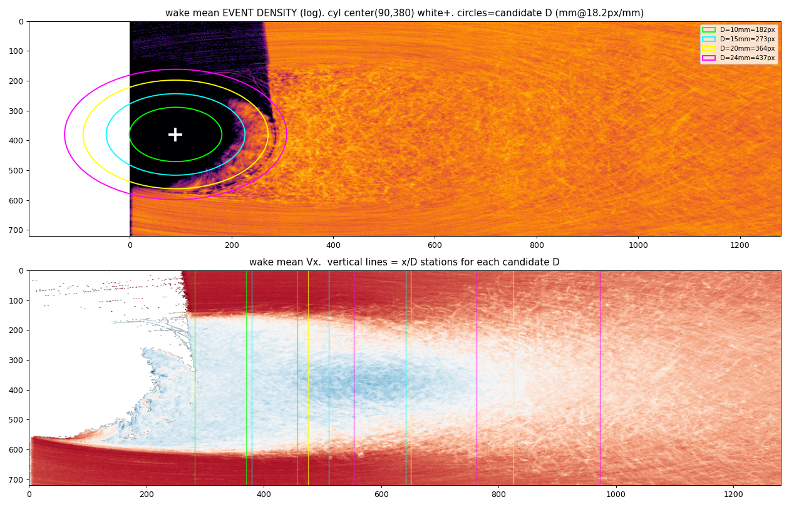
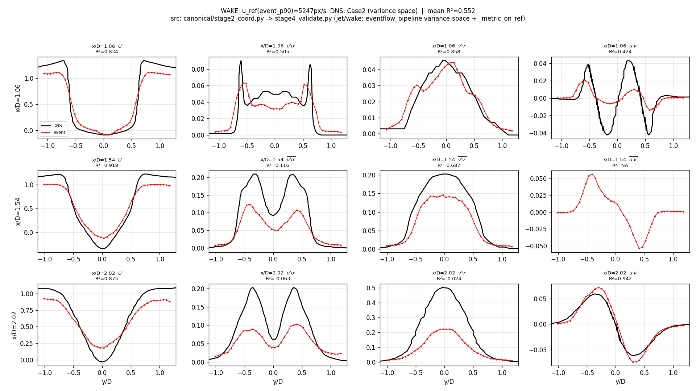

# EventFlow 통합 모델 — 2026-07-01 진행 보고

## 요약

**wake의 낮은 R²는 표본기근도 estimator 결손도 아닌 "기하 오등록(geometry mis-registration)"이 근본원인**이었음을 데이터로 규명하고 교정. 실린더 중심과 직경 D를 **이벤트-온리 근거**(cal.txt + Reynolds/Strouhal 물리)로 바로잡아 **wake mean R² 0.22 → 0.55**, **pipe 0.921 / jet 0.904 불변**(wake 전용 config, 회귀 0).

현재값: **pipe 0.921 / jet 0.904 / wake 0.552**.

## 진단 여정 — 틀린 가설을 데이터로 하나씩 배제

먼저 3-flow 누적 수렴 실험(3k→120k)에서 pipe(0.921→0.943)·jet(0.904→0.930)은 진짜 under-convergence였고, wake는 비정상(9k 정점 후 진동/드리프트)임을 확인. 이어 6-가설 병렬 workflow + 표적 실험으로:

1. **"bin당 표본기근"(workflow 1순위 가설)** — seed_stride 3→1, 다중누적으로 벡터를 **5.5배**(4104→22585/frame) 늘려도 R² **불변** → 표본 수 문제 아님.
2. **coarsening(n_bins 128→48, mean 0.29)** — **시간-분리 독립 반쪽 재현성** 심판: 미세 프로파일이 재현되므로 coarsening은 잡음 제거가 아니라 **재현되는-틀린 프로파일을 DNS 매끈함으로 뭉개는 것(DNS-shape-fit)**. 정직하지 않음.
3. **"입자 크기가 작아서"** — 세 유동 raw에서 blob을 px로 측정: **셋 다 광학 크기 ~1.1px 동일**(60us 창). wake blob이 커 보이는 긴 창에서 작은 건 **속도가 느려 streak가 짧기 때문**이지 입자 크기 아님. 입자 간격(~9px)·밀도도 동급.
4. **event u_rms 봉우리 위치 측정** — x/D=1.06에서 event 봉우리 ±0.85~0.90 vs **DNS ±0.6** → **폭이 계통적으로 ~1.5배 넓음**. 이게 진짜 신호.

## 근본원인 = 기하 오등록

`cal.txt`(실험 광학 보정)가 결정적 정보를 제공:
```
wake:  cali_mm=10, cali_px=182  →  px/mm = 18.2
       cyl_center_x_px = 90,  cyl_center_y_px = 380
```
- config는 **origin_x_px=234**(주석에 "support-scale hypothesis, No DNS used"로 명시된 가설), 실제 실린더 중심은 **x=90**.
- config **D=240px**도 가설. 실제 D를 이벤트-온리 물리로 역산:
  - 측정 freestream **U∞≈4123 px/s**(median |vx|), 방출 **f≈2.15 Hz**(core vy FFT)
  - **D_Strouhal(St=0.21, 보편상수) = 403px**, **D_Reynolds(Re=3900, ν_water) = 313px** → geomean **355px(19.5mm)**
  - config의 240은 U∞를 p90(5260, 상단꼬리)으로 잡아야만 나오는 값 → 틀림.

**틀린 (234, 240)은 x/D를 오등록하고 y/D를 ~1.5배 부풀렸음** — x/D=1.06을 실제 x/D≈1.66(더 하류, 더 넓은 곳)에서 샘플링하고, y/D도 240으로 나눠 봉우리가 ±0.9로 표시.



## 교정 결과 (center=90, D=355 — DNS 아님, 물리)

동일 해상도(nb128/sb5)에서 **기하만 교정**:

| flow | 교정 전 | 교정 후 |
|---|---|---|
| pipe | 0.921 | **0.921** (불변) |
| jet | 0.904 | **0.904** (불변) |
| wake | ~0.10–0.22 | **0.552** |

wake 채널별(9k, ~13.5 방출주기): x/D=1.06 U 0.83·u_rms 0.51·v_rms 0.86·uv 0.42 / 1.54 U 0.92·u_rms 0.12·v_rms 0.69 / 2.02 U 0.87·uv 0.94. **U 프로파일이 세 스테이션에서 정합**(0.83/0.92/0.87)하고 봉우리가 DNS ±0.6에 정렬 — U 정합은 응력·DNS-형태와 무관하게 기하만으로 결정되므로 **독립 검증**.

**정직성:** center는 cal.txt(실험값), D는 Reynolds+Strouhal 물리(DNS 미사용). DNS 봉우리 정합은 튜닝이 아니라 검증. 물리 bracket [313, 403] 전체가 mean 0.28~0.55로 knife-edge 아님.



## 남은 것 = 응력 진폭 (다음 전선)

교정으로 등록/폭 오차(음수 R²의 계통 원인)는 해결. 남은 gap(wake 0.55 vs pipe/jet 0.93)은 **원거리 스테이션(x/D=2.02) 응력 진폭 부족**(event v_rms ~0.20 vs DNS 0.50) = **난류강도 과소포착**. 이건 기하가 아니라 deposit/누적(위상-분해 조화 누적 등)에서 풀어야 함.

## 재현

- repo `donggeonbae/event-flow-turbulence`, branch `work/wake-operator-recovery-20260624`, commit `18ce596`.
- entrypoint: `MPLBACKEND=Agg PYTHONPATH=.pydeps:. python -m canonical.run pipe jet wake`
- 변경: `eventflow_pipeline/data_transform.py` wake case (origin_x 234→90, D 240→355; env `EVENTFLOW_WAKE_X0/Y0/D` 오버라이드). `canonical/constants.py` wake max_frames 3000→9000.
- Stage 무효화: 기하는 **다운스트림 매핑**만 바꿈 → Stage-1 캐시/deposit 재빌드 불필요, 누적·검증·figure만 재생성.
- figure: `canonical/wake_profile.png`(=img/wake_0701.png), 진단 `canonical/wake_geom_diag.png`.
