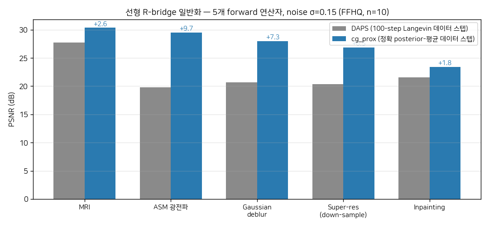
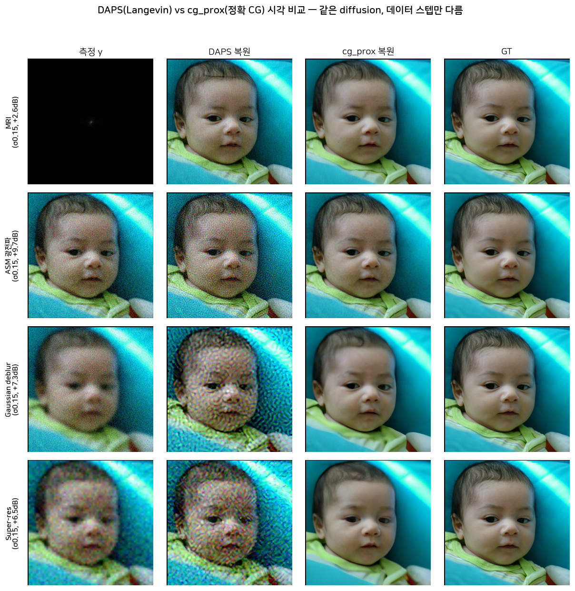
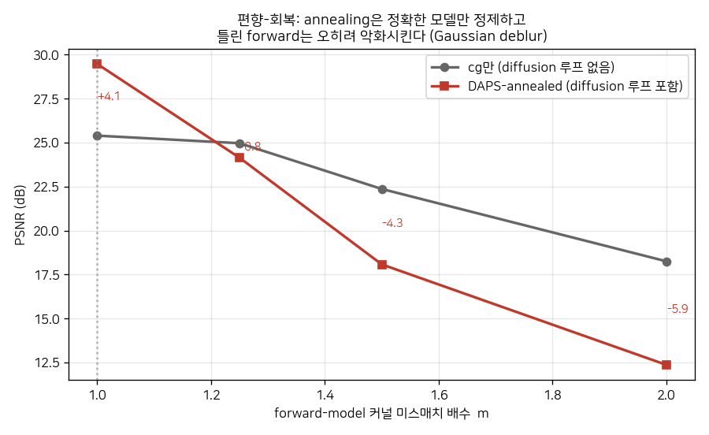
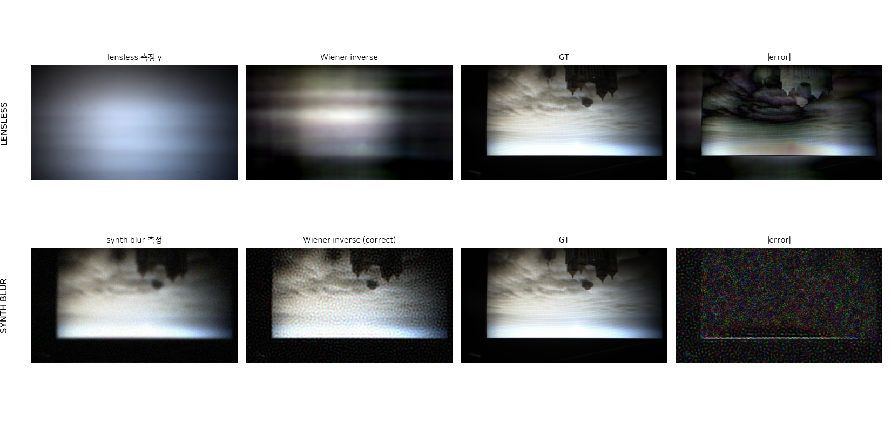
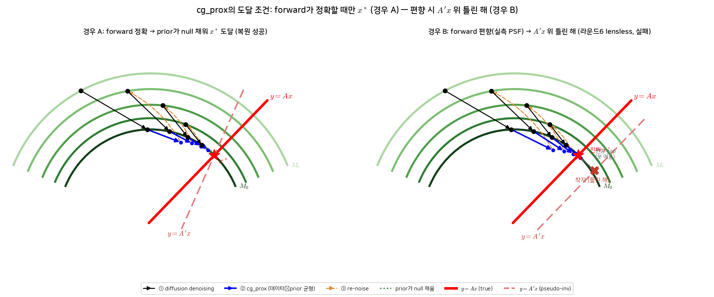

# Diffusion Inverse Solvers의 성공/실패 경계는 Forward 정확도다 — 합성부터 실제 lensless까지

이 보고서는 diffusion prior로 이미지 역문제를 푸는 방법(DPS·DAPS 계열)을 재현·확장하며 도달한 하나의 명제를 정리한다: **성공/실패를 가르는 것은 prior도 데이터-정합 알고리즘도 아니라, forward 연산자가 얼마나 정확한가이다.** forward가 정확하면(합성 MRI/광전파/deblur/SR) 정확한 데이터 스텝이 diffusion 전반을 개선하지만, forward가 편향되면(실제 DiffuserCam lensless, PSF 캘리브레이션 오차) prior·domain 학습·confidence 가중이 **모두** 실패한다.

- **코드**: `nonlinear_image_inverse/` (in-repo 방법·CA-DPS), `baselines/DAPS·DPS` (공식 레포 + `codex/wiener-prox`, `codex/ca-dps` 브랜치)
- **작성일**: 2026-07-07 · **W&B**: `oisl/nonlinear-image-inverse-scaffold`
- 정직성 원칙: 신규성 과장 금지. cg_prox(정확 CG 데이터 스텝)는 **known**(DDS ICLR'24/DiffPIR/PiGDM) — 알고리즘이 아니라 **경계 실증**이 기여.

---

## 1. 재현 — baseline 신뢰도 확보

공개 체크포인트로 DPS(ICLR'23)·DAPS(CVPR'25)를 FFHQ-256에서 재현했다(논문 대비 ≤0.4 dB).

| Task (FFHQ) | 최고 in-repo | DPS | DAPS | 논문 |
|---|---|---|---|---|
| Phase retrieval | HIO 13.7·PnP-UNet 14.0 | 13.5/18.8(best4) | **26.3/30.3(best4)** | DAPS 30.72 ✓ |
| Coded diffraction (4-mask) | HIO 28.4·**PnP-UNet 36.4** | — | — | — |
| Nonlinear deblur | — | 23.0 | **28.5** | 28.29 ✓ |
| HDR | — | — | **27.4** | 27.12 ✓ |

---

## 2. Forward가 정확할 때 — 정확한 데이터 스텝이 diffusion 전반을 개선

DAPS의 데이터-정합 스텝(확률적 Langevin 100스텝)을 **정확한 posterior-평균 CG 풀이**(cg_prox)로 바꾸면 어떻게 되는가. 두 방법 모두 같은 diffusion prior를 쓰고, **오직 데이터 스텝만** 다르다.

*그림 1. cg_prox vs DAPS, 5개 선형 연산자, σ=0.15, FFHQ n=10. 소스: `baselines/DAPS/cores/mcmc.py`(sample_cg_prox), 산출물 `results/round5/grid.json`.*

| 연산자 (σ=0.15) | DAPS | cg_prox | Δ |
|---|---|---|---|
| MRI | 27.7 | **30.3** | +2.6 |
| ASM 광전파 | 19.8 | **29.5** | +9.7 |
| Gaussian deblur | 20.7 | **28.0** | +7.3 |
| Super-resolution | 20.4 | **26.9** | +6.5 |
| Inpainting | 21.6 | 23.4 | +1.8 |

*그림 1b. 같은 이미지의 실제 복원: 측정 y | DAPS(Langevin) | cg_prox(정확 CG) | GT, 4개 연산자 σ=0.15. **DAPS는 이 노이즈 레벨(미튜닝)에서 노이즈·아티팩트가 심하고 cg_prox는 GT에 깨끗이 일치** — +2~10 dB 차이의 시각 증거. 소스: `results/round5/runs/grid_*_sigma0p15_{daps,cg_prox}/grid_results.png`. (튜닝된 DAPS는 아래 caveat 참고.)*

MRI·광전파·deblur·SR로 일반화, LPIPS도 우위. **정직한 caveat**: (a) cg_prox는 **결정론적 평균**으로만 유효(샘플링 켜면 −9~11 dB 붕괴), (b) σ=0.15의 큰 이득은 baseline 미튜닝 착시 — DAPS Langevin lr을 튜닝하면 σ=0.15에서 **동률**(27.96 vs 27.99). 순수 이득이 남는 건 **고노이즈 σ=0.30**(튜닝 후에도 +1.8 dB, LPIPS 우위). 알고리즘 자체는 DDS(ICLR'24)의 CG-in-diffusion과 겹치므로 신규성이 아니라 **일반화 실증**으로 제시한다.

---

## 3. 경계선 — annealing은 forward 편향을 고치지 못한다

핵심 질문: forward가 부정확해도 diffusion annealing이 그 오차를 보정하는가? 일부러 틀린 커널($m$배 넓은 blur)을 cg_prox에 주고 측정했다.

*그림 2. 커널 미스매치 $m$에 따른 PSNR. cg만(diffusion 無) vs DAPS-annealed. 산출물 `results/round5/bias_recovery.json`.*

| 미스매치 $m$ | cg만 | annealed | 격차 |
|---|---|---|---|
| 1.0 (정확) | 25.4 | 29.5 | **+4.1** |
| 1.5 | 22.4 | 18.1 | −4.3 |
| 2.0 | 18.3 | 12.4 | −5.9 |

**반증**: 정확한 모델에선 annealing이 정제(+4.1)하지만, forward가 조금이라도 틀리면 **오히려 악화**(−5.9까지). diffusion이 고치는 건 자기 prior의 manifold 오차이지 **forward-model 편향이 아니다.** 이것이 다음 절 lensless 실패의 근본 원인이다.

---

## 4. 경계를 넘어서 — 실제 lensless (DiffuserCam)에서 무엇이 무너지나

실제 DiffuserCam DLMD(lensless 측정 + lensed GT 페어, 실측 PSF)로 검증했다. forward가 정확하지 않다(실측 PSF 캘리브레이션 오차 + 큰 null space). 세 번의 정직한 시도가 모두 이 경계 밖에서 실패한다.

**① off-domain prior (라운드 6)**: DAPS + ImageNet diffusion → **9.7 dB**, cg_prox 단독(15.4)보다도 나쁨. off-domain prior가 null space를 틀리게 채워 hallucination.

**② domain-matched prior (라운드 7)**: DLMD lensed GT로 denoiser 학습(15k step) → PnP 15.95 vs cg_prox 단독 15.93. **PSNR 거의 안 오름**(+0.02), SSIM/LPIPS만 소폭. domain vs off-domain 차이도 미미. prior는 null 디테일만 채우고 **forward 편향은 못 건넌다.**

**③ confidence-aware 데이터 스텝 (라운드 8)**: 주파수별 신뢰도 $w(f)$로 감가중 + 편향 $b(f)$ 감산 → **13.9 dB, −2 dB로 악화.** flat-sigma(=일반 baseline)가 최선(15.95).

**④ blind PSF 추정 (naive blocked-Gibbs)**: 감가중 대신 forward를 직접 교정하려 커널 $K̂$를 $x$와 함께 추정(hard PSF prior·trust-region·δ-collapse guard 포함). 합성 gate(일부러 틀린 커널 m=1.5에서 시작)에서 **실패**: PSNR 18.1 → 12.4(회복 안 됨, 오라클 29.5), 커널 오차 0.043 → 0.088(참 커널로 수렴 못 하고 **wrong basin으로 drift**). δ-collapse는 막혔으나 non-convex 교대최적화가 엉뚱한 basin에 빠짐. 실측 DLMD는 gate 실패로 진행 안 함.

*그림 3. lensless 측정/Wiener(1행) vs 합성 blur(2행). 소스: `nonlinear_image_inverse` (WieNerDeconv). lensless 측정=형체 없는 glow, Wiener 오차=색편차 0.078·kurtosis 4.0(비-Gaussian 구조편향).*

**왜 confidence-aware가 실패했나(정직).** 실측 forward-오차 PSD $\sigma(f)$가 **저주파 지배**(DC/mid ≈210×)다 — 색편차·캘리브레이션 편향이 저주파에 쏠린다. 그런데 **저주파가 곧 이미지 신호 에너지**다. 감가중/감산이 편향과 함께 신호를 버린다. 즉 lensless에서 forward 편향은 **신호와 저주파에서 얽혀 있어** 잔차 기반으로 분리 불가. (설계 단계 적대적 리뷰의 공격 #3이 그대로 현실화.)

*그림 4. 기하 해석. A) forward 정확 → prior가 null 채워 $x^\ast$ 도달(성공). B) forward 편향($A'\neq A$) → $A'x$ 위 틀린 해, $x^\ast$ 비껴감(실패=lensless).*

---

## 5. 종합 — 하나의 경계

| forward | 결과 | 근거 |
|---|---|---|
| **정확** (합성 MRI/광전파/deblur/SR) | 정확 데이터 스텝이 diffusion 개선 (+2~10 dB) | §2 |
| **정확** (bias $m$=1.0) | annealing이 정제 (+4.1 dB) | §3 |
| **편향** (bias $m$≥1.25, 실제 lensless) | prior·domain·confidence **모두 실패** | §3,§4 |

**명제**: diffusion inverse solver의 성능 천장은 forward 연산자의 정확도가 정한다. 정확하면 정확한 데이터 스텝(+선택적 prior)이 크게 돕고, 편향되면 어떤 prior·가중도 그 편향을 못 건넌다 — 특히 lensless처럼 편향이 신호와 저주파에서 얽힌 경우.

**forward 편향은 쉽게 안 고쳐진다 (4연속 부정 결과).** 이 경계를 넘으려는 네 가지 시도가 모두 실패했다: off-domain prior(hallucination), domain prior(미미), confidence 감가중(신호 얽힘), naive blind PSF(wrong basin). 특히 커널을 25%만 틀려도(bias-recovery $m$=1.25) annealed가 이미 −0.8 dB로 뒤집히고, 그 커널을 데이터에서 되찾으려는 naive blind는 non-convex basin에 빠진다. 즉 forward 편향은 tuning·prior·가중·naive-blind 어느 것으로도 구제되지 않는 **구조적 경계**다.

**함의(향후)**: 실제 lensless를 살리려면 **정교한 blind 접근**(커널에 diffusion prior를 거는 BlindDPS류 + 스케줄링으로 wrong-basin 회피)이 필요하다 — naive blocked-Gibbs로는 부족. 그렇지 않으면 이 경계가 그대로 서 있다. confidence 가중과 domain prior는 forward가 이미 정확할 때만 유효한 보조다.

---

*출처: `nonlinear_image_inverse/`(in-repo·CA-DPS·그림), `baselines/DAPS·DPS`(공식+codex 브랜치), 산출물 `results/round4·5·6·7·8/`, `docs/RESULTS_nonlensless.md`·`docs/CA_DPS_design.md`. 설계·적대적 리뷰는 다중 에이전트 워크플로.*
