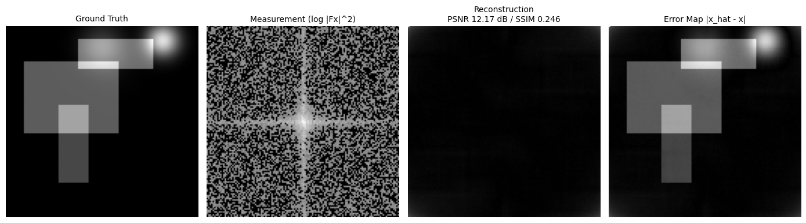
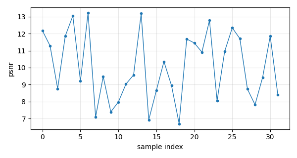

# Nonlinear Image Inverse Scaffold — Phase Retrieval 실험 뼈대 구축 보고

이 문서는 **phase retrieval 기반 이미지 nonlinear inverse problem 실험을 위한 research scaffold** 구축 결과를 정리한다. 구축 당시 전제는 "복원 모델 없이 파이프라인만"이었고 `DummyReconstructor`는 그 검증용 자리표시자였다. 이후 갱신(§4.1–4.2)으로 고전 베이스라인(HIO/WF/TV)이 스캐폴드에 구현되었고, SOTA(DAPS)·표준 베이스라인(DPS)은 공식 체크포인트로 동일 프로토콜 비교까지 완료했다. 신경망 계열의 스캐폴드 내장 구현은 여전히 TODO다.

- **코드 위치**: 로컬 `nonlinear_image_inverse_scaffold/` (src/evaluate.py가 진입점)
- **W&B**: `oisl/nonlinear-image-inverse-scaffold` (scalar/image/table/artifact 로깅 확인, run `7er8h1zk`)
- **작성일**: 2026-07-03



---

## 1. 문제 정의

Phase retrieval forward model:

$$y = |A x|^2 + \eta$$

여기서 $x \in [0,1]^{H \times W}$는 ground-truth 이미지, $A$는 2D Fourier transform(orthonormal, `norm="ortho"`), $y$는 intensity-only measurement, $\eta$는 noise다. $|Ax|^2$에서 **위상 정보가 소실**되므로 forward map은 $x$에 대해 nonlinear하고, 복원은 nonlinear inverse problem이 된다. 위 히어로 이미지의 두 번째 패널이 measurement(log-scale spectrum) — 위상이 없어 구조 정보가 보이지 않는 것이 문제의 본질이다.

Forward operator는 **DPS 논문(Chung et al., ICLR 2023, arXiv:2209.14687) 공식 코드와 동일한 설정**을 지원한다 (2026-07-03 갱신):

- **Measurement type**: `amplitude`($y=|Ax|$, DPS 설정) / `intensity`($y=|Ax|^2$, 고전 설정) 선택.
- **Oversampling**: DPS와 동일하게 $\text{pad}=\lfloor \frac{\text{oversample}}{8}\cdot H\rfloor$/side (oversample 2.0, 256px → 384px padded).
- **FFT**: centered orthonormal transform (ifftshift→FFT(ortho)→fftshift) — DPS의 `fft2_m`과 일치.
- **Noise**: 측정영역 Gaussian($\sigma=0.05$, DPS 기본값) + DPS 방식 Poisson($\mathrm{Pois}(255\,r\,y)/(255\,r)$) 구현. Coded diffraction mask(다중 마스크)는 TODO.
- **데이터셋 전처리도 논문과 동일**: center-crop → 256 resize → $[0,1]$ 정규화. DPS는 FFHQ-256/ImageNet-256을 쓰며, 같은 파이프라인이 폴더 지정만으로 적용된다(현재는 DIV2K valid로 실행).

## 2. 스캐폴드 구성

```
nonlinear_image_inverse_scaffold/
├── configs/scaffold_phase_retrieval_dummy.yaml   # 실험 전체를 config로 정의
├── src/
│   ├── datasets.py            # toy(다운로드 불필요) + local folder dataset
│   ├── forward_operators.py   # FourierPhaseRetrieval (+ registry)
│   ├── reconstructors/        # base/dummy/registry + 4개 TODO skeleton
│   ├── models/                # UNet/unrolled/diffusion prior — 전부 TODO
│   ├── metrics.py             # PSNR·SSIM·measurement error·DC loss
│   ├── evaluate.py            # evaluate-only 진입점 (step 누적)
│   ├── report_utils.py        # 독립형 HTML report 생성
│   ├── wandb_utils.py         # 전부 graceful no-op 가능
│   └── train.py               # 의도적 placeholder (안내 후 종료)
├── notebooks/
│   ├── scaffold_demo.ipynb    # 단일 샘플 인터랙티브 데모
│   └── view_results.ipynb     # 저장된 결과(지표·비교이미지·failure) 열람
└── outputs/reports/           # index.html + latest.html + metrics + samples
```

설계 원칙:

- **HTML report는 W&B 없이 독립 동작.** `use_wandb: false`로 꺼도 보고서는 완전하게 생성된다(실측 확인).
- **실험 = config.** dataset/forward/reconstructor/logging 전부 YAML 한 장으로 결정되고, config 스냅샷이 HTML 보고서에 포함되어 재현 가능하다.
- **나중에 꽂는 구조.** 새 reconstructor는 `Reconstructor.reconstruct(measurement, forward_operator, init=None)` 인터페이스 구현 → `registry.py` 한 줄 등록 → config에서 이름 선택. Wirtinger Flow / TV / unrolled / diffusion prior용 빈 파일이 이미 자리 잡고 있다.
- **measurement consistency와 image quality를 항상 병기.** nonlinear 문제 특성상 "measurement는 잘 맞는데 이미지가 틀린" ambiguity/local minimum 케이스를 잡기 위해 failure case를 PSNR·SSIM·measurement error 세 기준으로 따로 저장하고, 자동 코멘트(예: *high measurement consistency but poor image quality*)를 붙인다.

## 3. Dummy reconstructor (자리표시자)

$$\hat{x} = \mathrm{normalize}\left(\left|\mathcal{F}^{-1}\!\left(\sqrt{y}\right)\right|\right)$$

위상을 전부 버리고 magnitude만 역변환하므로 **의도적으로 틀린** 복원이다. shape이 맞고 결정적(deterministic)이라 파이프라인 검증에는 충분하다. 실제 복원은 스펙트럼 초기화 + Wirtinger Flow gradient가 첫 후보이며, 이를 위해 `forward_operators.py`에 선형 파트 $A$의 adjoint($\mathcal{F}^{-1}$)를 빌딩블록으로 미리 넣어 두었다.

## 4. 검증 결과 (toy dataset 32장, 128×128 grayscale, GPU)

| 지표 | 값 | 해석 |
|---|---|---|
| mean PSNR | **10.03 dB** | dummy라서 낮음 — 정상 |
| mean SSIM | **0.229** | 〃 |
| mean measurement error | **0.981** | $\||A\hat{x}|^2 - y\|_2 / \|y\|_2$, ~1 = 복원 불능 상태 |
| mean DC loss | 1.75e6 | $\||A\hat{x}|^2 - y\|_2^2$ |
| runtime/sample | ~5 ms | forward+dummy recon |
| 전체 평가 | ~11 s | 32장, 이미지·보고서 생성 포함 |



파이프라인 체크리스트 (전부 실측 통과):

- toy dataset이 외부 다운로드 없이 동작 (skimage 샘플 8장을 train/val/test로 분리 + split별 disjoint synthetic 이미지로 num_samples 충족)
- 평가 재실행 시 step 0→1→2 누적, `metrics.json`에 history/best 갱신
- `outputs/reports/`: index.html(11개 섹션)·latest.html·metrics.csv/json·5종 metric curve·샘플별 gt/measurement/recon/error_map/comparison PNG·3기준 failure case + 자동 코멘트
- W&B online: scalar + comparison image + sample table + HTML report artifact가 `oisl` entity로 업로드
- `use_wandb: false` / wandb 미설치 환경에서도 전 기능 동작 (graceful no-op)
- 두 노트북(`scaffold_demo`, `view_results`) headless 실행 통과
- `src/train.py`는 의도된 안내 메시지 출력 후 종료

## 4.1 실제 데이터셋 (DIV2K) + DPS 설정 검증 — 2026-07-03 추가

`scripts/download_div2k.sh`(DIV2K valid HR 100장) + `scripts/preprocess_div2k.py`(center-crop→512px) 구현 후 두 구성으로 실행:

| 구성 | 설정 | mean PSNR | mean SSIM | meas. err |
|---|---|---|---|---|
| `phase_retrieval_div2k.yaml` | intensity, oversample 없음, $\sigma=0.01$, 256px | 6.91 dB | 0.039 | 0.998 |
| `phase_retrieval_div2k_dps.yaml` | **DPS 정합**: amplitude, oversample 2.0(→384), $\sigma=0.05$ | 6.84 dB | 0.029 | 0.979 |

여전히 dummy이므로 수치는 기준선일 뿐이다. DPS 구성의 dummy 복원이 중앙 점(autocorrelation의 DC 집중)으로 나오는 것은 위상 소실의 교과서적 증상으로, forward 체인이 논문과 같은 방식으로 작동함을 시각적으로 확인해준다. forward operator 불변량(pad/crop 왕복, Parseval, adjoint가 선형 파트의 정확한 역)은 assert 기반 self-check로 검증했다. W&B: run `4owqyn52`(DIV2K), `wnxm38wz`(DIV2K-DPS).

## 4.2 SOTA·베이스라인 비교 실험 — 2026-07-03 추가

최신 문헌 기준 phase retrieval의 SOTA 계열은 diffusion prior 방법이다: **DPS**(Chung et al., ICLR 2023)가 표준 베이스라인, **DAPS**(Zhang et al., NeurIPS 2024, arXiv:2407.01521)가 대표 SOTA(FFHQ-256 PR 보고치 30.72 dB, DPS 대비 +9 dB). 2025년 이후 DiffStateGrad·DDfire 등이 DAPS를 소폭 개선하지만 공개 체크포인트·코드 성숙도 기준으로 DPS/DAPS를 채택했다.

**실험 프로토콜** — 모든 방법을 동일 조건으로 비교: FFHQ validation 10장(DAPS 저자 제공 demo set, 256×256 RGB), $y=|F(\text{pad}(x))|$, oversample 2.0, $\sigma=0.05$, 같은 noise seed, 전역 모호성(180°+shift) 정합 후 우리 스캐폴드 metric으로 통일 채점(`scripts/eval_external_recons.py`). Diffusion 방법은 논문 프로토콜대로 4-run(mean과 best-of-4 병기), 고전 방법은 random-restart 내장.

- **체크포인트**: DPS 저자 공식 Google Drive의 `ffhq_10m.pt`(FFHQ-256 DDPM, 374MB) — DPS·DAPS 공용. 순수 state_dict임을 `weights_only=True` 로드로 확인.
- **학습 불필요**: 두 방법 모두 사전학습 prior 위의 posterior sampling이므로 체크포인트만으로 실행.
- **코드**: 공식 레포 그대로(패치: DPS에 motionblur 서브모듈 클론, DAPS에 setproctitle 설치뿐).

| 방법 | 유형 | PSNR (mean / best-of-4) | SSIM | meas. err | 시간/장 |
|---|---|---|---|---|---|
| dummy | placeholder | 6.3 | 0.076 | 0.95 | 0.01 s |
| **HIO** (스캐폴드 구현) | 고전 | **15.1** | 0.216 | **0.141** | 1.2 s |
| Wirtinger Flow (스캐폴드 구현) | 고전 | 12.5 | 0.147 | 0.147 | 6.6 s |
| TV (스캐폴드 구현) | 고전 | 12.6 | 0.159 | 0.146 | 10.7 s |
| DPS (ICLR 2023, 체크포인트) | diffusion | 12.5 / **18.8** | 0.539 | 0.268 | ~150 s/run |
| **DAPS** (NeurIPS 2024, 체크포인트) | diffusion | 27.5 / **30.3** | **0.795** | 0.156 | ~30 s/run |


핵심 관찰:

1. **DAPS 재현 성공**: 자체 평가 30.36 dB(논문 30.72), 우리 통일 metric best-of-4 30.34 dB — 거의 완벽한 복원이 안정적으로 나온다.
2. **DPS의 불안정성도 문헌대로 재현**: run 간 5~15 dB 편차, 성공 시 30 dB/실패 시 12 dB(위 그림 2·3행). best-of-4 18.8 dB는 DPS 논문 보고(~17.4)와 부합.
3. **고전 방법의 한계 확인**: HIO가 고전 중 최선(15.1 dB)이나 σ=0.05 노이즈에서 구조만 겨우 복원. RGB를 채널별 독립 PR로 풀어 색이 어긋나는 것도 뚜렷한(그림) 고전 방법의 구조적 한계다 — diffusion prior는 채널 결합을 prior가 처리한다.
4. **measurement error와 PSNR의 괴리**: HIO(0.141)가 DAPS(0.156)보다 measurement에는 더 잘 맞지만 PSNR은 15 dB 낮다 — nonlinear inverse problem의 ambiguity/local minimum 문제를 정량적으로 보여주는 사례로, 스캐폴드가 두 지표를 병기하는 이유다.

부수 확인(DIV2K 32장, grayscale 256px, 동일 forward): HIO 14.8 / WF 13.2 / TV 13.3 / dummy 6.8 dB.

재현 커맨드: 스캐폴드 `configs/phase_retrieval_div2k_dps.yaml` + `--set reconstructor.name={hio,wirtinger_flow,tv}`; DPS/DAPS는 `/home/dgbae/data/baselines/`의 공식 레포 README 커맨드 그대로(run_info는 `outputs/metrics/*.json`).

## 5. TODO 로드맵

- [x] Wirtinger Flow baseline (autograd, 2026-07-03) — 스펙트럼 초기화는 TODO
- [x] TV-regularized optimization (2026-07-03)
- [ ] U-Net denoiser prior
- [ ] Unrolled reconstruction network
- [x] Diffusion prior 실험 (DPS/DAPS 공식 체크포인트, 2026-07-03) — 스캐폴드 내장 구현은 TODO
- [ ] Coded diffraction masks (다중 마스크 측정)
- [x] Poisson noise (DPS 방식, 2026-07-03) — noise robustness 실험은 TODO
- [x] HIO baseline (2026-07-03)
- [ ] Ablation runner
- [x] DIV2K valid set 다운로드+전처리 (2026-07-03) — train set(800장)은 학습 단계에서 추가

## 6. 사용법

```bash
pip install -r requirements.txt
python src/evaluate.py --config configs/scaffold_phase_retrieval_dummy.yaml
xdg-open outputs/reports/latest.html      # 또는 notebooks/view_results.ipynb
```

새 복원 알고리즘 추가: `src/reconstructors/base.py`의 인터페이스 구현 → `registry.py` 등록 → config `reconstructor.name` 변경. 그 외 코드는 손댈 필요 없다.

---

*출처: 로컬 스캐폴드 `nonlinear_image_inverse_scaffold/` (evaluate 결과물 `outputs/reports/`, 그림은 step_0002 산출물). W&B: `oisl/nonlinear-image-inverse-scaffold`.*
