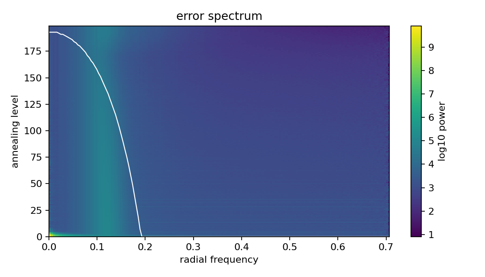

# 이미지 역문제와 Diffusion Prior — 재현 벤치마크와 "정확한 데이터 스텝(R-bridge)" 검증

이 프로젝트는 phase retrieval 스캐폴드에서 출발해, **여러 이미지 역문제(inverse problem)를 diffusion prior로 푸는 방법들을 동일 프로토콜로 재현·비교**하고, 그 위에서 **"데이터 정합 스텝을 정확한 posterior 평균으로 바꾸면 무슨 일이 일어나는가"** 라는 방법론 가설을 검증한 기록이다. 결론은 긍정과 부정이 뚜렷이 갈린다: 정확한 forward 모델에서는 강력하게 일반화하지만, forward 모델이 틀리면 diffusion annealing이 오히려 악화시킨다.

- **코드**: 로컬 `nonlinear_image_inverse/` (in-repo 방법·채점), `baselines/` (DPS·DAPS 공식 레포 + 우리 변형 브랜치 `codex/wiener-prox`)
- **작성일**: 2026-07-06 · **W&B**: `oisl/nonlinear-image-inverse-scaffold` · **논문 리뷰**: [DPS vs DAPS](https://donggeonbae.github.io/review/projects/dps-daps-phase-retrieval/)

---

## 0. Diffusion을 어디에 쓰는가 (용어 정리)

모든 SOTA 계열 방법(DPS, DAPS, 그리고 우리 변형 cg_prox)은 **사전학습된 FFHQ diffusion model(`ffhq_10m.pt`)을 공유 prior**로 쓴다. 역문제를 푸는 과정은 diffusion 샘플링 궤적을 따라 내려가면서, 매 노이즈 레벨에서 measurement $y$에 맞추는 "데이터 스텝"을 끼워넣는 구조다.

DAPS의 기하(아래 §4)로 말하면: 노이즈 레벨 $t$의 상태 $x_t$는 manifold $M_t$ 위에 있고, ① diffusion으로 깨끗한 추정 $\hat{x}_{0|t}$($M_0$ 위 점)를 만든 뒤, ② 그 근방에서 $y$에 맞추는 데이터 스텝을 밟고, ③ 다시 노이즈를 얹어 $M_{t-1}$로 간다. **우리가 손댄 것은 오직 ②(데이터 스텝)이고, prior인 diffusion(①③)은 그대로 쓴다.** 고전 방법(HIO/Wirtinger Flow/TV)과 PnP-UNet만 diffusion을 쓰지 않는다.

---

## 1. 재현 벤치마크 (FFHQ-256, 동일 forward·noise·정합 프로토콜)

먼저 공개 체크포인트로 DPS(ICLR 2023)·DAPS(CVPR 2025)를 재현하고, 우리 in-repo 고전·학습 방법을 같은 채점기로 비교했다. 논문 수치를 재현함으로써 이후 방법론 실험의 baseline 신뢰도를 확보하는 것이 목적이다.

*그림 1. Phase retrieval(진폭 측정, oversample 2.0, σ=0.05) 복원 비교. 좌→우: GT, dummy, HIO, Wirtinger Flow, TV, PnP-UNet, DPS, DAPS. 소스: `nonlinear_image_inverse/scripts/make_method_montage.py`, 산출물 `outputs/figures/ffhq10_method_comparison.png`.*

| Task (FFHQ) | 최고 고전/학습 (in-repo) | DPS | DAPS | 논문 대조 |
|---|---|---|---|---|
| Phase retrieval | HIO 13.7 · PnP-UNet 14.0 | 13.5 (single) / 18.8 (best-of-4) | **26.3 (single) / 30.3 (best-of-4)** | DAPS 30.72 ✓ |
| Coded diffraction (4-mask) | HIO 28.4 · **PnP-UNet 36.4** | — | — | — |
| Nonlinear deblur | — | 23.0 | **28.5** | DAPS 28.29 ✓ |
| HDR | — | — | **27.4** | DAPS 27.12 ✓ |

두 가지가 확인된다. (a) **DAPS 재현 성공** — nonlinear deblur/HDR/PR 모두 논문 수치와 0.3~0.4 dB 이내. (b) **측정 다양성이 문제를 바꾼다**: 단일 진폭 측정(PR)은 HIO 13.7에 그치지만, coded diffraction으로 마스크 4장을 쓰면 위상 모호성이 깨져 HIO 28.4, 학습 prior(PnP-UNet)를 얹으면 **36.4 dB**로 거의 완벽 복원. (PR single-run 100장에서 DAPS도 20% 실패하는데, 이는 bimodal posterior의 mode 실패로 best-of-N 프로토콜이 필요한 이유다.)

---

## 2. 방법 가설: 데이터 스텝을 "정확한 posterior 평균"으로 (cg_prox / R-bridge)

DAPS의 데이터 스텝은 $p(x_0 \mid x_t, y)$에서 **100-step Langevin MCMC**로 샘플링한다. 그런데 forward가 **선형**($y = Ax + n$)이면 이 분포는 **정확히 Gaussian**이고, 그 평균은 닫힌형 선형계

$$\Big(\tfrac{A^\top A}{\sigma^2} + \tfrac{1}{r_t^2} I\Big)\, x \;=\; \tfrac{A^\top y}{\sigma^2} + \tfrac{\hat{x}_{0|t}}{r_t^2}$$

의 해다. $A, A^\top$를 FFT로 싸게 곱할 수 있으니 **CG(conjugate gradient)로 15~25회 반복**하면 정확해에 수렴한다. 이것이 `cg_prox`다 — MCMC 샘플링을 정확한 데이터 정합 풀이로 대체하고, $\hat{x}_{0|t}$를 앵커로 삼아 diffusion prior와 균형을 맞춘다. (중요: **결정론적 평균**으로만 유효하다. §3 참고.)

### 2.1 긍정 결과 — 물리 연산자 전반으로 일반화

*그림 2. cg_prox vs DAPS, 5개 forward 연산자, σ=0.15, FFHQ n=10. 소스: `baselines/DAPS/cores/mcmc.py`(sample_cg_prox) + `scripts/noise_sweep_gaussian_blur.py`, 산출물 `baselines/DAPS/results/round5/grid.json`.*

같은 cg_prox 레시피를 **새 물리 연산자(MRI 부분샘플 푸리에, ASM 광 전파)와 DAPS 네이티브 task(Gaussian deblur, super-resolution, inpainting)** 다섯 개에 그대로 적용했다. 결정론적 평균으로 채점:

| 연산자 (σ=0.15) | DAPS | cg_prox | Δ | LPIPS (DAPS→cg) |
|---|---|---|---|---|
| MRI (4× 부분샘플) | 27.7 | **30.3** | +2.6 | 0.25→0.16 |
| ASM 광 전파 | 19.8 | **29.5** | +9.7 | 0.46→0.19 |
| Gaussian deblur | 20.7 | **28.0** | +7.3 | 0.56→0.20 |
| Super-resolution | 20.4 | **26.9** | +6.5 | 0.58→0.23 |
| Inpainting | 21.6 | 23.4 | +1.8 | 0.35→0.25 |

exact posterior-평균 데이터 스텝은 **다섯 연산자 모두에서 DAPS를 앞서고**(PSNR·LPIPS 동시), 고노이즈에서 특히 크며, 1.5~1.8× 빠르다. inpainting만 이득이 작은데, 이는 $A^\top A$가 투영이라 정확 풀이의 여지가 적기 때문으로 합리적이다. **"forward 커널 하나(deblur)에서만 되는 것 아니냐"는 우려를 이 일반화가 정면으로 반박한다.**

---

## 3. 정직한 귀속 분석 — 무엇이 이득의 원천인가

적대적 리뷰(다중 에이전트, 30개 공격)가 초기 주장을 해체했고, 재실험으로 다음을 확정했다.

- **cg_prox는 "샘플"이 아니라 평균으로만 유효**하다. CG 평균 주변을 실제로 샘플링하면 −9~11 dB 붕괴(σ0.15에서 28.0→17.1). 따라서 "정확한 posterior **샘플**"이라 부르면 과장이고, "정확한 posterior **평균(MMSE)** 데이터 스텝"이 정확한 표현이다. 다만 이 평균은 **LPIPS도 최고**라 단순 회귀-평균 과평활은 아니다.
- **DWDN(학습 deconvolution) 초기화는 오히려 해가 된다** (σ0.15에서 dwdn_init 22.2 < cg_prox 28.0). 초기 리뷰가 "이득은 대부분 DWDN 덕"이라 추측했으나 실측은 반대였다 — 학습 inverse 트랙은 폐기.
- **baseline 튜닝의 몫**: DAPS Langevin lr을 노이즈에 맞춰 낮추면(1e-5) σ0.15에서는 cg_prox와 사실상 동률(27.96 vs 27.99). 그러나 **σ0.30에서는 튜닝 후에도 cg_prox가 +1.79 dB, LPIPS 우위** — 고노이즈 이득은 baseline 미스튜닝 착시가 아니라 실재한다.

즉 방어 가능한 클레임은 좁고 정직하다: **"선형 역문제에서 정확한 posterior-평균 데이터 스텝은 고노이즈에서 빠르고 지각적으로 강한 drop-in이며 여러 물리 연산자로 일반화된다 — 단 결정론적 평균으로."**

---

## 4. 핵심 부정 결과 — annealing은 틀린 forward를 고치지 못한다

가장 흥미로운 질문은 이것이었다: **forward/inverse 모델이 부정확해도, diffusion annealing이 그 오차를 보정해 정답 근처로 데려갈 수 있는가?** ("네트워크와 annealing이 manifold 불일치를 해결한다"는 가설.) 이를 직접 측정하기 위해, cg_prox에 **일부러 틀린 커널**(진짜 대비 $m$배 넓은 blur)을 주고 두 조건을 비교했다: (a) cg만 — diffusion 루프 없이 편향된 평균 한 번, (b) DAPS-annealed — 그 편향된 데이터 스텝을 diffusion 루프에 넣어 전체 궤적 실행.

*그림 3. 커널 미스매치 $m$에 따른 PSNR. 소스: `baselines/DAPS/scripts` bias-recovery 러너, 산출물 `baselines/DAPS/results/round5/bias_recovery.json`. Gaussian deblur, FFHQ.*

| 미스매치 $m$ | cg만 | DAPS-annealed | 격차 (b−a) |
|---|---|---|---|
| 1.0 (정확) | 25.4 | 29.5 | **+4.1** |
| 1.25 | 25.0 | 24.1 | −0.8 |
| 1.5 | 22.4 | 18.1 | −4.3 |
| 2.0 | 18.3 | 12.4 | **−5.9** |

**가설은 반증됐다.** 정확한 모델($m{=}1.0$)에서는 annealing이 +4.1 dB 정제한다(예상대로). 그러나 forward가 조금이라도 틀리면($m{\ge}1.25$) annealing이 **오히려 손해를 키우고**, 미스매치가 클수록 급격히 악화된다(−5.9까지). 게다가 cg만 쓰면 편향에 우아하게 저하(25→18)하는데, annealed는 급붕괴(29→12) — **diffusion-in-the-loop가 forward-model 오차에 오히려 취약**하다.

메커니즘: 편향된 데이터 스텝이 매 레벨 *확신에 찬 틀린 목표*를 재주입하고, prior가 강한(틀린) 데이터 항을 이기지 못한다. **결론적 구분**: diffusion annealing이 보정하는 것은 *자신의 불완전한 prior 추정 $\hat{x}_{0|t}$*(manifold 오차)이지, **forward/데이터-모델의 편향이 아니다**. 강건성을 원하면 annealing에 기대지 말고 커널을 실제로 추정해야 한다(blind/joint estimation — 향후 과제).

---

## 5. 진단 — 주파수별 measurement→prior 지배권 교대

선형 문제에서 각 주파수 $f$의 measurement 정밀도는 $|K(f)|^2/\sigma^2$, prior 정밀도는 $1/r_t^2$이고, 둘이 교차하는 레벨 $t^*(f):\ r_{t^*}^2 = \sigma^2/|K(f)|^2$이 "그 대역의 지배권이 넘어가는 지점"이다 — 스칼라가 아니라 **주파수별 곡선**이다.

*그림 4. 어닐링 레벨 × 방사 주파수 오차 스펙트럼(로그), 해석적 교차 곡선 $t^*(f)$ 오버레이. Gaussian deblur σ=0.15. 소스: `baselines/DAPS` 계측 훅, 산출물 `results/round3a/inst_gb_sigma0p15/phase_bands.png`.*

정성적으로 데이터 스텝의 기여가 교차 곡선 왼쪽(measurement-지배 대역)에 집중되는 구조가 보인다. 다만 이를 정량적 "법칙"으로 부르기엔 근거가 약하다(선형 case에서 Pearson $r\approx-0.49$, 비선형 PR에서는 유의한 상관 없음). 이는 FGPS(ICCV 2025)·ΠGDM·DDRM·DiffPIR에 내재한 Wiener 가중을 하나의 대수적 객체로 정리한 **진단**으로 제시한다 — 새 법칙이 아니라. 실제로 phase retrieval에 이 가중을 적용한 band-split은 배포 가능 지표에서 유의한 개선을 주지 못했다(n=10, paired $p\approx0.75$).

---

## 6. 정리: 안전한 클레임과 열린 방향

**방어 가능한 결론:**
1. 공개 체크포인트로 DPS/DAPS를 FFHQ 다중 task에서 재현(논문 대비 ≤0.4 dB).
2. 선형 역문제에서 **정확한 posterior-평균 데이터 스텝(cg_prox)**은 MRI·ASM·deblur·SR로 일반화, 고노이즈에서 DAPS 대비 +2~10 dB, LPIPS 우위, 1.5~1.8× 빠름 — **결정론적 평균으로만**.
3. **diffusion annealing은 forward-model 편향을 보정하지 못한다** (정확 모델은 +4 dB 정제, 틀린 모델은 −6 dB 악화). 이는 annealing의 역할 범위를 명확히 한 부정 결과다.

**넘겨짚지 말아야 할 것:** cg_prox가 "정확 샘플"로 DAPS를 최대 +10 dB 이긴다(→ 평균이며, σ0.15는 튜닝 시 동률) / band-split이 PR을 개선한다(→ 미검증) / $t^*(f)$가 궤적을 지배하는 법칙이다(→ 진단 수준).

**열린 방향:** forward 오차에 강건하려면 annealing이 아니라 **커널을 함께 추정하는 blind 접근**(레벨별 $x$/$k$ blocked-Gibbs — cg_prox의 닫힌형이 $k$쪽에도 그대로 성립)이 필요하다. 물리 연산자(ASM/MRI)는 학습 편향이 없어 이 방향 검증에 가장 깨끗한 무대다.

---

*출처: `nonlinear_image_inverse/`(in-repo 방법·채점·그림), `baselines/DPS·DAPS`(공식 레포 + `codex/wiener-prox` 브랜치의 cg_prox/instrumentation/bias-recovery), 산출물 `baselines/DAPS/results/round3a·round3b·round5/`, `outputs/figures/`. 적대적 리뷰 메모: `baselines/DAPS/results/TRACKD_REVIEW_MEMO.md`.*
